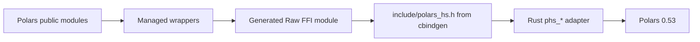

# hs-bindgen / cargo-cabal Investigation for polars-hs

Date: 2026-04-27

## Question

How can `hs-bindgen` and `cargo-cabal` help this project generate Haskell bindings for the Rust Polars adapter?

## Current project shape

`polars-hs` already uses a Rust adapter crate at `rust/polars-hs-ffi` and a stable repository-owned C ABI in `include/polars_hs.h`.


Key properties:

- Rust builds as a `staticlib` named `polars_hs_ffi`.
- `Setup.hs` runs `cargo build --release --manifest-path rust/polars-hs-ffi/Cargo.toml` during configure/build.
- `cbindgen` generates `include/polars_hs.h` from Rust `extern "C"` functions.
- `src/Polars/Internal/Raw.hs` hand-writes raw Haskell FFI imports.
- Public Haskell modules wrap raw imports with `ForeignPtr` finalizers, scoped `CString`s, typed `PolarsError`, and pure `Expr` AST compilation.

## Tool families found

Two active tool families use the `hs-bindgen` name.

### 1. Rust crate `hs-bindgen` with `cargo-cabal`

Sources:

- <https://crates.io/crates/hs-bindgen>
- <https://crates.io/crates/cargo-cabal>
- <https://github.com/yvan-sraka/hs-bindgen>
- <https://github.com/yvan-sraka/cargo-cabal>

Purpose:

- Annotate Rust functions with `#[hs_bindgen]`.
- Generate `extern "C"` wrappers prefixed with `__c_`.
- Generate a Haskell module with `foreign import ccall` declarations.
- Use `cargo cabal init` to generate a Cabal package, `Setup.lhs`, and `hsbindgen.toml` around a Rust crate.

Current versions from `cargo search` / `cargo info`:

- `hs-bindgen = 0.9.0`
- `cargo-cabal = 0.9.0`
- `hs-bindgen-traits = 0.9.0`
- `hs-bindgen-types = 0.9.0`

Local installation observation:

```bash
cargo install cargo-cabal --version 0.9.0 --root /tmp/polars-hs-bindgen-tools --locked
```

This failed on local `rustc 1.93.0-nightly` because the locked dependency set used `proc-macro2 1.0.47`, which references the removed `proc_macro_span_shrink` feature.

```bash
cargo install cargo-cabal --version 0.9.0 --root /tmp/polars-hs-bindgen-tools
```

This succeeded because Cargo selected newer compatible dependencies.

A temporary `greetings` crate generated these files through `cargo cabal init`:

- `greetings.cabal`
- `Setup.lhs`
- `hsbindgen.toml`
- `src/Greetings.hs` after `cargo build --release`

Generated Haskell looked like this:

```haskell
foreign import ccall safe "__c_hello" hello :: CString -> IO (())
```

Fit for `polars-hs`:

- Good for a new Rust-first Cabal package with simple annotated Rust functions.
- Helpful for quick prototypes where Rust functions expose `CString`, numeric types, and simple pointer shapes.
- The generated `Setup.lhs` overlaps with this project's custom `Setup.hs`; it adds `target/release` and `target/debug` as library dirs, while this project already injects the absolute Rust release dir and runs Cargo.
- It emits `safe` imports by default; our current raw bindings use `unsafe` imports for short, non-blocking C ABI calls.

Compatibility check with the current `phs_*` ABI:

A temporary test using an annotated function with a pointer-to-pointer output parameter failed during Rust compilation:

```rust
#[hs_bindgen(raw_hello :: CString -> Ptr (Ptr ()) -> IO CInt)]
fn raw_hello(name: *const c_char, out: *mut *mut MyHandle) -> c_int { ... }
```

The error reported missing `CFFISafe` support for `*const *const ()`. The `hs-bindgen-traits` crate seals `CFFISafe` and currently covers primitives, `*const primitive`, strings, and narrow vector/slice patterns. The current Polars ABI relies heavily on pointer-to-pointer out parameters such as:

```c
int phs_read_csv(const char *path, struct phs_dataframe **out, struct phs_error **err);
int phs_lazyframe_select(const struct phs_lazyframe *lazyframe,
                         const struct phs_expr *const *exprs,
                         uintptr_t len,
                         struct phs_lazyframe **out,
                         struct phs_error **err);
```

This makes direct annotation of the existing ABI a poor fit.

### 2. Well-Typed `hs-bindgen`

Sources:

- <https://github.com/well-typed/hs-bindgen>
- <https://github.com/well-typed/hs-bindgen/blob/main/manual/LowLevel/Usage/01-Invocation.md>
- <https://well-typed.com/blog/2026/02/hs-bindgen-alpha/>
- <https://well-typed.com/blog/2026/03/hs-bindgen-alpha2/>

Purpose:

- Parse C header files with libclang.
- Generate Haskell FFI bindings from C declarations.
- Invocation options include `hs-bindgen-cli preprocess`, Cabal literate preprocessor integration, and Template Haskell mode.

Example command from the manual/blog:

```bash
hs-bindgen-cli preprocess \
  --overwrite-files \
  --unique-id io.github.pe200012.polars-hs \
  --hs-output-dir generated \
  --module Polars.Internal.Raw.Generated \
  -I include \
  include/polars_hs.h
```

Cabal integration shape from the manual:

```cabal
library
  build-tool-depends:  hs-bindgen:hs-bindgen-cli
  ghc-options:         -pgmL hs-bindgen-cli -optL tool-support -optL literate
  build-depends:       base, hs-bindgen-runtime
```

Status:

- The project has alpha releases and package candidates.
- It is oriented toward low-level bindings from C headers.
- High-level binding generation remains a later roadmap area.
- Generated bindings may be platform-specific because libclang derives layouts for the configured target.

Fit for `polars-hs`:

- Stronger match for the current architecture because this project already has `include/polars_hs.h`.
- It can replace or assist `src/Polars/Internal/Raw.hs` generation while preserving the existing safe public Haskell API.
- It keeps the Rust adapter and `cbindgen` flow intact.
- It requires integrating `hs-bindgen-cli` and `hs-bindgen-runtime` into a Stack/Hpack build that currently has no `cabal.project` source-repository-package setup.

## Recommended direction

Use Well-Typed `hs-bindgen` as a low-level raw-binding generator trial. Keep `cargo-cabal` and Rust macro `hs-bindgen` as reference material for prototypes.

Recommended architecture:



This preserves the key design choice that makes the project robust: Rust owns Polars-specific logic, and Haskell exposes a safe API.

## Trial plan

### Trial A: Generate a raw module from the existing C header

Goal: check whether Well-Typed `hs-bindgen` can parse `include/polars_hs.h` and produce usable imports for opaque handles and pointer out parameters.

Proposed generated module path:

```text
generated/Polars/Internal/Raw/Generated.hs
```

Proposed command:

```bash
hs-bindgen-cli preprocess \
  --overwrite-files \
  --unique-id io.github.pe200012.polars-hs.raw \
  --hs-output-dir generated \
  --module Polars.Internal.Raw.Generated \
  -I include \
  include/polars_hs.h
```

Expected review points:

- Opaque struct representation for `phs_dataframe`, `phs_lazyframe`, `phs_expr`, `phs_error`, and `phs_bytes`.
- Pointer types for `struct phs_dataframe **out` and `const struct phs_expr *const *exprs`.
- Generated names for constants such as `PHS_OK` and functions such as `phs_read_csv`.
- Import safety annotations and any generated runtime dependencies.
- Compatibility with `ForeignPtr` finalizers in `Polars.Internal.Managed`.

Integration approach after a successful parse:

1. Keep current `src/Polars/Internal/Raw.hs` as a stable hand-written facade.
2. Add generated module under `generated/` or `src/Polars/Internal/Raw/Generated.hs`.
3. Re-export or wrap generated imports from `Polars.Internal.Raw`.
4. Migrate one small area first, such as `phs_version_major`, `phs_error_code`, or `phs_bytes_len`.
5. Run the full verification suite.

### Trial B: Use Rust macro `hs-bindgen` in a side crate

Goal: evaluate the Rust macro for future helper functions with simple types.

Trial crate shape:

```toml
[dependencies]
hs-bindgen = { version = "0.9.0", features = ["full"] }

[lib]
crate-type = ["staticlib"]
```

Example:

```rust
use hs_bindgen::*;

#[hs_bindgen(polars_hs_version_major :: IO Word32)]
fn polars_hs_version_major() -> u32 {
    0
}
```

This works best for functions with simple return values or string inputs. It should stay outside the main adapter until the generated ABI shape and memory ownership rules match project needs.

## Migration strategy for this project

### Short term

- Keep the existing manual `Polars.Internal.Raw` imports.
- Keep `cbindgen` and current `Setup.hs`.
- Add a documented `hs-bindgen-cli preprocess` experiment once we can pin Well-Typed `hs-bindgen` in Stack or a Cabal side workflow.

### Medium term

- Generate `Polars.Internal.Raw.Generated` from `include/polars_hs.h`.
- Keep public modules unchanged.
- Use the generated raw module only behind `Polars.Internal.Raw`.
- Compare generated types against current hand-written signatures with a small compile test.

### Longer term

- Replace hand-written raw imports function group by function group.
- Keep hand-written ownership and error wrappers.
- Evaluate removal of the hand-written raw facade after generated names, types, and import safety are stable across Linux x86_64 CI.

## Concrete changes needed for a Well-Typed hs-bindgen trial

Possible `package.yaml` additions for a generated module:

```yaml
library:
  source-dirs:
  - src
  - generated
  other-modules:
  - Polars.Internal.Raw.Generated
  dependencies:
  - hs-bindgen-runtime
```

Possible build-tool integration in Cabal form:

```cabal
build-tool-depends: hs-bindgen:hs-bindgen-cli
```

With Hpack, this may require `build-tool-depends` support in `package.yaml` or a custom `Setup.hs` hook that runs:

```bash
hs-bindgen-cli preprocess \
  --overwrite-files \
  --unique-id io.github.pe200012.polars-hs.raw \
  --hs-output-dir generated \
  --module Polars.Internal.Raw.Generated \
  -I include \
  include/polars_hs.h
```

Stack dependency pinning may need `extra-deps` or source dependencies because the Well-Typed tool is alpha/prerelease. A Cabal side experiment may be faster than forcing the main Stack workflow first.

## Concrete changes needed for a cargo-cabal / Rust macro trial

Current `rust/polars-hs-ffi/Cargo.toml` already has the required crate type:

```toml
[lib]
name = "polars_hs_ffi"
crate-type = ["staticlib"]
```

A trial would add:

```toml
[dependencies]
hs-bindgen = { version = "0.9.0", features = ["full"] }
```

Then annotate one simple Rust function:

```rust
use hs_bindgen::*;

#[hs_bindgen(phs_version_major_generated :: IO Word32)]
fn phs_version_major_generated() -> u32 {
    0
}
```

`cargo cabal init` would generate:

- `hsbindgen.toml`
- a Cabal file for the Rust crate
- `Setup.lhs`
- generated Haskell module under `rust/polars-hs-ffi/src/`

This output conflicts with the repository's Hpack/Stack package layout. Treat it as a separate experiment rather than a mainline migration path.

## Spike result: Well-Typed hs-bindgen CLI

After the initial investigation, a side spike was run in `/tmp` using both `release-0.1-alpha2` and the current `main` branch of `well-typed/hs-bindgen`.

Environment:

```text
ghc 9.12.2
cabal-install 3.10.3.0
clang 22.1.3
llvm-config 22.1.3
```

The `release-0.1-alpha2` setup used this source package configuration:

```cabal
source-repository-package
  type: git
  location: https://github.com/well-typed/hs-bindgen
  tag: release-0.1-alpha2
  subdir: c-expr-dsl c-expr-runtime hs-bindgen hs-bindgen-runtime

source-repository-package
  type: git
  location: https://github.com/well-typed/libclang
  tag: release-0.1-alpha
```

The CLI built successfully. Running `preprocess` against a minimal header failed:

```c
struct phs_error;
int phs_error_code(const struct phs_error *error);
```

Command shape:

```bash
cabal v2-run hs-bindgen:hs-bindgen-cli -- preprocess \
  --overwrite-files \
  --create-output-dirs \
  --unique-id io.github.pe200012.simple2 \
  --hs-output-dir generated-simple2 \
  --module Simple2.Generated \
  --select-all \
  -I . \
  simple2.h
```

Failure:

```text
Uncaught exception: CallFailed "\"\" is not a part of this translation unit"
...
clang_tokenize, called at src-internal/HsBindgen/Frontend/ProcessIncludes.hs
Please report this at https://github.com/well-typed/hs-bindgen/issues
```

The same failure occurred with the current `main` branch and with the project header:

```bash
cabal v2-run hs-bindgen:hs-bindgen-cli -- preprocess \
  --overwrite-files \
  --create-output-dirs \
  --unique-id io.github.pe200012.polars-hs.raw \
  --hs-output-dir /tmp/polars-hsbindgen-generated \
  --module Polars.Internal.Raw.Generated \
  --select-all \
  -I /mnt/data/Document/Development/CodeCollection/Haskell/polars-hs/include \
  /mnt/data/Document/Development/CodeCollection/Haskell/polars-hs/include/polars_hs.h
```

Result: no generated module was produced. The failure happens before Polars-specific declarations are processed, so the blocker appears to be a tool/libclang integration issue in this environment.

## Decision

Recommended next step: keep the current hand-written `Polars.Internal.Raw` module for mainline work. Track Well-Typed `hs-bindgen` as a future raw-binding generator once the CLI can preprocess a minimal header on this environment.

If we want to help upstream, create a small issue for Well-Typed `hs-bindgen` with the minimal header, the command above, GHC/Cabal/clang versions, and the `CallFailed "\"\" is not a part of this translation unit"` trace.

The Rust macro `hs-bindgen` and `cargo-cabal` are useful for examples and small Rust-first libraries. The current `polars-hs` ABI shape relies on pointer-to-pointer output parameters and explicit finalizers, so the Rust macro route has a narrow role in this repository.
