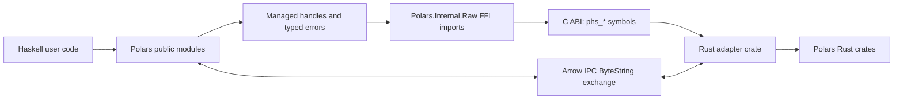
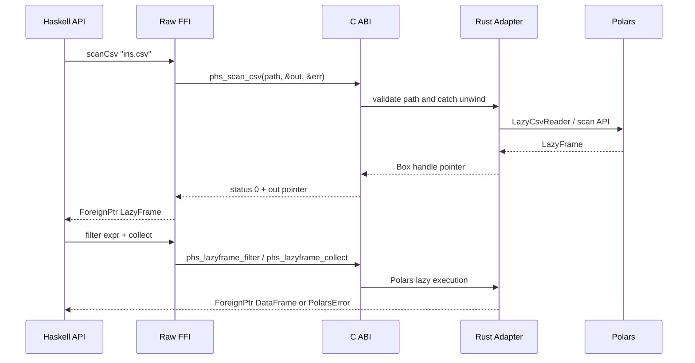

# Polars Haskell Binding Design

## Background

`polars-hs` will provide Haskell bindings to Polars, a Rust dataframe and analytical query engine. The repository currently contains a Stack/Hpack Haskell scaffold with initial library, executable, and test files. The project stack configuration now pins this build matrix:

```yaml
resolver: nightly-2026-04-26
compiler: ghc-9.12.2
```

A web check found that Stackage labels `nightly-2026-04-26` with GHC 9.12.4. The explicit `compiler: ghc-9.12.2` entry is therefore a project-level compiler pin, and the design treats GHC 9.12.2 as the required compiler. Stack 3.9.3 accepts the existing `resolver` key, and the lock file points to the `nightly/2026/4/26.yaml` snapshot.

Polars crates on crates.io currently publish the `0.53.0` family for `polars`, `polars-core`, `polars-lazy`, `polars-io`, `polars-ffi`, and `polars-arrow`. The binding will pin this crate family in `rust/polars-hs-ffi/Cargo.lock` and expose a Haskell-facing ABI owned by this repository.

## Problem

Haskell can call C ABI functions through GHC's FFI, while Rust's Polars API is a native Rust API with evolving type signatures and feature flags. A direct Haskell binding to every Polars Rust function would create brittle marshalling code and a large unsafe surface.

The design needs a stable repository-owned ABI, safe resource ownership, typed Haskell errors, and a practical MVP that demonstrates real dataframe execution. Bulk tabular data exchange also needs a columnar path that preserves Polars performance.

## Questions and Answers

### Q1. Which compiler and resolver does this design target?

Answer: Target Stack with `resolver: nightly-2026-04-26` and `compiler: ghc-9.12.2`. The implementation plan will verify `stack test --fast` on this exact matrix and will keep generated Cabal files aligned with `package.yaml`.

### Q2. Which Polars version family should the Rust adapter pin?

Answer: Pin the Rust adapter to the Polars `0.53.0` crate family. All Polars crates used by the adapter should share that version family, including `polars`, `polars-core`, `polars-lazy`, `polars-io`, `polars-ffi`, and `polars-arrow` when used.

### Q3. Should the first version expose a handle API, Arrow C Data Interface, or both?

Answer: The first version exposes opaque handles for Polars objects and Arrow IPC bytes for dataframe import/export. Arrow C Data Interface arrives after the handle-based MVP because release callbacks and cross-runtime lifetime rules deserve focused tests.

### Q4. How should Haskell users see errors?

Answer: Public APIs return `IO (Either PolarsError a)` for recoverable Polars failures. `PolarsError` carries a numeric code and UTF-8 `Text` message from Rust. Haskell frees the Rust error object after copying the message.

### Q5. How should modules be documented?

Answer: Every public and internal module gets a Haddock module header explaining its role, ownership model, and safety boundary. Internal FFI modules document each foreign import and the corresponding Rust symbol.

## Design

### Architecture



The binding has three layers:

1. Rust adapter crate `rust/polars-hs-ffi` owns all direct Polars calls and exports `extern "C"` symbols with the `phs_` prefix.
2. Raw Haskell FFI modules import `phs_` symbols and represent foreign pointers as opaque raw types.
3. Public Haskell modules wrap dataframe and lazy-frame raw pointers in `ForeignPtr`, convert error objects into `PolarsError`, keep expressions as a pure Haskell AST, and expose a small composable API.

### Rust adapter crate

Files:

- `rust/polars-hs-ffi/Cargo.toml`
- `rust/polars-hs-ffi/Cargo.lock`
- `rust/polars-hs-ffi/build.rs`
- `rust/polars-hs-ffi/cbindgen.toml`
- `rust/polars-hs-ffi/src/lib.rs`
- `rust/polars-hs-ffi/src/error.rs`
- `rust/polars-hs-ffi/src/handles.rs`
- `rust/polars-hs-ffi/src/dataframe.rs`
- `rust/polars-hs-ffi/src/lazyframe.rs`
- `rust/polars-hs-ffi/src/expr.rs`
- `rust/polars-hs-ffi/src/ipc.rs`
- `include/polars_hs.h`

`Cargo.toml` uses crate types that serve development and distribution:

```toml
[lib]
name = "polars_hs_ffi"
crate-type = ["staticlib", "cdylib"]
```

The Rust adapter exports opaque structs:

```c
typedef struct phs_dataframe phs_dataframe;
typedef struct phs_lazyframe phs_lazyframe;
typedef struct phs_expr phs_expr;
typedef struct phs_error phs_error;
typedef struct phs_bytes phs_bytes;
```

Handle ownership rules:

- Rust creates handles with `Box::into_raw`.
- Haskell owns returned pointers after a success status.
- Haskell finalizers call matching Rust free functions.
- Rust free functions accept null pointers and return immediately.
- Rust functions validate input pointers before dereferencing.
- Rust uses `std::panic::catch_unwind` at every exported FFI entry point and converts panic payloads into `phs_error`.

Error protocol:

```c
int phs_error_code(const phs_error* error);
const char* phs_error_message(const phs_error* error);
void phs_error_free(phs_error* error);
```

All fallible functions follow this shape:

```c
int phs_read_csv(const char* path, phs_dataframe** out, phs_error** err);
```

Status code meanings:

| Code | Meaning |
|---:|---|
| `0` | Success |
| `1` | Polars error |
| `2` | Invalid argument |
| `3` | UTF-8 conversion error |
| `4` | Panic captured at FFI boundary |

### Haskell module map

Public modules:

| Module | Purpose |
|---|---|
| `Polars` | Convenience re-export for the MVP API. |
| `Polars.DataFrame` | Eager dataframe handle, readers, shape/schema/head/tail/string rendering, IPC export/import. |
| `Polars.LazyFrame` | Lazy scan, select, filter, with columns, sort, limit, collect. |
| `Polars.Expr` | Pure expression AST, constructors, and aliases. |
| `Polars.Operators` | Pure infix expression operators for comparisons, boolean logic, and arithmetic. |
| `Polars.Error` | `PolarsError`, `PolarsErrorCode`, and error rendering. |
| `Polars.Schema` | `DataType`, `Field`, and schema decoding. |
| `Polars.IPC` | Arrow IPC byte helpers and documented data exchange semantics. |

Internal modules:

| Module | Purpose |
|---|---|
| `Polars.Internal.Raw` | Raw `foreign import ccall` declarations for `phs_*` symbols. |
| `Polars.Internal.Managed` | `ForeignPtr` constructors, finalizer attachment, and pointer validation helpers. |
| `Polars.Internal.Result` | Shared conversion from status/error out-pointers into `Either PolarsError a`. |
| `Polars.Internal.Expr` | Compiles pure Haskell `Expr` values into temporary Rust expression handles. |
| `Polars.Internal.CString` | UTF-8 `Text`/`CString` marshalling helpers with scoped lifetime rules. |
| `Polars.Internal.Bytes` | Rust-owned byte buffer import/export and finalization. |

Each module will begin with a Haddock header. Example:

```haskell
{- |
Module      : Polars.DataFrame
Description : Safe eager DataFrame operations backed by Rust Polars handles.

This module owns the high-level DataFrame API. Values of 'DataFrame' wrap
Rust-owned Polars DataFrame handles in 'ForeignPtr' finalizers, so callers use
normal Haskell garbage collection while Rust releases the underlying allocation.
-}
```

### Haskell public types

```haskell
newtype DataFrame = DataFrame (ForeignPtr RawDataFrame)
newtype LazyFrame = LazyFrame (ForeignPtr RawLazyFrame)

data Expr
    = Column !Text
    | LiteralBool !Bool
    | LiteralInt !Int64
    | LiteralDouble !Double
    | LiteralText !Text
    | Alias !Text !Expr
    | Binary !BinaryOperator !Expr !Expr
    | Not !Expr
    deriving stock (Eq, Show)

data BinaryOperator
    = Eq
    | NotEq
    | Gt
    | GtEq
    | Lt
    | LtEq
    | And
    | Or
    | Add
    | Subtract
    | Multiply
    | Divide
    deriving stock (Eq, Show)

newtype RawDataFrame = RawDataFrame ()
newtype RawLazyFrame = RawLazyFrame ()
newtype RawExpr = RawExpr ()
newtype RawError = RawError ()
newtype RawBytes = RawBytes ()

data PolarsErrorCode
    = PolarsFailure
    | InvalidArgument
    | Utf8Error
    | PanicError
    | UnknownError !Int
    deriving stock (Eq, Show)

data PolarsError = PolarsError
    { polarsErrorCode :: !PolarsErrorCode
    , polarsErrorMessage :: !Text
    }
    deriving stock (Eq, Show)

data DataType
    = Boolean
    | Int8
    | Int16
    | Int32
    | Int64
    | UInt8
    | UInt16
    | UInt32
    | UInt64
    | Float32
    | Float64
    | Utf8
    | Date
    | Datetime
    | Duration
    | Time
    | Binary
    | List !DataType
    | Struct ![Field]
    | Null
    | Categorical
    | UnknownType !Text
    deriving stock (Eq, Show)

data Field = Field
    { fieldName :: !Text
    , fieldType :: !DataType
    }
    deriving stock (Eq, Show)
```

### MVP public API signatures

Eager dataframe operations:

```haskell
readCsv :: FilePath -> IO (Either PolarsError DataFrame)
readParquet :: FilePath -> IO (Either PolarsError DataFrame)

height :: DataFrame -> IO (Either PolarsError Int)
width :: DataFrame -> IO (Either PolarsError Int)
shape :: DataFrame -> IO (Either PolarsError (Int, Int))
schema :: DataFrame -> IO (Either PolarsError [Field])
head :: Int -> DataFrame -> IO (Either PolarsError DataFrame)
tail :: Int -> DataFrame -> IO (Either PolarsError DataFrame)
toText :: DataFrame -> IO (Either PolarsError Text)
```

Lazy dataframe operations:

```haskell
scanCsv :: FilePath -> IO (Either PolarsError LazyFrame)
scanParquet :: FilePath -> IO (Either PolarsError LazyFrame)
collect :: LazyFrame -> IO (Either PolarsError DataFrame)

select :: [Expr] -> LazyFrame -> IO (Either PolarsError LazyFrame)
filter :: Expr -> LazyFrame -> IO (Either PolarsError LazyFrame)
withColumns :: [Expr] -> LazyFrame -> IO (Either PolarsError LazyFrame)
sort :: [Text] -> LazyFrame -> IO (Either PolarsError LazyFrame)
limit :: Word32 -> LazyFrame -> IO (Either PolarsError LazyFrame)
```

Expressions:

```haskell
col :: Text -> Expr
litBool :: Bool -> Expr
litInt :: Int64 -> Expr
litDouble :: Double -> Expr
litText :: Text -> Expr
alias :: Text -> Expr -> Expr

(.==) :: Expr -> Expr -> Expr
(.!=) :: Expr -> Expr -> Expr
(.>) :: Expr -> Expr -> Expr
(.>=) :: Expr -> Expr -> Expr
(.<) :: Expr -> Expr -> Expr
(.<=) :: Expr -> Expr -> Expr
(.&&) :: Expr -> Expr -> Expr
(.||) :: Expr -> Expr -> Expr
not_ :: Expr -> Expr
(+.) :: Expr -> Expr -> Expr
(-.) :: Expr -> Expr -> Expr
(*.) :: Expr -> Expr -> Expr
(/.) :: Expr -> Expr -> Expr
```

IPC exchange:

```haskell
toIpcBytes :: DataFrame -> IO (Either PolarsError ByteString)
fromIpcBytes :: ByteString -> IO (Either PolarsError DataFrame)
writeIpcFile :: FilePath -> DataFrame -> IO (Either PolarsError ())
readIpcFile :: FilePath -> IO (Either PolarsError DataFrame)
```

### Data flow



### Validation rules

- Every exported Rust function checks required input pointers for null.
- Every C string input is decoded as UTF-8 and copied into Rust-owned `String` or `PathBuf` during the call.
- Every out pointer starts as null on the Haskell side before calling Rust.
- Haskell reads output pointers only when status code is `0`.
- Haskell reads and frees `phs_error` only when status code is nonzero and an error pointer is present.
- Byte lengths crossing the FFI use `size_t` on the C side and `CSize` on the Haskell side.
- Row counts and column counts crossing the FFI use `uint64_t` on the C side and checked conversion into Haskell `Int`.
- Public functions that accept counts reject negative Haskell `Int` values before entering FFI.
- `sort` accepts column names for MVP; expression-based sorting is a later extension.

### Build integration

The project remains Stack/Hpack-first. `package.yaml` stays the source of truth for Haskell package metadata, while `polars-hs.cabal` remains generated.

Build assets:

- `Setup.hs` changes to `build-type: Custom` support and runs Cargo before Haskell linking.
- `include/polars_hs.h` is generated by cbindgen and committed for reviewability.
- `rust/polars-hs-ffi/Cargo.lock` is committed to pin Polars crates.
- Stack builds the Haskell package on `nightly-2026-04-26` with `compiler: ghc-9.12.2`.

Expected commands:

```bash
cargo test --manifest-path rust/polars-hs-ffi/Cargo.toml
cargo clippy --manifest-path rust/polars-hs-ffi/Cargo.toml -- -D warnings
stack test --fast
hlint src app test
```

### Testing strategy

Rust tests:

- `read_csv_success` reads a fixture CSV and returns shape `(3, 2)`.
- `read_csv_missing_file` returns status `1` and a `phs_error` message containing the missing path.
- `null_pointer_arguments` returns status `2` for required null inputs.
- `panic_boundary` uses a test-only exported function to verify panic-to-error conversion.
- `ipc_roundtrip` converts a dataframe to IPC bytes and back with matching shape and schema.

Haskell tests:

- `DataFrame.readCsv` returns `Right DataFrame` for `test/data/people.csv`.
- `shape` returns `(3, 2)` for the fixture.
- `schema` returns field names and dtypes for known columns.
- missing file returns `Left PolarsError` with `PolarsFailure`.
- `scanCsv > filter > select > collect` returns the expected shape.
- `toIpcBytes > fromIpcBytes > shape` preserves shape.
- repeated allocation and `performGC` preserve single-owner finalization under RTS checks.

### Example target code

```haskell
{-# LANGUAGE OverloadedStrings #-}

module Main (main) where

import qualified Polars as Pl

main :: IO ()
main = do
    result <- do
        lf0 <- Pl.scanCsv "examples/iris.csv"
        lf1 <- Pl.filter (Pl.col "sepal_length" Pl..> Pl.litDouble 5.0) lf0
        lf2 <- Pl.select [Pl.col "species", Pl.col "sepal_width"] lf1
        Pl.collect lf2

    case result of
        Left err -> print err
        Right df -> do
            print =<< Pl.shape df
            textResult <- Pl.toText df
            either print putStrLn textResult
```

## Implementation Plan

### Phase 1: Repository shape and build bridge

Create the Rust adapter crate, generate `include/polars_hs.h`, configure Hpack/Cabal custom setup, and verify Cargo plus Stack builds under the pinned resolver/compiler configuration.

### Phase 2: Error and handle foundation

Implement `phs_error`, status conversion, opaque handle allocation/free functions, Haskell raw imports, `ForeignPtr` finalizers, and shared `Either` conversion helpers.

### Phase 3: Eager dataframe MVP

Implement CSV/Parquet readers, shape/height/width, schema decoding, head/tail, string rendering, and fixture-based tests.

### Phase 4: Lazy query MVP

Implement lazy scans, expression constructors, filter/select/withColumns/sort/limit, collect, and one integration test that exercises the full lazy pipeline.

### Phase 5: IPC exchange

Implement Rust-owned byte buffers, dataframe-to-IPC and IPC-to-dataframe functions, Haskell `ByteString` copying wrappers, file helpers, and round-trip tests.

### Phase 6: Documentation and examples

Replace scaffold modules with documented `Polars.*` modules, add README quickstart, add `examples/iris.hs`, and list verified build/test commands.

## Examples

### Good patterns

✅ Keep the unsafe surface in internal modules:

```haskell
module Polars.Internal.Raw where

foreign import ccall unsafe "phs_dataframe_free"
    phs_dataframe_free :: Ptr RawDataFrame -> IO ()
```

✅ Expose managed public values:

```haskell
newtype DataFrame = DataFrame (ForeignPtr RawDataFrame)
```

✅ Copy Rust errors into Haskell-owned values:

```haskell
PolarsError code <$> peekUtf8Text messagePtr
```

✅ Pin Polars crates in `Cargo.lock` and keep `phs_*` as the compatibility surface.

### Bad patterns

❌ Expose raw pointers from public modules:

```haskell
readCsvRaw :: FilePath -> IO (Ptr RawDataFrame)
```

❌ Let Haskell construct Rust structs by layout:

```haskell
data RustDataFrameLayout = RustDataFrameLayout ...
```

❌ Return plain `Bool` for fallible operations:

```haskell
readCsvOk :: FilePath -> IO Bool
```

❌ Convert dataframe columns row-by-row for normal data exchange:

```haskell
rows <- getRows df
```

## Trade-offs

### Opaque handles plus Rust adapter

This approach gives the project a stable ABI surface and keeps Polars API churn inside Rust. It also makes the first useful binding smaller because Haskell calls coarse operations. The cost is an adapter crate that must track Polars feature flags and compile times.

### Arrow IPC before Arrow C Data Interface

IPC bytes are straightforward to test and package through `ByteString`. The exchange copies data, yet it gives users a reliable interchange path early. Arrow C Data Interface remains the preferred zero-copy milestone after handle lifecycle and error handling are proven.

### Pure expression AST before public expression handles

A pure `Text`-based expression AST matches Haskell expectations for `col`, literals, and infix operators. The binding compiles expressions into temporary Rust handles only when a lazy operation crosses the FFI boundary. A typed schema layer can build on the same AST later with phantom types or Template Haskell column declarations.

### Custom Setup before full Nix packaging

A Cabal custom setup integrates with Stack and keeps the current project workflow intact. Nix can later pin Cargo, GHC, LLVM, and system linkers for reproducible developer environments.

## Acceptance Criteria

The MVP is accepted when all criteria pass:

1. `stack test --fast` builds the Haskell library, executable, and tests with `nightly-2026-04-26` plus `compiler: ghc-9.12.2`.
2. `cargo test --manifest-path rust/polars-hs-ffi/Cargo.toml` passes.
3. `cargo clippy --manifest-path rust/polars-hs-ffi/Cargo.toml -- -D warnings` passes.
4. `hlint src app test` reports a clean lint result.
5. A Haskell example reads CSV, filters lazily, collects, and prints shape.
6. A Haskell IPC round-trip preserves fixture shape and schema.
7. Public modules contain Haddock headers and explicit export lists.
8. Rust FFI functions use status/error out-pointers and free functions for every allocated handle.

## Implementation Results

Design document created for review on 2026-04-27. Implementation work starts after this design is reviewed and an implementation plan is approved.

After review, the expression representation was refined from public `ForeignPtr RawExpr` handles to a pure Haskell `Expr` AST. This keeps public constructors and operators pure while compiling temporary Rust expression handles at FFI call sites.

Implementation completed in the current jj repository after the user requested `jj git init` and explicitly skipped worktree creation. The implementation uses static Rust linking by setting the Rust crate type to `staticlib`; this avoids runtime `LD_LIBRARY_PATH` requirements for Stack tests. Verification passed: Rust unit tests 9/9, `cargo clippy -- -D warnings`, Haskell tests 6/6, HLint with no hints, and `stack runghc examples/iris.hs`.
