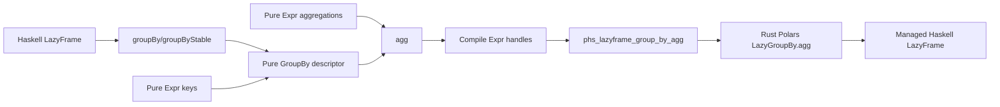

# Polars Haskell Binding Phase 2: GroupBy/Agg Design

## Background

The MVP binding exposes safe Haskell APIs for eager DataFrame reads, LazyFrame scans, expression filters, projections, column additions, sorting, limiting, and IPC byte round trips. Public expressions are pure Haskell AST values and are compiled into temporary Rust Polars expression handles only at FFI boundaries.

Polars Rust `0.53.0` supports lazy grouping through `LazyFrame::group_by`, ordered grouping through `LazyFrame::group_by_stable`, and aggregation through `LazyGroupBy::agg`. Aggregation expressions are ordinary Polars `Expr` values produced by methods such as `sum`, `mean`, `min`, `max`, `count`, `len`, `first`, and `last`.

## Problem

Phase 2 adds grouped analytics to the MVP's read and transform capabilities. The design keeps the current binding architecture: safe public Haskell values, Rust-owned Polars internals, explicit `Either PolarsError` failures, and a repository-owned `phs_*` C ABI.

## Questions and Answers

### Q1. What is the Phase 2 scope?

Answer: GroupBy/Agg MVP.

This includes `groupBy`, `groupByStable`, `agg`, and common aggregation expressions. Joins, windows, dynamic grouping, rolling grouping, and post-aggregation `having` are later phases.

### Q2. Which GroupBy representation should the Haskell API use?

Answer: Use a pure Haskell `GroupBy` descriptor and execute aggregation through one FFI call.

This matches the current pure `Expr` design, keeps Rust handle ownership small, and gives users a Polars-like fluent API:

```haskell
result <-
  Pl.scanCsv "people.csv"
    >>= either (pure . Left) (Pl.agg [Pl.sum_ (Pl.col "salary") `Pl.alias` "salary_sum"] . Pl.groupBy [Pl.col "department"])
```

## Design

### Public API

Add a new public module:

```haskell
module Polars.GroupBy
  ( GroupBy
  , groupBy
  , groupByStable
  , agg
  )
```

Expose it from `Polars`.

The planned type signatures are:

```haskell
data GroupBy

groupBy :: [Expr] -> LazyFrame -> GroupBy
groupByStable :: [Expr] -> LazyFrame -> GroupBy
agg :: [Expr] -> GroupBy -> IO (Either PolarsError LazyFrame)
```

`groupBy` uses Polars' default grouping order. `groupByStable` preserves input group order through Rust Polars `group_by_stable`.

Extend `Polars.Expr` with aggregation nodes and constructors:

```haskell
data AggFunction
  = AggSum
  | AggMean
  | AggMin
  | AggMax
  | AggCount
  | AggLen
  | AggFirst
  | AggLast

data Expr
  = ...
  | Aggregate !AggFunction !Expr

sum_ :: Expr -> Expr
mean_ :: Expr -> Expr
min_ :: Expr -> Expr
max_ :: Expr -> Expr
count_ :: Expr -> Expr
len_ :: Expr -> Expr
first_ :: Expr -> Expr
last_ :: Expr -> Expr
```

The underscore suffix keeps unqualified imports usable with Prelude names. Qualified usage remains compact:

```haskell
Pl.sum_ (Pl.col "salary")
Pl.mean_ (Pl.col "age")
```

### Internal Haskell API

`Polars.GroupBy` stores only Haskell values:

```haskell
data GroupBy = GroupBy
  { groupByInput :: !LazyFrame
  , groupByKeys :: ![Expr]
  , groupByMaintainOrder :: !Bool
  }
```

`agg` compiles keys and aggregation expressions with `withCompiledExprs`, then calls one Rust FFI function. Empty aggregation lists return `Left (PolarsError InvalidArgument ...)` on the Haskell side. Key lists pass through to Rust Polars, which defines the final behavior for global-style aggregation and reports failures through the normal error protocol.

### Rust C ABI

Add expression aggregation support:

```c
int phs_expr_agg(
  int op,
  const phs_expr *expr,
  phs_expr **out,
  phs_error **err
);
```

Aggregation op codes:

| Code | Function |
| ---: | --- |
| 0 | sum |
| 1 | mean |
| 2 | min |
| 3 | max |
| 4 | count |
| 5 | len |
| 6 | first |
| 7 | last |

Add grouped aggregation:

```c
int phs_lazyframe_group_by_agg(
  const phs_lazyframe *lazyframe,
  const phs_expr *const *keys,
  size_t key_len,
  const phs_expr *const *aggs,
  size_t agg_len,
  bool maintain_order,
  phs_lazyframe **out,
  phs_error **err
);
```

Rust implementation flow:

```rust
let lf = lazyframe_ref(lazyframe)?.value.clone();
let keys = expr_vec(keys, key_len)?;
let aggs = expr_vec(aggs, agg_len)?;
let grouped = if maintain_order { lf.group_by_stable(keys) } else { lf.group_by(keys) };
let out_lf = grouped.agg(aggs);
```

All Rust functions remain inside `ffi_boundary`, set output pointers to null before work, and return `PHS_INVALID_ARGUMENT` for invalid op codes or invalid pointer/length combinations.

### Data Flow



### Error Handling

`agg []` returns `InvalidArgument` before FFI. Compilation failures return the first `PolarsError`. Rust Polars errors, invalid op codes, null pointers, UTF-8 failures, and panics use the existing `phs_error` protocol and become `Left PolarsError` in Haskell.

### Testing

Rust tests cover:

1. `phs_expr_agg` builds each supported aggregation expression.
2. Unknown aggregation op code returns `PHS_INVALID_ARGUMENT`.
3. `phs_lazyframe_group_by_agg` groups the CSV fixture and collects the expected shape.
4. Null expression arrays with positive lengths return `PHS_INVALID_ARGUMENT`.

Haskell tests cover:

1. `groupByStable [col "department"]` with `sum_`, `mean_`, and `count_` collects successfully.
2. Aggregation aliases appear in the schema.
3. `agg []` returns `InvalidArgument`.
4. Missing columns in aggregation return a Polars failure during `collect`.
5. Existing MVP tests continue to pass.

### Acceptance Criteria

- `stack test --fast` passes all Haskell tests.
- `cargo test --manifest-path rust/polars-hs-ffi/Cargo.toml` passes all Rust tests.
- `cargo clippy --manifest-path rust/polars-hs-ffi/Cargo.toml -- -D warnings` passes.
- `hlint src app test` reports no hints.
- `stack runghc examples/iris.hs` still runs.
- CI includes the same verification command family.
- Public APIs expose safe Haskell values and keep raw FFI modules internal.

## Implementation Plan

1. Add failing Haskell tests for grouped aggregation behavior and validation.
2. Add Rust tests for aggregation expression op codes and grouped aggregation FFI.
3. Extend Rust `expr.rs` with `phs_expr_agg`.
4. Extend Rust `lazyframe.rs` with `phs_lazyframe_group_by_agg`.
5. Regenerate `include/polars_hs.h` through the existing Cargo build path.
6. Extend `Polars.Expr` and `Polars.Internal.Expr` for aggregation expressions.
7. Add `Polars.GroupBy` and re-export it from `Polars`.
8. Update README and examples with a grouped aggregation snippet.
9. Run the full verification suite and commit implementation results.

## Examples

### Good pattern

```haskell
import qualified Polars as Pl

run :: IO (Either Pl.PolarsError Pl.DataFrame)
run = do
  lf <- Pl.scanCsv "test/data/people.csv"
  case lf of
    Left err -> pure (Left err)
    Right frame -> do
      grouped <-
        Pl.agg
          [ Pl.alias "salary_sum" (Pl.sum_ (Pl.col "salary"))
          , Pl.alias "age_mean" (Pl.mean_ (Pl.col "age"))
          , Pl.alias "people" (Pl.count_ (Pl.col "name"))
          ]
          (Pl.groupByStable [Pl.col "department"] frame)
      case grouped of
        Left err -> pure (Left err)
        Right result -> Pl.collect result
```

✅ Qualified imports keep expression names clear.

✅ Aggregations use aliases when output names need stable test assertions.

### Bad pattern

```haskell
Pl.agg [] (Pl.groupBy [Pl.col "department"] frame)
```

❌ Empty aggregations produce an `InvalidArgument` result.

## Trade-offs

### Pure Haskell `GroupBy` descriptor

This approach keeps ownership simple and follows the existing pure `Expr` model. It also makes `groupBy` and `groupByStable` pure functions, so users can build descriptors with allocation delayed until `agg`.

### Single grouped aggregation FFI call

One call handles keys, aggregations, and ordering. The C ABI stays small, and Rust remains the only layer that knows Polars' `LazyGroupBy` internals.

### Underscore aggregation names

Names such as `sum_` and `max_` make unqualified imports practical and still read well under qualified imports. This favors Haskell ergonomics while preserving a recognizable Polars vocabulary.

## Implementation Results

Implementation begins after user approval. This section will record verification output, deviations, and final commit information after implementation work starts.
