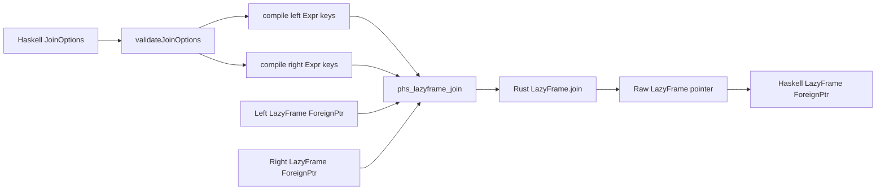

# Design Log: Polars Haskell Phase 3 Join MVP

## Background

Phase 1 created a safe Haskell binding over a Rust-owned `phs_*` C ABI for eager frames, lazy scans, expressions, and IPC. Phase 2 added grouped aggregation with a pure Haskell `GroupBy` descriptor and a single Rust FFI call. Phase 3 adds lazy joins for the common relational workflow: combine two `LazyFrame` values by one or more key expressions.

Current upstream research:

- Rust Polars 0.53 exposes `LazyFrame.join(other, left_on, right_on, JoinArgs::new(JoinType::*))`.
- `JoinArgs` supports suffix customization through `with_suffix`.
- Core join variants available through the generic join path are inner, left, right, and full.
- Polars Python and Rust docs present joins as a primary lazy-query operation, with multi-key joins and suffix behavior as common use cases.

## Problem

Users can scan, filter, project, aggregate, serialize, and inspect data. They need to combine related datasets through lazy joins while keeping the binding's safety model:

- public Haskell APIs return `Either PolarsError` for recoverable failures;
- Haskell users work with pure `Expr` values;
- Rust owns Polars internals and exposes repository-owned stable ABI functions;
- handle ownership remains `ForeignPtr` based on the Haskell side.

## Questions and Answers

### Q1. What is the Phase 3 scope?

Answer: Core Join MVP. Implement inner, left, right, and full joins with multi-key expression support and suffix configuration.

### Q2. Which public API shape should users see?

Answer: Add a focused `Polars.Join` module with `JoinOptions`, `JoinType`, `joinWith`, and convenience wrappers. This keeps `Polars.LazyFrame` focused on single-frame transformations and gives join-specific options a clear home.

### Q3. Should suffix configuration be part of Phase 3?

Answer: Yes. Duplicate column names are common in joins, and Rust Polars already exposes suffix configuration through `JoinArgs::with_suffix`.

### Q4. How should invalid join keys be reported?

Answer: Haskell validates empty key lists and mismatched key lengths before calling Rust. Rust also validates these invariants at the ABI boundary. Both layers report `InvalidArgument`.

## Design

### Public module

Create `src/Polars/Join.hs` and expose it through `package.yaml` and `Polars`.

```haskell
module Polars.Join
  ( JoinOptions (..)
  , JoinType (..)
  , defaultJoinOptions
  , fullJoin
  , innerJoin
  , joinWith
  , leftJoin
  , rightJoin
  ) where
```

### Public types

```haskell
data JoinType
    = JoinInner
    | JoinLeft
    | JoinRight
    | JoinFull
    deriving stock (Eq, Show)

data JoinOptions = JoinOptions
    { joinType :: !JoinType
    , leftOn :: ![Expr]
    , rightOn :: ![Expr]
    , suffix :: !(Maybe Text)
    }
    deriving stock (Eq, Show)
```

`JoinInner`, `JoinLeft`, `JoinRight`, and `JoinFull` avoid clashes with common constructors and read clearly under qualified imports.

### Public functions

```haskell
defaultJoinOptions :: JoinOptions

defaultJoinOptions = JoinOptions
    { joinType = JoinInner
    , leftOn = []
    , rightOn = []
    , suffix = Nothing
    }

joinWith :: JoinOptions -> LazyFrame -> LazyFrame -> IO (Either PolarsError LazyFrame)

innerJoin :: [Expr] -> [Expr] -> LazyFrame -> LazyFrame -> IO (Either PolarsError LazyFrame)
leftJoin :: [Expr] -> [Expr] -> LazyFrame -> LazyFrame -> IO (Either PolarsError LazyFrame)
rightJoin :: [Expr] -> [Expr] -> LazyFrame -> LazyFrame -> IO (Either PolarsError LazyFrame)
fullJoin :: [Expr] -> [Expr] -> LazyFrame -> LazyFrame -> IO (Either PolarsError LazyFrame)
```

Convenience wrappers call `joinWith` with the matching `JoinType` and `suffix = Nothing`.

### Validation rules

```haskell
validateJoinOptions :: JoinOptions -> Either PolarsError ()
```

Rules:

- `leftOn = []` returns `InvalidArgument` with message `left join keys must contain at least one expression`.
- `rightOn = []` returns `InvalidArgument` with message `right join keys must contain at least one expression`.
- Different key counts return `InvalidArgument` with message `left and right join key counts must match`.

Rust repeats the same validation so raw ABI calls have identical safety behavior.

### Rust ABI

Add one C ABI function to `rust/polars-hs-ffi/src/lazyframe.rs`:

```c
int phs_lazyframe_join(
    const phs_lazyframe *left,
    const phs_lazyframe *right,
    const phs_expr *const *left_on,
    size_t left_len,
    const phs_expr *const *right_on,
    size_t right_len,
    int join_type,
    const char *suffix,
    phs_lazyframe **out,
    phs_error **err
);
```

Join type codes:

| Code | Haskell | Rust |
| ---: | --- | --- |
| 0 | `JoinInner` | `JoinType::Inner` |
| 1 | `JoinLeft` | `JoinType::Left` |
| 2 | `JoinRight` | `JoinType::Right` |
| 3 | `JoinFull` | `JoinType::Full` |

`suffix = NULL` means Rust uses Polars' default suffix. A non-null suffix is decoded as UTF-8 and passed to `JoinArgs::with_suffix(Some(...))`.

### Haskell FFI layer

Add this import to `Polars.Internal.Raw`:

```haskell
foreign import ccall unsafe "phs_lazyframe_join"
    phs_lazyframe_join ::
        Ptr RawLazyFrame ->
        Ptr RawLazyFrame ->
        Ptr (Ptr RawExpr) ->
        CSize ->
        Ptr (Ptr RawExpr) ->
        CSize ->
        CInt ->
        CString ->
        Ptr (Ptr RawLazyFrame) ->
        Ptr (Ptr RawError) ->
        IO CInt
```

`Polars.Join` will compile left and right key expressions through `withCompiledExprs`, pass the optional suffix with a scoped CString, and wrap the result with `mkLazyFrame`.

### Data flow



### Error handling

- Haskell validation returns `InvalidArgument` before Rust allocation.
- Rust pointer, join type, and key-shape validation returns `PHS_INVALID_ARGUMENT`.
- Polars planning and execution failures return `PolarsFailure` through the existing error protocol.
- Panic capture remains inside `ffi_boundary`.

### Tests

#### Haskell tests

Add `test/data/employees.csv`:

```csv
id,name,department,salary
1,Alice,Engineering,100
2,Bob,Engineering,150
3,Carol,Sales,90
4,Eve,Support,80
```

Add `test/data/departments.csv`:

```csv
department,name,budget
Engineering,Grace,1000
Sales,Heidi,700
Finance,Ivan,500
```

Test cases:

- inner join returns shape `(3, 6)` and includes `name_right` with default suffix;
- left join returns shape `(4, 6)` and includes `Support`;
- full join returns shape `(5, 7)` when key coalescing follows Polars full-join defaults;
- custom suffix via `joinWith defaultJoinOptions { suffix = Just "_dept" }` yields `name_dept`;
- empty key lists return `InvalidArgument`;
- mismatched key counts return `InvalidArgument`.

#### Rust tests

Add tests in `rust/polars-hs-ffi/src/lazyframe.rs`:

- `lazy_join_inner_collects_expected_shape` builds two lazy scans, joins by `department`, collects, and checks shape;
- `lazy_join_rejects_mismatched_key_lengths` checks `PHS_INVALID_ARGUMENT`;
- `lazy_join_rejects_unknown_join_type` checks `PHS_INVALID_ARGUMENT`.

### Documentation and examples

Add `examples/join.hs` showing `leftJoin` and custom suffix. Update README public module list and add a join quickstart section.

## Implementation Plan

1. Add failing Haskell join tests and CSV fixtures.
2. Add failing Rust join FFI tests.
3. Implement `phs_lazyframe_join` in Rust and regenerate `include/polars_hs.h`.
4. Add Haskell raw FFI import and `Polars.Join`.
5. Expose `Polars.Join` through `package.yaml` and `Polars`.
6. Add docs, example, and full verification notes.

## Examples

### Inner join

```haskell
joined <-
    Pl.innerJoin
        [Pl.col "department"]
        [Pl.col "department"]
        employees
        departments
```

### Join with custom suffix

```haskell
joined <-
    Pl.joinWith
        Pl.defaultJoinOptions
            { Pl.joinType = Pl.JoinLeft
            , Pl.leftOn = [Pl.col "department"]
            , Pl.rightOn = [Pl.col "department"]
            , Pl.suffix = Just "_dept"
            }
        employees
        departments
```

### Bad input

```haskell
Pl.innerJoin [] [Pl.col "department"] employees departments
-- Left (PolarsError InvalidArgument "left join keys must contain at least one expression")
```

## Trade-offs

### `Polars.Join` module

This keeps join-specific options and validation together. It also gives future join features a clear extension point.

### `JoinOptions` record

The record is slightly larger than a positional function, and it supports suffix now plus future options such as null equality, coalescing, validation, and maintain-order controls.

### Core join variants only

Inner, left, right, and full cover the first relational workflow. Semi, anti, cross, asof, and expression inequality joins fit later phases with separate feature checks and tests.

## Acceptance Criteria

- `Polars.Join` is exposed and re-exported by `Polars`.
- `innerJoin`, `leftJoin`, `rightJoin`, `fullJoin`, and `joinWith` work with multi-key `Expr` lists.
- `suffix = Just value` affects duplicate right-side column names.
- Empty or mismatched key lists return `InvalidArgument`.
- Rust join type and key validation return `PHS_INVALID_ARGUMENT`.
- Full verification passes:
  - `cargo test --manifest-path rust/polars-hs-ffi/Cargo.toml`
  - `cargo clippy --manifest-path rust/polars-hs-ffi/Cargo.toml -- -D warnings`
  - `stack test --fast`
  - `hlint src app test`
  - `stack runghc examples/join.hs`

## Implementation Results

Implementation begins after user approval. This section will record verification output, deviations, and final commit information after implementation work starts.
