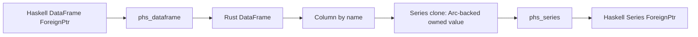

# Design Log: Polars-Haskell Unified Column and Series Handle API

## Background

Phase 4 added named typed DataFrame column extraction through `Polars.Column`:

```haskell
columnBool   :: DataFrame -> Text -> IO (Either PolarsError (Vector (Maybe Bool)))
columnInt64  :: DataFrame -> Text -> IO (Either PolarsError (Vector (Maybe Int64)))
columnDouble :: DataFrame -> Text -> IO (Either PolarsError (Vector (Maybe Double)))
columnText   :: DataFrame -> Text -> IO (Either PolarsError (Vector (Maybe Text)))
```

The next API step introduces Series as an owned Haskell value and improves typed extraction ergonomics with visible type applications:

```haskell
{-# LANGUAGE TypeApplications #-}

column @Series df "age"    :: IO (Either PolarsError Series)
column @Int64  df "age"    :: IO (Either PolarsError (Vector (Maybe Int64)))
column @Text   df "name"   :: IO (Either PolarsError (Vector (Maybe Text)))
```

Polars Rust 0.53 uses `Series(pub Arc<dyn SeriesTrait>)`. A `DataFrame::column(name)` returns a `Column`, and `Column::as_materialized_series()` gives a `&Series`. Cloning that `Series` gives an owned Arc-backed value suitable for an opaque FFI handle.

## Problem

Users need one column selection concept with two use cases:

- take a named DataFrame column as a reusable Series handle;
- read a named DataFrame column as typed Haskell values.

Named functions remain useful for discoverability, while `column @xxx` gives the concise Haskell style users expect from a typed binding. Typed value readers return boxed `Data.Vector.Vector` values so column-sized payloads use an array-oriented Haskell container.

The implementation must preserve the safe-handle architecture: Haskell sees opaque handles, Rust owns Polars objects, and recoverable failures return `Either PolarsError a`.

## Questions and Answers

### Q1. What should Series handle MVP cover?

Answer: Series handle plus metadata plus the four typed value readers from Phase 4.

Selected Series API:

```haskell
seriesName      :: Series -> IO (Either PolarsError Text)
seriesLength    :: Series -> IO (Either PolarsError Int)
seriesNullCount :: Series -> IO (Either PolarsError Int)
seriesDataType  :: Series -> IO (Either PolarsError DataType)
seriesHead      :: Int -> Series -> IO (Either PolarsError Series)
seriesTail      :: Int -> Series -> IO (Either PolarsError Series)
seriesToFrame   :: Series -> IO (Either PolarsError DataFrame)

seriesBool   :: Series -> IO (Either PolarsError (Vector (Maybe Bool)))
seriesInt64  :: Series -> IO (Either PolarsError (Vector (Maybe Int64)))
seriesDouble :: Series -> IO (Either PolarsError (Vector (Maybe Double)))
seriesText   :: Series -> IO (Either PolarsError (Vector (Maybe Text)))
```

### Q2. Should `column @xxx` become the main column extraction API?

Answer: Yes. `column @Series` returns a Series handle. `column @Bool`, `column @Int64`, `column @Double`, and `column @Text` return typed values.

Selected unified API:

```haskell
class Column a where
    type ColumnResult a
    column :: DataFrame -> Text -> IO (Either PolarsError (ColumnResult a))

instance Column Series where
    type ColumnResult Series = Series

instance Column Bool where
    type ColumnResult Bool = Vector (Maybe Bool)

instance Column Int64 where
    type ColumnResult Int64 = Vector (Maybe Int64)

instance Column Double where
    type ColumnResult Double = Vector (Maybe Double)

instance Column Text where
    type ColumnResult Text = Vector (Maybe Text)
```

### Q3. What happens to `columnBool`, `columnInt64`, `columnDouble`, and `columnText`?

Answer: They remain stable convenience aliases backed by `column @xxx`.

```haskell
columnBool   :: DataFrame -> Text -> IO (Either PolarsError (Vector (Maybe Bool)))
columnInt64  :: DataFrame -> Text -> IO (Either PolarsError (Vector (Maybe Int64)))
columnDouble :: DataFrame -> Text -> IO (Either PolarsError (Vector (Maybe Double)))
columnText   :: DataFrame -> Text -> IO (Either PolarsError (Vector (Maybe Text)))
```

### Q4. Should Series transform operations enter this phase?

Answer: This phase covers read-oriented operations and shape-preserving slices. Transform operations such as `cast`, `rename`, `sort`, and `unique` get a separate design because they introduce DataType-to-Rust mapping and broader behavior choices.

### Q5. Should typed value readers return lists or vectors?

Answer: They return boxed `Vector (Maybe a)` values from `Data.Vector`. This gives a uniform public result type for primitive values and `Text`, preserves Polars nulls as `Nothing`, and keeps room for specialized nullable primitive buffers in a later phase.

## Design

### Public module layout

Add `Polars.Series`:

```haskell
module Polars.Series
    ( Series
    , seriesBool
    , seriesDataType
    , seriesDouble
    , seriesHead
    , seriesInt64
    , seriesLength
    , seriesName
    , seriesNullCount
    , seriesTail
    , seriesText
    , seriesToFrame
    ) where
```

Extend `Polars.Column`:

```haskell
{-# LANGUAGE AllowAmbiguousTypes #-}
{-# LANGUAGE TypeApplications #-}
{-# LANGUAGE TypeFamilies #-}

module Polars.Column
    ( Column (..)
    , columnBool
    , columnDouble
    , columnInt64
    , columnText
    ) where
```

Re-export `Polars.Series` from `Polars`.

### Public usage

✅ Series handle:

```haskell
{-# LANGUAGE TypeApplications #-}

ageSeries <- column @Series df "age"
```

✅ Typed values:

```haskell
ages   <- column @Int64 df "age"
names  <- column @Text df "name"
scores <- column @Double df "score"
flags  <- column @Bool df "active"
```

✅ Convenience aliases:

```haskell
ages <- columnInt64 df "age"
```

### Typeclass behavior

`ColumnResult` encodes the output family for each type parameter. `Vector` means `Data.Vector.Vector`.

| Type application | Result payload |
| --- | --- |
| `column @Series` | `Series` |
| `column @Bool` | `Vector (Maybe Bool)` |
| `column @Int64` | `Vector (Maybe Int64)` |
| `column @Double` | `Vector (Maybe Double)` |
| `column @Text` | `Vector (Maybe Text)` |

`column @Series` performs one Rust FFI call to create a `phs_series`. Typed instances call `column @Series` and then the matching `series*` reader:

```haskell
instance Column Int64 where
    type ColumnResult Int64 = Vector (Maybe Int64)
    column df name = column @Series df name >>= either (pure . Left) seriesInt64
```

This keeps typed DataFrame extraction behavior aligned with Series extraction.

### Rust handle ownership

Add `phs_series` and `SeriesHandle` in `rust/polars-hs-ffi/src/handles.rs`:

```rust
#[repr(C)]
pub struct phs_series {
    _private: [u8; 0],
}

pub struct SeriesHandle {
    pub value: Series,
}

pub fn series_into_raw(value: Series) -> *mut phs_series;
pub unsafe fn series_ref<'a>(ptr: *const phs_series) -> PhsResult<&'a SeriesHandle>;

#[unsafe(no_mangle)]
pub unsafe extern "C" fn phs_series_free(ptr: *mut phs_series);
```

`phs_dataframe_column` clones the materialized Series:

```rust
let series = handle.value.column(name)?.as_materialized_series().clone();
*out = series_into_raw(series);
```

The returned Series handle owns an Arc-backed Polars Series and can be used after the DataFrame handle goes out of scope.



### C ABI

New functions:

```c
void phs_series_free(struct phs_series *ptr);

int phs_dataframe_column(
  const struct phs_dataframe *dataframe,
  const char *name,
  struct phs_series **out,
  struct phs_error **err
);

int phs_series_name(const struct phs_series *series, struct phs_bytes **out, struct phs_error **err);
int phs_series_dtype(const struct phs_series *series, struct phs_bytes **out, struct phs_error **err);
int phs_series_len(const struct phs_series *series, uint64_t *out, struct phs_error **err);
int phs_series_null_count(const struct phs_series *series, uint64_t *out, struct phs_error **err);
int phs_series_head(const struct phs_series *series, uint64_t n, struct phs_series **out, struct phs_error **err);
int phs_series_tail(const struct phs_series *series, uint64_t n, struct phs_series **out, struct phs_error **err);
int phs_series_to_frame(const struct phs_series *series, struct phs_dataframe **out, struct phs_error **err);

int phs_series_values_bool(const struct phs_series *series, struct phs_bytes **out, struct phs_error **err);
int phs_series_values_i64(const struct phs_series *series, struct phs_bytes **out, struct phs_error **err);
int phs_series_values_f64(const struct phs_series *series, struct phs_bytes **out, struct phs_error **err);
int phs_series_values_text(const struct phs_series *series, struct phs_bytes **out, struct phs_error **err);
```

### Encoding

Series typed values reuse the Phase 4 tagged byte format:

- per-row tag: `0` null, `1` value;
- bool: tag plus one byte;
- int64: tag plus 8 little-endian bytes;
- double: tag plus 8 little-endian IEEE-754 bytes;
- text: tag plus u64 little-endian byte length plus UTF-8 bytes.

Move Rust encoder helpers from DataFrame-specific column extraction into a reusable helper that accepts `&Series`. Existing `phs_dataframe_column_bool` style ABI can call `phs_dataframe_column` then encode the Series, or call the same helper directly after selecting the materialized Series.

### Haskell internals

Extend `Polars.Internal.Raw`:

```haskell
data RawSeries

foreign import ccall unsafe "&phs_series_free"
    phs_series_free_finalizer :: FinalizerPtr RawSeries
```

Extend `Polars.Internal.Managed`:

```haskell
newtype Series = Series (ForeignPtr RawSeries)

mkSeries :: Ptr RawSeries -> IO Series
withSeries :: Series -> (Ptr RawSeries -> IO a) -> IO a
```

Add `Polars.Internal.Series` for shared FFI result helpers:

```haskell
seriesOut :: (Ptr (Ptr RawSeries) -> Ptr (Ptr RawError) -> IO CInt) -> IO (Either PolarsError Series)
seriesBytesOut :: Series -> (Ptr RawSeries -> Ptr (Ptr RawBytes) -> Ptr (Ptr RawError) -> IO CInt) -> (BS.ByteString -> Either PolarsError a) -> IO (Either PolarsError a)
seriesWord64Out :: Series -> (Ptr RawSeries -> Ptr Word64 -> Ptr (Ptr RawError) -> IO CInt) -> IO (Either PolarsError Int)
```

`Polars.Column` defines the associated-type API and keeps compatibility functions.

### Error handling

- Missing DataFrame column: Rust Polars error, exposed as `PolarsFailure`.
- Type mismatch in typed Series readers: Rust Polars error, exposed as `PolarsFailure`.
- Negative `seriesHead` or `seriesTail` count: Haskell-side `InvalidArgument`.
- Null raw pointer from a successful FFI call: Haskell-side `InvalidArgument`.
- Malformed typed value payload: Haskell-side `InvalidArgument` from `Polars.Internal.ColumnDecode`.

## Examples

✅ DataFrame column to Series:

```haskell
{-# LANGUAGE TypeApplications #-}

result <- Pl.readCsv "test/data/values.csv"
case result of
  Left err -> print err
  Right df -> do
    seriesResult <- Pl.column @Pl.Series df "age"
    case seriesResult of
      Left err -> print err
      Right age -> do
        print =<< Pl.seriesLength age
        print =<< Pl.seriesInt64 age
```

✅ DataFrame column to typed values:

```haskell
ages <- Pl.column @Int64 df "age"
```

✅ Convert Series to a one-column DataFrame:

```haskell
Right age <- Pl.column @Pl.Series df "age"
Right oneColumn <- Pl.seriesToFrame age
print =<< Pl.shape oneColumn
```

## Implementation Plan

1. Add failing Hspec tests for `column @Series`, `column @Int64`, metadata, typed readers, `head`, `tail`, `toFrame`, error paths, and named compatibility functions.
2. Add Rust `phs_series` handle support in `handles.rs` with Rust ownership tests.
3. Add Rust Series FFI functions in a new `series.rs` module and wire it from `lib.rs`.
4. Refactor DataFrame typed column ABI functions to reuse Series encoders where practical.
5. Add raw Haskell FFI imports and managed `Series` wrapper.
6. Add `Polars.Series` and update `Polars.Column` with the associated-type `Column` class.
7. Update `package.yaml`, examples, README, CHANGELOG, and generated header/cabal files.
8. Verify with Rust tests, Clippy, Stack tests, HLint, and examples.

## Trade-offs

### Benefits

- Gives one column selection spelling for Series handles and typed values.
- Preserves source-compatible named extraction helpers.
- Uses Haskell visible type applications for concise typed reads.
- Reuses tested Phase 4 value encoding and Haskell decoders.
- Provides a foundation for later Series transforms.

### Costs

- Requires `TypeApplications` in user code for the concise `column @xxx` style.
- Uses `TypeFamilies` and `AllowAmbiguousTypes` inside `Polars.Column`.
- Adds a dependency on the `vector` package for typed value readers.
- Adds one more opaque handle type and finalizer path.
- Clones a Polars `Series` handle when taking a column from a DataFrame.

### Future extensions

- `seriesCast` after DataType mapping is specified.
- `seriesRename`, `seriesSort`, `seriesUnique`, and `seriesAppend`.
- Arrow C Data Interface export for Series.
- Constructors for building Series from Haskell lists.

## Implementation Results

Implementation starts after design approval. Verification results, deviations, and final commit information are recorded during implementation.
