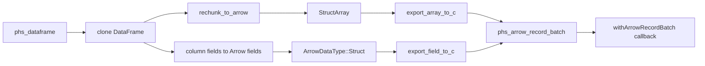

# Design Log: Polars-Haskell Arrow C Data Interface Export

## Background

The binding now imports a standard Arrow C Data Interface RecordBatch into a managed Polars `DataFrame`:

```haskell
unsafeArrowRecordBatch :: Ptr schema -> Ptr array -> ArrowRecordBatch
fromArrowRecordBatch :: ArrowRecordBatch -> IO (Either PolarsError DataFrame)
```

The inverse direction lets a Polars `DataFrame` leave Haskell through the same ABI shape: a top-level struct `ArrowSchema` plus a top-level struct `ArrowArray`. Apache Arrow C++ documents RecordBatch export as a struct array whose buffers remain alive until the consumer calls the release callback.

Polars 0.53 provides the Rust export primitives:

```rust
polars_arrow::ffi::export_array_to_c
polars_arrow::ffi::export_field_to_c
DataFrame::rechunk_to_arrow(CompatLevel::newest())
```

## Problem

Users need to hand a `polars-hs` `DataFrame` to Arrow consumers without serializing through IPC bytes. The API should mirror the import module, keep Arrow lifetime rules explicit, and prevent accidental use of pointers after their scoped lifetime.

## Questions and Answers

### Q1. Which export shape should the MVP support?

Answer: `DataFrame -> Arrow RecordBatch`, represented as a top-level struct `ArrowSchema` and top-level struct `ArrowArray`.

Selected public shape:

```haskell
withArrowRecordBatch :: DataFrame -> (Ptr schema -> Ptr array -> IO a) -> IO (Either PolarsError a)
```

This scoped API gives the callback temporary access to the exported Arrow pointers. The callback may pass them to an Arrow consumer that imports or copies the data during the callback.

### Q2. Why use a scoped callback instead of returning raw pointers?

Answer: A scoped callback gives Haskell one owner for the export handle and one cleanup point. The exported C structs stay live during the callback, then Rust frees the wrapper after the callback returns. If the consumer imports the batch and moves the Arrow structs, the release callbacks become null and Rust only frees the struct allocations. If the consumer only reads the batch, Rust calls the live release callbacks during cleanup.

### Q3. Which data types enter the MVP?

Answer: Export every DataFrame column type Polars 0.53 can convert through `DataFrame::rechunk_to_arrow(CompatLevel::newest())`. Hspec round-trip tests cover `Text` and `Int64` with nulls by exporting a constructed DataFrame and importing it back with `fromArrowRecordBatch`.

## Design

### Public API

Extend `src/Polars/Arrow.hs`:

```haskell
withArrowRecordBatch :: DataFrame -> (Ptr schema -> Ptr array -> IO a) -> IO (Either PolarsError a)
```

Usage:

```haskell
result <- Pl.withArrowRecordBatch df $ \schemaPtr arrayPtr -> do
    Pl.fromArrowRecordBatch (Pl.unsafeArrowRecordBatch schemaPtr arrayPtr)
```

The existing import types remain:

```haskell
data ArrowRecordBatch
unsafeArrowRecordBatch :: Ptr schema -> Ptr array -> ArrowRecordBatch
fromArrowRecordBatch :: ArrowRecordBatch -> IO (Either PolarsError DataFrame)
```

### Rust C ABI

Add an opaque Rust-owned export handle:

```c
struct phs_arrow_record_batch;

int phs_dataframe_to_arrow_record_batch(
  const struct phs_dataframe *dataframe,
  struct phs_arrow_record_batch **out,
  struct phs_error **err
);

void *phs_arrow_record_batch_schema(struct phs_arrow_record_batch *batch);
void *phs_arrow_record_batch_array(struct phs_arrow_record_batch *batch);
void phs_arrow_record_batch_free(struct phs_arrow_record_batch *batch);
```

`phs_arrow_record_batch` owns heap-allocated `ArrowSchema` and `ArrowArray` values. The accessor functions return pointers into the handle. `phs_arrow_record_batch_free` releases live Arrow callbacks and frees the handle.

### Rust export flow



Algorithm:

1. Validate `dataframe` and `out` pointers.
2. Clone the DataFrame handle value so export never mutates the input handle.
3. Convert columns to one Arrow chunk each with `DataFrame::rechunk_to_arrow(CompatLevel::newest())`.
4. Convert Polars column fields to Arrow fields with `Column::field().to_arrow(CompatLevel::newest())`.
5. Build `ArrowDataType::Struct(fields.clone())`.
6. Build `StructArray::new(dtype.clone(), df.height(), arrays, None)`.
7. Export schema with `export_field_to_c(&ArrowField::new("".into(), dtype, false))`.
8. Export array with `export_array_to_c(Box::new(struct_array))`.
9. Store both C structs in a `phs_arrow_record_batch` handle.
10. Haskell obtains temporary pointers with accessor functions.
11. The finalizer calls `phs_arrow_record_batch_free`.

### Haskell ownership

`Polars.Arrow` adds an internal managed wrapper:

```haskell
data ExportedArrowRecordBatch
```

This type stays internal to the module. Public users receive only callback-scoped pointers:

```haskell
withArrowRecordBatch :: DataFrame -> (Ptr schema -> Ptr array -> IO a) -> IO (Either PolarsError a)
```

Implementation outline:

```haskell
withArrowRecordBatch df action =
    withDataFrame df $ \dfPtr ->
        arrowRecordBatchOut (phs_dataframe_to_arrow_record_batch dfPtr) $ \batch ->
            withExportedArrowRecordBatch batch action
```

`withExportedArrowRecordBatch` obtains schema and array pointers and brackets the Rust handle with `ForeignPtr` finalization. Pointer lifetime ends when the callback returns.

### Error handling

Errors map through the existing `ffi_boundary` and `PolarsError` protocol.

| Condition | Result |
| --- | --- |
| null DataFrame pointer | `InvalidArgument` |
| null output pointer | `InvalidArgument` |
| unsupported Arrow export dtype | Polars/Arrow error copied into `PolarsError` |
| null schema or array accessor input | null pointer result from accessor |
| consumer moves Arrow structs during callback | cleanup frees wrapper and observes null release callbacks |
| consumer reads Arrow structs during callback | cleanup calls live release callbacks |

### Testing

Rust unit tests in `rust/polars-hs-ffi/src/arrow.rs`:

1. Build a small DataFrame, export it to `phs_arrow_record_batch`, verify schema and array pointers are non-null, import it back with `phs_dataframe_from_arrow_record_batch`, and check shape.
2. Verify freeing an export handle after no consumer import releases live callbacks.
3. Verify freeing an export handle after importing through `phs_dataframe_from_arrow_record_batch` handles moved Arrow structs.

Hspec tests in `test/Spec.hs`:

1. Construct a DataFrame with `series @Text` and `series @Int64` containing nulls.
2. Export with `withArrowRecordBatch`.
3. Import inside the callback with `fromArrowRecordBatch . unsafeArrowRecordBatch`.
4. Verify shape and values through `column @Text` and `column @Int64`.

## Implementation Plan

1. Add RED Hspec round-trip test for `withArrowRecordBatch`.
2. Add `phs_arrow_record_batch` handle and Rust export ABI.
3. Add Rust export/free/accessor tests.
4. Add raw Haskell imports and finalizer in `Polars.Internal.Raw` / `Polars.Arrow`.
5. Update README, CHANGELOG, design results, and full verification.

## Examples

### Round-trip through Arrow C Data Interface

```haskell
Right exported <- Pl.withArrowRecordBatch df $ \schemaPtr arrayPtr ->
    Pl.fromArrowRecordBatch (Pl.unsafeArrowRecordBatch schemaPtr arrayPtr)
```

### Hand pointers to another Arrow consumer

```haskell
result <- Pl.withArrowRecordBatch df $ \schemaPtr arrayPtr ->
    consumerImportsRecordBatch schemaPtr arrayPtr
```

The consumer must finish importing or copying before the callback returns.

## Trade-offs

### Benefits

- Completes the RecordBatch import/export symmetry.
- Uses Arrow C Data Interface release callbacks for buffer lifetime.
- Keeps raw pointer lifetime scoped by a Haskell callback.
- Reuses the existing `Polars.Arrow` public module.

### Costs

- MVP exports one RecordBatch by rechunking each column into one Arrow array.
- Long-lived exported pointers require a future owned export handle API.
- Streaming export remains a separate design.

### Future extensions

- Owned export handles for consumers that retain pointers beyond a callback.
- `Series -> ArrowSchema + ArrowArray` export.
- Arrow C Stream export for chunked/lazy outputs.
- Optional helpers for specific Haskell Arrow ecosystem packages.

## Implementation Results

Implemented public API:

```haskell
withArrowRecordBatch :: DataFrame -> (Ptr schema -> Ptr array -> IO a) -> IO (Either PolarsError a)
```

Implemented Rust ABI:

```c
struct phs_arrow_record_batch;
int phs_dataframe_to_arrow_record_batch(const struct phs_dataframe *dataframe, struct phs_arrow_record_batch **out, struct phs_error **err);
void *phs_arrow_record_batch_schema(struct phs_arrow_record_batch *batch);
void *phs_arrow_record_batch_array(struct phs_arrow_record_batch *batch);
void phs_arrow_record_batch_free(struct phs_arrow_record_batch *batch);
```

Implementation files updated:

- `rust/polars-hs-ffi/src/arrow.rs`
- `src/Polars/Arrow.hs`
- `src/Polars/Internal/Raw.hs`
- `test/Spec.hs`

Validation coverage:

- Rust tests cover live export pointers and export/import round-trip.
- Hspec tests cover public `withArrowRecordBatch` export followed by `fromArrowRecordBatch` import, preserving shape and typed columns.

Implementation matched the approved scoped-callback design.

Verification results:

```text
cargo test --manifest-path rust/polars-hs-ffi/Cargo.toml: 41 passed
cargo clippy --manifest-path rust/polars-hs-ffi/Cargo.toml -- -D warnings: passed
stack test --fast: 44 examples, 0 failures
hlint src app test: No hints
stack runghc examples/iris.hs: passed
stack runghc examples/groupby.hs: passed
stack runghc examples/join.hs: passed
stack runghc examples/columns.hs: passed
stack runghc examples/series.hs: passed
stack runghc examples/construction.hs: passed
```
