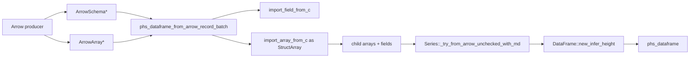

# Design Log: Polars-Haskell Arrow C Data Interface Import

## Background

The binding already supports three data interchange paths:

```haskell
fromIpcBytes :: ByteString -> IO (Either PolarsError DataFrame)
toIpcBytes :: DataFrame -> IO (Either PolarsError ByteString)
dataFrame :: [Series] -> IO (Either PolarsError DataFrame)
```

Arrow IPC is safe and convenient, and it copies through serialized bytes. The Arrow C Data Interface provides an ABI-level path where an Arrow producer shares in-memory buffers through `ArrowSchema` and `ArrowArray` plus release callbacks. Apache Arrow specifies that consumers call the base structure release callback when finished, and released structures have a null release callback.

Polars 0.53 exposes the needed Rust primitives through `polars-arrow`:

```rust
polars_arrow::ffi::import_field_from_c
polars_arrow::ffi::import_array_from_c
polars_arrow::array::StructArray
```

The Haskell `dataframe` package exports a whole table as a top-level struct `ArrowSchema` plus a top-level struct `ArrowArray` through:

```haskell
dataframeToArrow :: DataFrame -> IO (Ptr ArrowSchema, Ptr ArrowArray)
```

This design targets that standard RecordBatch shape first.

## Problem

Users need a lower-copy import path for Arrow producers such as Haskell `dataframe`, PyArrow, R nanoarrow, Julia Arrow, and C/C++ Arrow integrations. The API should keep the existing safe Haskell style around `DataFrame`, keep raw FFI details internal, and make ownership transfer explicit at the Arrow boundary.

## Questions and Answers

### Q1. Which Arrow import shape should the MVP support?

Answer: Standard Arrow RecordBatch import: a top-level struct `ArrowSchema` and a top-level struct `ArrowArray` representing a table.

Selected public shape:

```haskell
data ArrowRecordBatch

unsafeArrowRecordBatch :: Ptr schema -> Ptr array -> ArrowRecordBatch
fromArrowRecordBatch :: ArrowRecordBatch -> IO (Either PolarsError DataFrame)
```

The constructor has an `unsafe` prefix because Arrow C Data pointers are valid only when the producer follows the Arrow C Data Interface contract. The import function itself consumes the batch and returns a managed `DataFrame`.

### Q2. How should ownership work?

Answer: `fromArrowRecordBatch` consumes the top-level `ArrowSchema` and `ArrowArray`.

After pointer validation, Rust owns the two top-level Arrow structures. Rust imports the schema metadata, moves the top-level array into `polars_arrow::ffi::import_array_from_c`, marks the source array as released, and releases the schema. On success, Polars owns the imported buffers through Rust Arrow arrays until the returned `DataFrame` is freed.

### Q3. Which data types enter the MVP?

Answer: Accept every Arrow child type that Polars 0.53 can import through `polars-arrow`. Hspec tests cover `Int64` and `Utf8` with nulls because those types connect to the existing `column @Int64` and `column @Text` readers.

## Design

### Public API

Create `src/Polars/Arrow.hs`:

```haskell
module Polars.Arrow
    ( ArrowRecordBatch
    , fromArrowRecordBatch
    , unsafeArrowRecordBatch
    ) where
```

Types and functions:

```haskell
data ArrowRecordBatch = ArrowRecordBatch !(Ptr ()) !(Ptr ())

unsafeArrowRecordBatch :: Ptr schema -> Ptr array -> ArrowRecordBatch
unsafeArrowRecordBatch schema array =
    ArrowRecordBatch (castPtr schema) (castPtr array)

fromArrowRecordBatch :: ArrowRecordBatch -> IO (Either PolarsError DataFrame)
```

`Polars` re-exports `Polars.Arrow`.

Usage with a producer that returns schema and array pointers:

```haskell
(schemaPtr, arrayPtr) <- dataframeToArrow sourceDf
plDf <- Pl.fromArrowRecordBatch (Pl.unsafeArrowRecordBatch schemaPtr arrayPtr)
```

### Stable C ABI

Add a `void *` based ABI to avoid duplicate `struct ArrowSchema` and `struct ArrowArray` definitions in `include/polars_hs.h`:

```c
int phs_dataframe_from_arrow_record_batch(
  void *schema,
  void *array,
  struct phs_dataframe **out,
  struct phs_error **err
);
```

Rust casts the pointers internally:

```rust
let schema = schema.cast::<polars_arrow::ffi::ArrowSchema>();
let array = array.cast::<polars_arrow::ffi::ArrowArray>();
```

This keeps `polars_hs.h` compatible with projects that include the Apache Arrow `abi.h` header.

### Rust import flow

Add `rust/polars-hs-ffi/src/arrow.rs` and export it from `lib.rs`.



Algorithm:

1. Validate `schema`, `array`, and `out` pointers.
2. Validate both top-level release callbacks are live.
3. Import the top-level field through `import_field_from_c` and require `ArrowDataType::Struct`.
4. Move the top-level `ArrowArray` value with `ptr::read`, then set the source `release` callback to null.
5. Import the moved array through `import_array_from_c` using the struct dtype.
6. Downcast the imported array to `StructArray` and reject top-level struct nulls.
7. Deconstruct `StructArray` into child fields and child arrays.
8. Build one Polars `Series` per child:

```rust
Series::_try_from_arrow_unchecked_with_md(
    field.name.clone(),
    vec![array],
    field.dtype(),
    field.metadata.as_deref(),
)?
```

9. Convert the Series values into Columns and call `DataFrame::new_infer_height`.
10. Wrap the result with `dataframe_into_raw`.
11. Release the schema after metadata import. Array release is owned by the imported Rust Arrow arrays and runs when the resulting DataFrame drops.

### Error handling

Errors map through the existing `ffi_boundary` and `PolarsError` protocol.

Validation rules:

| Condition | Result |
| --- | --- |
| null schema pointer | `InvalidArgument` |
| null array pointer | `InvalidArgument` |
| released schema or array | `InvalidArgument` |
| top-level schema dtype outside `Struct` | `InvalidArgument` |
| top-level struct null count greater than zero | `InvalidArgument` |
| malformed Arrow buffers/schema | Polars/Arrow error copied into `PolarsError` |
| duplicate child names | `PolarsFailure` from `DataFrame::new_infer_height` |

After pointer validation, Rust releases or moves the incoming Arrow resources on success and error paths. This gives callers one ownership rule: after calling `fromArrowRecordBatch`, treat the batch as consumed.

### Testing

Rust unit tests in `rust/polars-hs-ffi/src/arrow.rs`:

1. Build a Polars/Arrow `StructArray` with `Int64` and `Utf8` children, export it through `polars_arrow::ffi`, import it through `phs_dataframe_from_arrow_record_batch`, and verify shape plus column values.
2. Pass a released `ArrowArray` and verify `PHS_INVALID_ARGUMENT`.
3. Pass a non-struct Arrow array and verify `PHS_INVALID_ARGUMENT`.
4. Pass duplicate child names and verify a Polars construction error.

Hspec tests in `test/Spec.hs`:

1. Add a small `test/ArrowRecordBatch.hs` fixture module that allocates a valid struct `ArrowSchema` and `ArrowArray` for two columns: `name :: Utf8` and `age :: Int64`, with nulls.
2. Import with `Pl.fromArrowRecordBatch (Pl.unsafeArrowRecordBatch schema array)`.
3. Verify `shape`, `column @Text`, and `column @Int64`.
4. Verify a second import attempt on the consumed pointers returns `InvalidArgument`.

## Implementation Plan

1. Add design approval gate and implementation plan before code changes.
2. Add `polars-arrow = "0.53.0"` to the Rust adapter dependencies.
3. Add Rust `arrow.rs` with the import ABI and Rust tests.
4. Add raw Haskell import in `Polars.Internal.Raw`.
5. Add public `Polars.Arrow` module and re-export it from `Polars`.
6. Add Hspec Arrow fixture helpers and import tests.
7. Update README, CHANGELOG, `package.yaml`, and generated `polars-hs.cabal`.
8. Run full verification:

```bash
cargo test --manifest-path rust/polars-hs-ffi/Cargo.toml
cargo clippy --manifest-path rust/polars-hs-ffi/Cargo.toml -- -D warnings
stack test --fast
hlint src app test
stack runghc examples/iris.hs
stack runghc examples/groupby.hs
stack runghc examples/join.hs
stack runghc examples/columns.hs
stack runghc examples/series.hs
stack runghc examples/construction.hs
```

## Examples

### Import a RecordBatch from an Arrow producer

```haskell
{-# LANGUAGE TypeApplications #-}

import qualified Polars as Pl

main :: IO ()
main = do
    (schemaPtr, arrayPtr) <- dataframeToArrow sourceDf
    result <- Pl.fromArrowRecordBatch (Pl.unsafeArrowRecordBatch schemaPtr arrayPtr)
    case result of
        Left err -> print err
        Right df -> do
            print =<< Pl.shape df
            print =<< Pl.column @Int64 df "age"
```

### Continue with existing Polars APIs

```haskell
Right df <- Pl.fromArrowRecordBatch batch
Right lf <- Pl.lazy df
Right out <- Pl.collect =<< Pl.select [Pl.col "age"] lf
```

## Trade-offs

### Benefits

- Provides a lower-copy import path from Arrow producers into Rust-owned Polars DataFrames.
- Uses the standard Arrow RecordBatch shape used by Haskell `dataframe` and common Arrow ecosystem tools.
- Keeps the repository-owned `phs_*` ABI stable with `void *` boundary pointers.
- Preserves the existing Haskell ownership model after import: the result is a managed `DataFrame` handle.

### Costs

- The pointer constructor is explicitly unsafe because C Data Interface validity is a producer-side contract.
- The MVP targets RecordBatch import only; additional Arrow export and streaming APIs can build on the same module.
- Tests need a small Arrow fixture allocator because Haskell has limited general-purpose Arrow C Data Interface tooling.

### Future extensions

- DataFrame export to Arrow C Data Interface.
- `Series` import from a single `ArrowSchema` + `ArrowArray` pair.
- Arrow C Stream import for batch iterators.
- Integration helpers for Haskell `dataframe` behind an optional package flag.
