# Design Log: Polars-Haskell Series and DataFrame Construction API

## Background

The binding now supports reading data from Polars into Haskell values:

```haskell
{-# LANGUAGE TypeApplications #-}

column @Int64 df "age" :: IO (Either PolarsError (Vector (Maybe Int64)))
column @Text  df "name" :: IO (Either PolarsError (Vector (Maybe Text)))
```

It also supports owned `Series` handles, Series transforms, append, and shift. The next step completes a basic round trip: build Series from Haskell values, assemble a DataFrame, then use the existing extraction and transform APIs.

Polars Rust 0.53 provides the construction primitives we need:

```rust
Series::new(name.into(), values)
DataFrame::new_infer_height(columns)
```

A DataFrame in Polars 0.53 is built from `Column` values, and `Series` converts into `Column` through the existing Polars conversion path.

## Problem

Users need to create small and medium DataFrames directly in Haskell for examples, tests, and programmatic data pipelines. The API should match the type-directed style already used by `column @xxx` and `seriesCast @xxx`, preserve nulls, and keep Rust ownership behind opaque handles.

## Questions and Answers

### Q1. What constructor style should the Haskell API use?

Answer: Use visible type applications for Series construction, plus a simple DataFrame constructor.

Selected API:

```haskell
class SeriesFrom a where
    series :: Text -> Vector (Maybe a) -> IO (Either PolarsError Series)

dataFrame :: [Series] -> IO (Either PolarsError DataFrame)
```

### Q2. Which element types enter the MVP?

Answer: Match the current typed extraction and cast surface: `Bool`, `Int64`, `Double`, and `Text`.

```haskell
instance SeriesFrom Bool
instance SeriesFrom Int64
instance SeriesFrom Double
instance SeriesFrom Text
```

### Q3. Where should the public functions live?

Answer: `series @xxx` lives in `Polars.Series`, and `dataFrame` lives in `Polars.DataFrame`. The convenience module `Polars` re-exports both.

## Design

### Public API

Extend `Polars.Series`:

```haskell
class SeriesFrom a where
    series :: Text -> Vector (Maybe a) -> IO (Either PolarsError Series)
```

Extend `Polars.DataFrame`:

```haskell
dataFrame :: [Series] -> IO (Either PolarsError DataFrame)
```

Usage:

```haskell
{-# LANGUAGE OverloadedStrings #-}
{-# LANGUAGE TypeApplications #-}

import Data.Int (Int64)
import qualified Data.Text as T
import qualified Data.Vector as V
import qualified Polars as Pl

mkPeople :: IO (Either Pl.PolarsError Pl.DataFrame)
mkPeople = do
    name <- Pl.series @T.Text "name" (V.fromList [Just "Alice", Just "Bob"])
    age <- Pl.series @Int64 "age" (V.fromList [Just 34, Nothing])
    active <- Pl.series @Bool "active" (V.fromList [Just True, Just False])
    score <- Pl.series @Double "score" (V.fromList [Just 9.5, Just 8.25])
    case (name, age, active, score) of
        (Right nameSeries, Right ageSeries, Right activeSeries, Right scoreSeries) ->
            Pl.dataFrame [nameSeries, ageSeries, activeSeries, scoreSeries]
        (Left err, _, _, _) -> pure (Left err)
        (_, Left err, _, _) -> pure (Left err)
        (_, _, Left err, _) -> pure (Left err)
        (_, _, _, Left err) -> pure (Left err)
```

### Encoding

Haskell encodes `Vector (Maybe a)` into the same tagged byte format used by Series extraction:

| Type | Encoding |
| --- | --- |
| `Bool` | tag `0` for null, tag `1` plus one byte `0/1` for value |
| `Int64` | tag `0` for null, tag `1` plus 8 little-endian bytes |
| `Double` | tag `0` for null, tag `1` plus 8 little-endian IEEE-754 bytes |
| `Text` | tag `0` for null, tag `1` plus u64 little-endian UTF-8 byte length plus bytes |

Add `Polars.Internal.ColumnEncode`:

```haskell
encodeBoolColumn   :: Vector (Maybe Bool) -> BS.ByteString
encodeInt64Column  :: Vector (Maybe Int64) -> BS.ByteString
encodeDoubleColumn :: Vector (Maybe Double) -> BS.ByteString
encodeTextColumn   :: Vector (Maybe Text) -> BS.ByteString
```

The module is pure and mirrors `Polars.Internal.ColumnDecode`.

### Rust ABI

Add Series constructors:

```c
int phs_series_new_bool(
  const char *name,
  const uint8_t *data,
  uintptr_t len,
  struct phs_series **out,
  struct phs_error **err
);

int phs_series_new_i64(...);
int phs_series_new_f64(...);
int phs_series_new_text(...);
```

Add DataFrame constructor:

```c
int phs_dataframe_new(
  const struct phs_series *const *series,
  uintptr_t len,
  struct phs_dataframe **out,
  struct phs_error **err
);
```

Rust decodes the tagged payload into `Vec<Option<T>>`, creates a `Series`, and returns a `phs_series` handle. `phs_dataframe_new` clones the owned Series values behind each handle, converts them into `Column`, and calls `DataFrame::new_infer_height`.

### Haskell FFI and ownership

`Polars.Internal.Raw` gains constructor imports. `Polars.Series` calls constructor imports through `withTextCString` and `BS.useAsCStringLen`, returning managed `Series` values via `seriesOut`. `Polars.DataFrame.dataFrame` uses `withSeries` over the input list, passes an array of raw Series pointers to Rust, and wraps the returned `phs_dataframe` with `mkDataFrame`.

Ownership remains stable:

```mermaid
flowchart LR
  HaskellVector[Vector Maybe values] --> Encode[tagged ByteString]
  Encode --> RustDecode[decode Vec Option]
  RustDecode --> RustSeries[Polars Series]
  RustSeries --> RawSeries[phs_series]
  RawSeries --> HaskellSeries[ForeignPtr Series]
  HaskellSeries --> RawArray[array of phs_series pointers]
  RawArray --> RustDF[Polars DataFrame]
  RustDF --> RawDF[phs_dataframe]
```



### Error handling

- malformed constructor payload returns `InvalidArgument`;
- invalid UTF-8 in text payload returns `Utf8Error`;
- null C pointers return `InvalidArgument`;
- DataFrame length mismatch and duplicate column names return `PolarsFailure` from Rust Polars;
- Haskell-side integer length overflow during encoding returns `InvalidArgument` through the public constructor call.

## Examples

### Construct and read back values

```haskell
Right age <- Pl.series @Int64 "age" (V.fromList [Just 34, Nothing, Just 29])
Right name <- Pl.series @T.Text "name" (V.fromList [Just "Alice", Just "Bob", Just "Carol"])
Right df <- Pl.dataFrame [name, age]
Pl.shape df
Pl.column @Int64 df "age"
```

### Construct then use Series transforms

```haskell
Right score <- Pl.series @Double "score" (V.fromList [Just 9.5, Just 8.25, Nothing])
Right dense <- Pl.seriesDropNulls score
Right sorted <- Pl.seriesSort Pl.defaultSeriesSortOptions dense
```

## Implementation Plan

1. Add RED Hspec tests for constructing Bool, Int64, Double, and Text Series.
2. Add RED Hspec tests for `dataFrame`, length mismatch, duplicate names, and read-back through `column @xxx`.
3. Add Rust payload decoders and Series constructor ABI functions.
4. Add Rust DataFrame constructor ABI function.
5. Add Haskell `ColumnEncode`, raw imports, and public constructor wrappers.
6. Update docs, examples, design results, and full verification.

## Trade-offs

### Benefits

- Completes the Haskell value → Series → DataFrame → typed extraction round trip.
- Reuses the existing tagged bytes format, keeping the C ABI small and stable.
- Keeps construction type-directed through `series @xxx`.
- Lets Rust Polars perform DataFrame validation for lengths and duplicate names.

### Costs

- Boxed `Vector (Maybe a)` is the MVP input representation.
- The constructor ABI copies Haskell data into Rust-owned Polars buffers.
- MVP type coverage follows the current typed read surface.

### Future extensions

- Additional numeric, temporal, and binary constructors.
- Nullable primitive vector representation for lower allocation overhead.
- Record-oriented DataFrame builders.
- Arrow C Data Interface import for high-throughput construction.

## Implementation Results

Implementation starts after design approval. Verification results, deviations, and final commit information are recorded during implementation.
