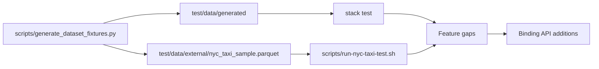

# Design Log: Dataset-Driven Testing for polars-hs

## Background

The binding now supports typed construction, column extraction, lazy operations, Arrow IPC, and Arrow C Data Interface import/export. The next quality step is to test with data shaped by external dataframe ecosystems and a real transportation dataset.

Environment probe results:

```text
uv: available
python: 3.13.12
polars via uv: 1.40.1
metasyn via uv: 2.0.0
pyarrow via uv: available
pl.datasets: absent in the current PyPI polars module
```

Polars documentation and related PRs describe example/public datasets through Hugging Face and cloud URLs. Metasyn documents fitting a `MetaFrame` to a Polars dataframe and synthesizing a new Polars dataframe. NYC Taxi public data is available as Parquet, with documented Polars public dataset references and NYC TLC trip-data files.

## Problem

Current tests use hand-written small CSV fixtures. They validate API mechanics, yet they exercise a narrow set of schemas and data distributions. We need dataset-driven tests that expose missing binding features early while keeping normal CI stable.

## Questions and Answers

### Q1. How should dataset tests enter the project?

Answer: Use small generated fixtures in normal tests, and keep NYC Taxi as an opt-in real-world test.

Selected mode:

- normal CI: generated small fixtures committed under `test/data/generated/`;
- local regeneration: Python script using `uv`, Polars, Metasyn, and PyArrow;
- real-world NYC Taxi: opt-in script that downloads or samples Parquet and runs Haskell checks.

### Q2. How do we handle `pl.datasets` availability?

Answer: The generator probes `pl.datasets`. When present, it uses `pl.datasets.load`. In the current PyPI environment, it uses Polars public dataset URLs such as the Hugging Face Polars docs iris CSV.

This gives one interface in the script:

```python
def load_polars_dataset(name: str) -> pl.DataFrame:
    if hasattr(pl, "datasets"):
        return pl.datasets.load(name)
    return fallback_public_dataset(name)
```

### Q3. What should tests implement when missing binding features appear?

Answer: The first dataset test phase should actively add missing APIs needed by the smoke tests. Each discovered API gap gets its own RED test and implementation step. Initial expected gaps are likely around numeric summaries, typed extraction coverage, and real Parquet schema handling.

## Design

### Components



### Python fixture generator

Create `scripts/generate_dataset_fixtures.py`.

Responsibilities:

1. Run under `uv run --with polars --with metasyn --with pyarrow`.
2. Generate `test/data/generated/polars_iris.csv` from `pl.datasets.load("iris")` when available, or from a Polars public iris CSV URL.
3. Generate `test/data/generated/metasyn_people.csv` by fitting `metasyn.MetaFrame` to a small Polars dataframe and synthesizing deterministic test rows where Metasyn supports seeded output.
4. Generate `test/data/generated/manifest.json` with source names, row counts, column names, and dtypes.
5. With `--nyc-taxi`, create `test/data/external/nyc_taxi_sample.parquet` from a configured NYC Taxi Parquet source, limiting rows for local testing.

### Default Hspec coverage

Add dataset smoke tests to `test/Spec.hs` or a focused test module:

```haskell
readCsv "test/data/generated/polars_iris.csv"
shape
schema
column @Double "sepal_length"
column @Text "species"
```

Metasyn fixture checks:

```haskell
readCsv "test/data/generated/metasyn_people.csv"
shape
schema
column @Text "city"
column @Int64 "age"
```

The tests should perform real assertions on row counts, selected schema fields, and null-aware typed columns.

### Opt-in NYC Taxi check

Create `scripts/run-nyc-taxi-test.sh` and `test/NYCTaxi.hs`.

Flow:

1. Ensure `test/data/external/nyc_taxi_sample.parquet` exists, generating it with `scripts/generate_dataset_fixtures.py --nyc-taxi` when absent.
2. Use `readParquet` and `scanParquet` to validate eager and lazy paths.
3. Run a query over numeric columns available in NYC Taxi, such as `passenger_count`, `trip_distance`, `fare_amount`, or `payment_type`.
4. If a needed dtype or expression helper is missing, add the feature with a RED test before updating the NYC script.

### Expected API gaps and active implementation policy

Initial work can proceed with existing APIs:

- CSV read;
- Parquet read and scan;
- shape/schema;
- `column @Text`, `column @Int64`, `column @Double`;
- lazy filter/select/group-by over numeric and string columns.

If tests require additional APIs, implement them in the smallest complete phase:

- typed extraction: add the dtype reader and corresponding Rust ABI;
- expressions: add the missing expression constructor/operator;
- IO: add reader option or scan feature only when the dataset test needs it.

### Files

Add:

- `scripts/generate_dataset_fixtures.py`
- `scripts/run-nyc-taxi-test.sh`
- `test/NYCTaxi.hs`
- `test/data/generated/polars_iris.csv`
- `test/data/generated/metasyn_people.csv`
- `test/data/generated/manifest.json`

Modify:

- `test/Spec.hs`
- `package.yaml` / `polars-hs.cabal` when adding test modules or extra source files
- `README.md`
- `CHANGELOG.md`

## Implementation Plan

1. Write generator script and run it through `uv`.
2. Commit generated small fixtures and manifest.
3. Add Hspec smoke tests for Polars public dataset fixture and Metasyn fixture.
4. Run `stack test --fast`; implement missing APIs discovered by RED failures.
5. Add opt-in NYC Taxi script and Haskell test driver.
6. Run full verification plus one opt-in NYC sample run when network/data generation succeeds.
7. Record results and any implemented API gaps.

## Examples

Generate committed smoke fixtures:

```bash
uv run --with polars --with metasyn --with pyarrow python scripts/generate_dataset_fixtures.py
```

Run real-world NYC Taxi test:

```bash
scripts/run-nyc-taxi-test.sh
```

## Trade-offs

### Benefits

- Exercises realistic schemas and data distributions.
- Keeps normal CI deterministic through committed small fixtures.
- Gives an opt-in real-world Parquet path for larger data.
- Turns feature gaps into dataset-driven RED tests.

### Costs

- Adds Python/uv tooling for fixture generation.
- NYC Taxi runs depend on network and external data availability.
- Generated fixtures need refresh rules documented in README.

### Future extensions

- Add weekly CI job for NYC Taxi opt-in test.
- Add Arrow C Data Interface round-trip against PyArrow-generated batches.
- Add dtype matrix tests generated from Polars/Metasyn schemas.
