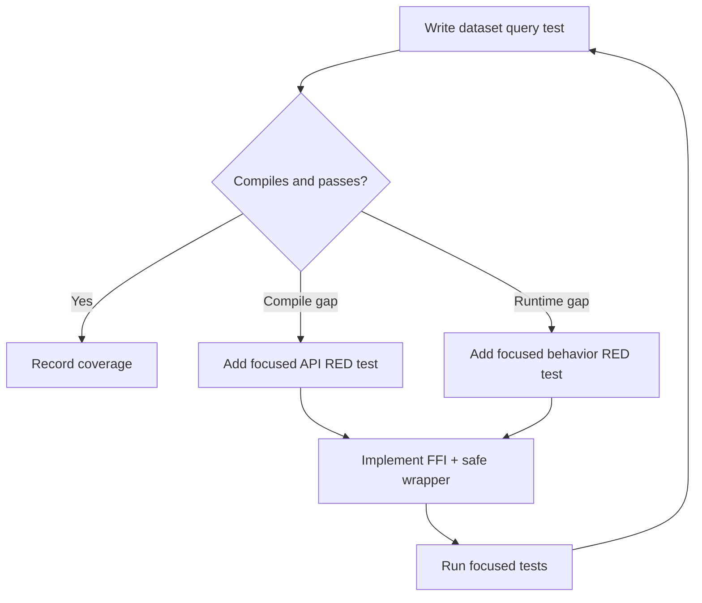

# Design Log: Dataset-Driven Query Coverage

## Background

The project now has committed dataset fixtures and an opt-in NYC Taxi runner:

```text
test/data/generated/polars_iris.csv
test/data/generated/metasyn_people.csv
test/data/generated/manifest.json
scripts/run-nyc-taxi-test.sh
test/NYCTaxi.hs
```

Existing binding coverage includes lazy CSV/Parquet scan, filter, select, withColumns, sort, limit, grouped aggregation, joins, typed column extraction, Arrow import/export, and Series transforms. The next step is to use the generated and real-world datasets as higher-level smoke tests that exercise realistic query pipelines.

Polars lazy query guidance emphasizes predicate pushdown, projection pushdown, grouping, and final collection. The tests should mirror those patterns with the Haskell binding API.

## Problem

Current tests verify each binding feature mostly with small hand-written fixtures. Dataset-driven tests should combine those features into realistic pipelines. When a query exposes a missing binding surface, that missing API should be implemented through a focused RED test before the dataset test is completed.

## Questions and Answers

### Q1. Which datasets drive the default tests?

Answer: Use committed fixtures in normal `stack test --fast`:

- `polars_iris.csv` for lazy filter/select/groupby/sort coverage;
- `metasyn_people.csv` for lazy withColumns/filter/sort coverage.

### Q2. How should NYC Taxi be used?

Answer: Keep NYC Taxi opt-in through `scripts/run-nyc-taxi-test.sh`. Extend `test/NYCTaxi.hs` with a real lazy groupby pipeline over the generated local Parquet sample.

### Q3. Should missing APIs be implemented during this phase?

Answer: Yes. Dataset tests are allowed to reveal missing functionality. Each missing API gets the smallest complete implementation needed by the test, with Rust/Haskell FFI and tests.

## Design

### Default Hspec query tests

Add a new Hspec block after the existing `Dataset-driven fixtures` block:

```haskell
describe "Dataset-driven lazy queries" $ do
    it "filters, groups, sorts, and collects the iris fixture"
    it "adds derived Metasyn columns and filters on them"
```

Iris pipeline:

```haskell
scanCsv polarsIrisCsv
filter (col "sepal_length" .> litDouble 5.0)
agg [alias "mean_sepal_width" (mean_ (col "sepal_width"))]
    (groupByStable [col "species"] lf)
sort ["species"]
collect
```

Assertions:

- shape is `(3, 2)`;
- species column is `setosa`, `versicolor`, `virginica`;
- `mean_sepal_width` has length 3 and all values are present.

Metasyn pipeline:

```haskell
scanCsv metasynPeopleCsv
withColumns [alias "score_boosted" (col "score" .+ litDouble 1.0)]
filter (col "age" .>= litInt 30)
sort ["city"]
limit 8
collect
```

Assertions:

- width is 4;
- row count is between 1 and 8;
- `score_boosted` exists as `Double`;
- `city` exists as `Text`.

### NYC Taxi opt-in query test

Extend `test/NYCTaxi.hs` with a grouped lazy query:

```haskell
scanParquet nycTaxifilter (col "fare_amount" .> litDouble 0.0)
agg
  [ alias "mean_fare" (mean_ (col "fare_amount"))
  , alias "total_distance" (sum_ (col "trip_distance"))
  ]
  (groupByStable [col "payment_type"] lf)
sort ["payment_type"]
collect
```

Assertions:

- at least one payment type group exists;
- grouped result has columns `payment_type`, `mean_fare`, and `total_distance`;
- all extracted aggregate values are present for the local 5,000-row sample.

### Missing API path



Preferred query APIs:

```haskell
scanCsv :: FilePath -> IO (Either PolarsError LazyFrame)
scanParquet :: FilePath -> IO (Either PolarsError LazyFrame)
filter :: Expr -> LazyFrame -> IO (Either PolarsError LazyFrame)
withColumns :: [Expr] -> LazyFrame -> IO (Either PolarsError LazyFrame)
sort :: [Text] -> LazyFrame -> IO (Either PolarsError LazyFrame)
limit :: Word -> LazyFrame -> IO (Either PolarsError LazyFrame)
agg :: [Expr] -> GroupBy -> IO (Either PolarsError LazyFrame)
column @Text :: Text -> DataFrame -> IO (Either PolarsError (Vector (Maybe Text)))
column @Double :: Text -> DataFrame -> IO (Either PolarsError (Vector (Maybe Double)))
column @Int64 :: Text -> DataFrame -> IO (Either PolarsError (Vector (Maybe Int64)))
```

## Implementation Plan

1. Add RED tests to `test/Spec.hs` for iris and Metasyn query pipelines.
2. Run `stack test --fast` and record the first failure.
3. Implement any missing query API exposed by that failure.
4. Extend `test/NYCTaxi.hs` with grouped Parquet query coverage.
5. Run `scripts/run-nyc-taxi-test.sh`.
6. Run full verification:

```bash
cargo test --manifest-path rust/polars-hs-ffi/Cargo.toml
cargo clippy --manifest-path rust/polars-hs-ffi/Cargo.toml -- -D warnings
stack test --fast
hlint src app test
stack runghc examples/iris.hs
stack runghc examples/groupby.hs
stack runghc examples/join.hs
stack runghc examples/columns.hs
stack runghc examples/series.hs
stack runghc examples/construction.hs
```

7. Append implementation results and deviations to this log.

## Examples

✅ Good dataset query test:

```haskell
irisMeans `shouldSatisfy` Vector.all isJust
```

✅ Good gap handling:

```haskell
-- add a focused unit test that proves the missing binding surface before adding the dataset assertion
```

❌ Fragile assertion:

```haskell
meanSepalWidth `shouldBe` [Just 3.4313725490196076, ...]
```

Use robust shape, schema, and presence checks unless exact output is stable and central to the behavior.

## Trade-offs

- Higher-level dataset tests catch integration gaps across APIs, at the cost of less precise failure localization.
- Committed CSV fixtures keep default tests fast and reproducible.
- NYC Taxi stays opt-in because it depends on network access and a larger local Parquet sample.

## Implementation Results

Implemented files:

- `test/Spec.hs`: added `Dataset-driven lazy queries` with two tests:
  - iris CSV scan → filter → groupByStable aggregation → sort → collect;
  - Metasyn CSV scan → derived column via `withColumns` → filter → sort → limit → collect.
- `test/NYCTaxi.hs`: added opt-in NYC Taxi Parquet scan → filter → groupByStable aggregation → sort → collect coverage.
- `README.md`: documented default lazy query smoke coverage.
- `CHANGELOG.md`: recorded dataset-driven lazy query coverage.

Deviations:

- Existing `scanCsv`, `scanParquet`, `filter`, `withColumns`, `sort`, `limit`, `agg`, and typed `column @xxx` APIs covered the desired query shapes.
- The approved design log contained the implementation steps for this small follow-up.

Verification results:

```text
cargo test --manifest-path rust/polars-hs-ffi/Cargo.toml: 41 passed
cargo clippy --manifest-path rust/polars-hs-ffi/Cargo.toml -- -D warnings: passed
stack test --fast: 48 examples, 0 failures
hlint src app test: No hints
stack runghc test/NYCTaxi.hs: passed
stack runghc examples/iris.hs: passed
stack runghc examples/groupby.hs: passed
stack runghc examples/join.hs: passed
stack runghc examples/columns.hs: passed
stack runghc examples/series.hs: passed
stack runghc examples/construction.hs: passed
```
