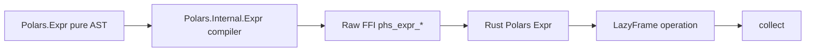

# Design Log: Complete Expression DSL

## Background

`polars-hs` currently exposes a small pure expression AST:

```haskell
data Expr
    = Column Text
    | LiteralBool Bool
    | LiteralInt Int64
    | LiteralDouble Double
    | LiteralText Text
    | Alias Text Expr
    | BinaryExpr BinaryOperator Expr Expr
    | Not Expr
    | Aggregate AggFunction Expr
```

`Polars.Internal.Expr` compiles this AST into short-lived Rust `Expr` handles through `phs_expr_*` functions. Lazy APIs accept pure `Expr` values, compile them at the FFI boundary, and keep the public surface safe.

Upstream Polars 0.53 exposes a broad expression API across core expressions, conditional expressions, casts, null/NaN predicates, statistics, cumulative operations, ranking, string namespace, temporal namespace, collection namespaces, windows, rolling windows, selectors, horizontal functions, and feature-gated helpers.

## Problem

The current expression DSL supports basic filters, projections, aggregations, and arithmetic. Real Polars workflows need expression parity across the high-frequency API and a clear route to full upstream coverage. The implementation must keep these properties:

- pure Haskell `Expr` construction;
- internal raw FFI only;
- stable Rust-owned `phs_*` ABI;
- typed errors through `Either PolarsError a`;
- dataset-driven and Arrow-driven tests.

## Questions and Answers

### Q1. What does “complete Expression DSL” mean?

Answer: Match the Rust Polars 0.53 expression surface available through stable Rust APIs and crate features used by this adapter. The roadmap covers core expressions, string, temporal, list, array, struct, window, rolling, horizontal, range, and selector-style helpers.

### Q2. How should the implementation be staged?

Answer: Implement full coverage through multiple small phases. Each phase adds a coherent expression family, focused Rust ABI, Hspec RED tests, Rust ABI tests, and verification.

### Q3. What is the first implementation phase?

Answer: Foundation/Core expressions:

- cast / strictCast;
- null and NaN predicates;
- fillNull / fillNan;
- conditional `whenThenOtherwise`;
- richer aggregations and stats: median, std, var, quantile, nUnique;
- cumulative ops: cumCount, cumSum, cumProd, cumMin, cumMax;
- rank;
- slice, expression filter, sortBy;
- window `over`.

### Q4. How should opcode drift be managed?

Answer: Keep opcodes private to `Polars.Internal.Expr` and `rust/polars-hs-ffi/src/expr.rs`. Public APIs use named Haskell constructors. Tests cover each opcode family.

### Q5. How should feature-gated upstream APIs be handled?

Answer: Expand Rust `polars` features in `rust/polars-hs-ffi/Cargo.toml` as phases require them. Each phase records the enabled feature list and the API family it unlocks.

## Design

### Architecture

The public DSL remains a pure AST. The compiler maps AST nodes to Rust expression handles at lazy-operation boundaries.



### Public Haskell modules

`Polars.Expr` becomes the main constructor module. `Polars.Operators` keeps symbolic operators.

Planned public additions:

```haskell
data DataTypeCode
    = CastBool
    | CastInt64
    | CastFloat64
    | CastUtf8
    | CastDate
    | CastDatetime
    | CastTime
    | CastDuration

cast :: DataTypeCode -> Expr -> Expr
strictCast :: DataTypeCode -> Expr -> Expr

isNull :: Expr -> Expr
isNotNull :: Expr -> Expr
isNan :: Expr -> Expr
isNotNan :: Expr -> Expr
isFinite :: Expr -> Expr
isInfinite :: Expr -> Expr

fillNull :: Expr -> Expr -> Expr
fillNan :: Expr -> Expr -> Expr

whenThenOtherwise :: Expr -> Expr -> Expr -> Expr

median_ :: Expr -> Expr
std_ :: Word8 -> Expr -> Expr
var_ :: Word8 -> Expr -> Expr
quantile_ :: QuantileMethod -> Expr -> Expr -> Expr
nUnique_ :: Expr -> Expr

cumCount :: Bool -> Expr -> Expr
cumSum :: Bool -> Expr -> Expr
cumProd :: Bool -> Expr -> Expr
cumMin :: Bool -> Expr -> Expr
cumMax :: Bool -> Expr -> Expr

rank :: RankOptions -> Expr -> Expr
sliceExpr :: Expr -> Expr -> Expr -> Expr
filterExpr :: Expr -> Expr -> Expr
sortByExpr :: [Expr] -> SortMultipleOptions -> Expr -> Expr
over :: [Expr] -> Expr -> Expr
```

Later phases add namespace helpers:

```haskell
strContains :: Expr -> Expr -> Expr
strStartsWith :: Expr -> Expr -> Expr
strEndsWith :: Expr -> Expr -> Expr
strReplace :: Expr -> Expr -> Expr -> Expr
strToLowercase :: Expr -> Expr
strToUppercase :: Expr -> Expr
strLenBytes :: Expr -> Expr
strLenChars :: Expr -> Expr
strSlice :: Expr -> Expr -> Expr -> Expr
strStrptime :: StrptimeOptions -> DataTypeCode -> Expr -> Expr

dtStrftime :: Text -> Expr -> Expr
dtYear :: Expr -> Expr
dtMonth :: Expr -> Expr
dtDay :: Expr -> Expr
dtHour :: Expr -> Expr
dtMinute :: Expr -> Expr
dtSecond :: Expr -> Expr

listLen :: Expr -> Expr
listContains :: Expr -> Expr -> Expr
listGet :: Expr -> Expr -> Expr
arrayLen :: Expr -> Expr
arrayContains :: Expr -> Expr -> Expr
structFieldByName :: Text -> Expr -> Expr
```

### Internal AST

`Expr` gains family nodes instead of one constructor per upstream function:

```haskell
data Expr
    = Column Text
    | LiteralBool Bool
    | LiteralInt Int64
    | LiteralDouble Double
    | LiteralText Text
    | Alias Text Expr
    | BinaryExpr BinaryOperator Expr Expr
    | Not Expr
    | Aggregate AggFunction Expr
    | Cast CastOptions Expr
    | Unary UnaryFunction Expr
    | BinaryFunction BinaryFunction Expr Expr
    | TernaryFunction TernaryFunction Expr Expr Expr
    | NaryFunction NaryFunction [Expr]
    | Window WindowOptions Expr [Expr]
    | StringFunction StringFunction Expr [Expr]
    | TemporalFunction TemporalFunction Expr [Expr]
    | ListFunction ListFunction Expr [Expr]
    | ArrayFunction ArrayFunction Expr [Expr]
    | StructFunction StructFunction Expr [Expr]
```

This keeps public APIs typed and keeps FFI compact.

### Rust ABI

Foundation phase adds generic ABI families:

```c
int phs_expr_cast(int dtype_code, bool strict, const phs_expr *expr, phs_expr **out, phs_error **err);
int phs_expr_unary(int op, const phs_expr *expr, phs_expr **out, phs_error **err);
int phs_expr_binary_function(int op, const phs_expr *left, const phs_expr *right, phs_expr **out, phs_error **err);
int phs_expr_ternary_function(int op, const phs_expr *a, const phs_expr *b, const phs_expr *c, phs_expr **out, phs_error **err);
int phs_expr_nary_function(int op, const phs_expr *const *exprs, size_t len, phs_expr **out, phs_error **err);
int phs_expr_window_over(const phs_expr *expr, const phs_expr *const *partition_by, size_t len, phs_expr **out, phs_error **err);
```

Later phases add namespace-specific ABI families:

```c
int phs_expr_string_function(int op, const phs_expr *expr, const phs_expr *const *args, size_t len, phs_expr **out, phs_error **err);
int phs_expr_temporal_function(int op, const phs_expr *expr, const phs_expr *const *args, size_t len, phs_expr **out, phs_error **err);
int phs_expr_list_function(int op, const phs_expr *expr, const phs_expr *const *args, size_t len, phs_expr **out, phs_error **err);
int phs_expr_array_function(int op, const phs_expr *expr, const phs_expr *const *args, size_t len, phs_expr **out, phs_error **err);
int phs_expr_struct_function(int op, const phs_expr *expr, const phs_expr *const *args, size_t len, phs_expr **out, phs_error **err);
```

### Cargo features

The full expression roadmap needs additional Polars features beyond the current set:

```toml
features = [
  "lazy", "csv", "parquet", "ipc", "fmt", "strings", "temporal",
  "dtype-full", "is_between", "is_in", "is_unique",
  "is_first_distinct", "is_last_distinct", "is_close",
  "rank", "cum_agg", "round_series", "replace",
  "list_eval", "list_any_all", "list_count", "list_drop_nulls",
  "list_filter", "list_gather", "list_sets", "list_to_struct",
  "array_any_all", "array_arithmetic", "array_count", "array_to_struct",
  "dtype-struct", "rolling_window", "rolling_window_by",
  "range", "concat_str"
]
```

The exact feature list can be reduced during implementation when Cargo reports feature names accepted by Polars 0.53.

### Testing

Each phase uses the same TDD loop:

1. Add Hspec tests that fail because constructors or FFI are absent.
2. Add Rust ABI tests for opcode dispatch.
3. Implement Haskell AST constructors and compiler cases.
4. Implement Rust ABI mapping to Polars expressions.
5. Run focused tests.
6. Run full verification.

Core test fixture strategy:

- `test/data/values.csv` for null, NaN, fill, cast, and stats;
- generated iris fixture for string and numeric pipeline tests;
- Metasyn fixture for conditionals, rank, cumulative, and sortBy;
- NYC Taxi opt-in fixture for temporal/string/rolling as those APIs land;
- Arrow fixtures for dtype compatibility.

## Implementation Phases

### Phase 1: Foundation/Core

Files:

- `src/Polars/Expr.hs`
- `src/Polars/Internal/Expr.hs`
- `src/Polars/Internal/Raw.hs`
- `rust/polars-hs-ffi/src/expr.rs`
- `rust/polars-hs-ffi/Cargo.toml`
- `include/polars_hs.h`
- `test/Spec.hs`
- `CHANGELOG.md`
- `README.md`

Deliverables:

- casts, null/NaN predicates, fill, conditionals;
- median/std/var/quantile/nUnique;
- cumulative ops, rank, slice/filter/sortBy, window over;
- Hspec coverage through lazy `select`, `withColumns`, `filter`, and `groupByStable` contexts.

### Phase 2: String namespace

Deliverables:

- contains, startsWith, endsWith, replace, replaceAll, strip, lowercase, uppercase, lenBytes, lenChars, slice, strptime;
- dataset tests over iris and Metasyn text columns.

### Phase 3: Temporal namespace

Deliverables:

- date/time field extraction, formatting, rounding/truncation subset, timezone subset supported by Polars Rust 0.53;
- NYC Taxi opt-in tests over timestamp columns after fixture generation includes temporal columns.

### Phase 4: Collection namespaces

Deliverables:

- list/array len, contains, get/gather, sort, unique, slice, eval subset;
- struct field extraction by name;
- Arrow fixture tests for nested arrays and structs.

### Phase 5: Advanced expression families

Deliverables:

- rolling expressions, horizontal functions, range functions, replace strict, selector-style helper coverage;
- additional feature flags and regression tests.

## Examples

✅ Core expressions:

```haskell
Pl.select
  [ Pl.alias "age_filled" (Pl.fillNull (Pl.col "age") (Pl.litInt 0))
  , Pl.alias "score_rank" (Pl.rank Pl.defaultRankOptions (Pl.col "score"))
  ]
```

✅ Conditional expression:

```haskell
Pl.withColumns
  [ Pl.alias "age_band" $
      Pl.whenThenOtherwise
        (Pl.col "age" Pl..>= Pl.litInt 40)
        (Pl.litText "senior")
        (Pl.litText "junior")
  ]
```

✅ Window expression:

```haskell
Pl.withColumns
  [ Pl.alias "species_mean" $
      Pl.over [Pl.col "species"] (Pl.mean_ (Pl.col "sepal_width"))
  ]
```

## Trade-offs

- Generic ABI families reduce C ABI surface while keeping public Haskell functions named and typed.
- Phased implementation keeps each commit reviewable and gives users working DSL improvements after every phase.
- Feature expansion increases Rust compile time and binary size while enabling expression parity with upstream Polars.
- A pure AST gives stable Haskell values and simple tests; it requires explicit compiler coverage for every expression family.

## Approval State

The user selected full upstream expression coverage and approved the phased design direction. This design log defines the full route and makes Phase 1 the first implementation target.
