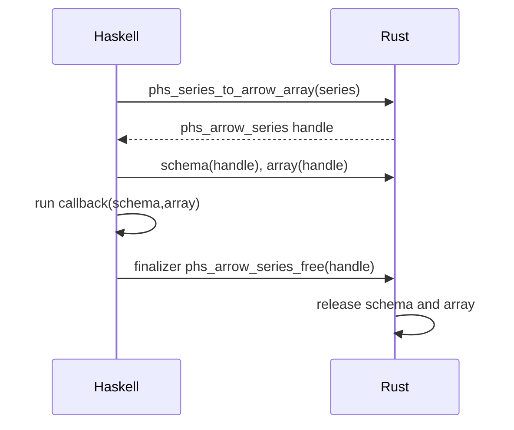

# Design Log: Series Arrow C Data Interface

## Background

`Polars.Arrow` currently supports Arrow C Data Interface RecordBatch import/export for whole `DataFrame` values:

```haskell
unsafeArrowRecordBatch :: Ptr schema -> Ptr array -> ArrowRecordBatch
fromArrowRecordBatch :: ArrowRecordBatch -> IO (Either PolarsError DataFrame)
withArrowRecordBatch :: DataFrame -> (Ptr schema -> Ptr array -> IO a) -> IO (Either PolarsError a)
```

The project also exposes owned `Series` handles with typed construction, transforms, and typed extraction. A single-column Arrow interop surface lets callers exchange one Arrow `Field` + `Array` pair without wrapping it in a struct RecordBatch.

Polars Rust 0.53 exposes `Series::to_arrow(chunk_idx, CompatLevel)` for Arrow export and `Series::_try_from_arrow_unchecked_with_md` for Arrow array import. `polars-arrow` exposes `export_field_to_c`, `export_array_to_c`, `import_field_from_c`, and `import_array_from_c` for Arrow C Data Interface ownership transfer.

## Problem

Callers that already hold a single Arrow array need a safe Haskell API to create a managed `Series`. Callers with a managed `Series` need callback-scoped Arrow C Data Interface pointers. The public Haskell API should stay safe while pointer validity stays explicit at the unsafe boundary.

## Questions and Answers

### Q1. What public API should be added?

Answer: Extend `Polars.Arrow` with a single-Series wrapper:

```haskell
data ArrowSeries
unsafeArrowSeries :: Ptr schema -> Ptr array -> ArrowSeries
fromArrowSeries :: ArrowSeries -> IO (Either PolarsError Series)
withArrowSeries :: Series -> (Ptr schema -> Ptr array -> IO a) -> IO (Either PolarsError a)
```

### Q2. What ownership model should import use?

Answer: Match `fromArrowRecordBatch`. `fromArrowSeries` consumes producer pointers. Rust imports the field, releases the schema, takes the Arrow array by value, marks the source C array as released, imports it into a Polars array, and returns a Rust-owned `Series`.

### Q3. What ownership model should export use?

Answer: Match `withArrowRecordBatch`. Rust owns an opaque export handle containing boxed `ArrowSchema` and `ArrowArray`. Haskell exposes pointers only during the callback and finalizes the handle afterwards.

### Q4. How should chunked Series export behave?

Answer: Export a single Arrow array by rechunking the Series first, then exporting chunk 0. This gives one `ArrowArray` matching the Haskell API shape.

## Design

### Haskell API

`Polars.Arrow` gains:

```haskell
data ArrowSeries = ArrowSeries !(Ptr ()) !(Ptr ())

unsafeArrowSeries :: Ptr schema -> Ptr array -> ArrowSeries
fromArrowSeries :: ArrowSeries -> IO (Either PolarsError Series)
withArrowSeries :: Series -> (Ptr schema -> Ptr array -> IO a) -> IO (Either PolarsError a)
```

The raw pointer wrapper is unsafe because Arrow C Data Interface validity comes from the producer.

### Rust ABI

Add opaque handle and functions:

```c
typedef struct phs_arrow_series phs_arrow_series;

int phs_series_to_arrow_array(
  const struct phs_series *series,
  struct phs_arrow_series **out,
  struct phs_error **err);

void *phs_arrow_series_schema(struct phs_arrow_series *series);
void *phs_arrow_series_array(struct phs_arrow_series *series);
void phs_arrow_series_free(struct phs_arrow_series *series);

int phs_series_from_arrow_array(
  void *schema,
  void *array,
  struct phs_series **out,
  struct phs_error **err);
```

### Import implementation

Rust flow:

```rust
let field = import_field_from_c(&*schema)?;
release_schema(schema);
let array_value = take_array(array)?;
let imported = import_array_from_c(array_value, field.dtype.clone())?;
let series = Series::_try_from_arrow_unchecked_with_md(
    field.name.clone(),
    vec![imported],
    field.dtype(),
    field.metadata.as_deref(),
)?;
```

Validation rules:

- null schema pointer → `InvalidArgument`;
- null array pointer → `InvalidArgument`;
- already released schema or array → `InvalidArgument`;
- Arrow import/conversion failure → `PolarsFailure` through existing error conversion.

### Export implementation

Rust flow:

```rust
let series = handle.value.rechunk();
let compat_level = CompatLevel::newest();
let field = series.field().to_arrow(compat_level);
let array = series.to_arrow(0, compat_level);
let schema = Box::new(export_field_to_c(&field));
let array = Box::new(export_array_to_c(array));
```

Callback lifecycle:



## Implementation Plan

1. Add focused Hspec tests using a C Arrow Int64 array fixture:
   - `fromArrowSeries` imports `age :: Int64` with null preservation;
   - `withArrowSeries` exports and reimports a `Series` preserving name, dtype, length, null count, and values;
   - null Arrow pointers return `InvalidArgument`.
2. Extend `test/cbits/arrow_record_batch.c` and `test/ArrowRecordBatch.hs` with a single Arrow array fixture.
3. Add Rust ABI in `rust/polars-hs-ffi/src/arrow.rs` with unit tests.
4. Add raw imports and finalizer in `src/Polars/Internal/Raw.hs`.
5. Add safe wrappers in `src/Polars/Arrow.hs` and export through `Polars` re-export.
6. Build to regenerate `include/polars_hs.h`.
7. Run full verification.
8. Append implementation results and deviations.

## Examples

✅ Import a single Arrow array:

```haskell
withAgeArray $ \schema array -> do
  result <- fromArrowSeries (unsafeArrowSeries schema array)
  case result of
    Right s -> seriesInt64 s `shouldReturn` Right (V.fromList [Just 34, Nothing, Just 29])
```

✅ Export callback scope:

```haskell
withArrowSeries ages $ \schema array ->
  fromArrowSeries (unsafeArrowSeries schema array)
```

❌ Persisting callback pointers:

```haskell
ref <- newIORef nullPtr
withArrowSeries s $ \_ array -> writeIORef ref array
```

The callback pointer is scoped to the callback.

## Trade-offs

- Rechunking during export gives a simple single-array API and copies data when a Series has multiple chunks.
- The API mirrors DataFrame RecordBatch interop, so users learn one ownership model.
- Struct/list arrays can be imported by Polars when supported by the Rust crate, while typed Haskell extraction remains limited to implemented `Series` readers.

## Implementation Results

Implemented files:

- `rust/polars-hs-ffi/src/arrow.rs`
  - Added opaque `phs_arrow_series` export handle.
  - Added `phs_series_to_arrow_array`, `phs_arrow_series_schema`, `phs_arrow_series_array`, `phs_arrow_series_free`, and `phs_series_from_arrow_array`.
  - Added Rust tests for live export pointers, import, export/import round-trip, empty Series round-trip, and null pointer errors.
- `include/polars_hs.h`
  - Regenerated C ABI declarations through the Rust build script.
- `src/Polars/Internal/Raw.hs`
  - Added raw FFI imports and `RawArrowSeries`.
- `src/Polars/Arrow.hs`
  - Added `ArrowSeries`, `unsafeArrowSeries`, `fromArrowSeries`, and `withArrowSeries`.
- `test/cbits/arrow_record_batch.c` and `test/ArrowRecordBatch.hs`
  - Added a test-only `age :: Int64` Arrow Field/Array fixture.
- `test/Spec.hs`
  - Added Hspec tests for Arrow Series import, null pointer errors, and Series export/import round-trip.
- `README.md` and `CHANGELOG.md`
  - Documented single-array Series Arrow interop.

Deviations:

- The implementation stayed within the approved design.
- Export also gained Rust coverage for empty Series round-trip, strengthening the rechunk-and-export path.

Verification results:

```text
cargo test --manifest-path rust/polars-hs-ffi/Cargo.toml: 46 passed
cargo clippy --manifest-path rust/polars-hs-ffi/Cargo.toml -- -D warnings: passed
stack test --fast: 51 examples, 0 failures
hlint src app test: No hints
stack runghc test/NYCTaxi.hs: passed
stack runghc examples/iris.hs: passed
stack runghc examples/groupby.hs: passed
stack runghc examples/join.hs: passed
stack runghc examples/columns.hs: passed
stack runghc examples/series.hs: passed
stack runghc examples/construction.hs: passed
```
