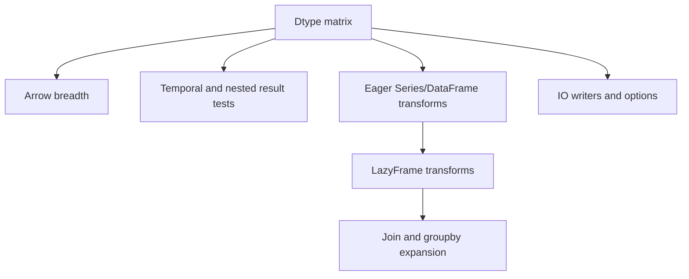

# Design Log: Polars 0.53 Parity Expansion

## Background

`polars-hs` binds Rust Polars 0.53 through a Rust-owned `phs_*` C ABI and safe
Haskell wrappers. The current parity workspace starts from bookmark
`expression-dsl-string` at commit `6abbf574`, which already includes the
Expression DSL string, temporal, list starter, scalar predicate, horizontal,
name, and string n-ary batches.

The upstream audit used local Polars 0.53 crate source, docs.rs, Context7, and
project memories. Major upstream families are DataFrame and Series eager
operations, LazyFrame transformations and plan introspection, expression
namespaces, IO readers/writers/options, joins, groupby/time-series, dtypes, and
Arrow interop.

## Problem

The binding has useful MVP coverage, while upstream Polars exposes a much larger
surface. The next implementation session needs a concrete task graph that keeps
changes small enough to test and review while advancing toward complete Polars
0.53 parity.

The strongest dependency chain is:



## Questions and Answers

### Q1. What is the implementation baseline?

Answer: Use `.worktrees/polars-parity-2`, whose working-copy parent is
`expression-dsl-string` commit `6abbf574`.

### Q2. Which feature should start implementation?

Answer: Data Type Matrix Phase 1. It extends existing tagged byte column
encoding and Rust Series constructors, and it unlocks reliable tests for casts,
schema, Arrow, IO round-trips, and later temporal/nested work.

### Q3. How should "all Polars features" be scoped?

Answer: The target is Rust Polars 0.53 parity through stable Haskell APIs. Each
task ships one coherent feature family with Hspec result tests, Rust ABI tests,
docs, and verification. Version upgrades are separate tasks after 0.53 coverage
stabilizes.

### Q4. Which features need broader design before code?

Answer: Nested `List/Array/Struct`, temporal scalar representation, cloud IO,
SQLContext, dynamic/rolling groupby, and selectors need focused design logs
before implementation because they affect public types, feature gates, and test
infrastructure.

## Design

### Coverage Matrix

| Area | Current coverage at `6abbf574` | First parity tasks |
| --- | --- | --- |
| Dtypes | Bool, Int64, Double, Text construction/extraction/casts; schema parses more names | Int8/16/32, UInt8/16/32/64, Float32 constructors/readers/casts/schema/Arrow |
| Arrow | RecordBatch import/export, Series single-array import/export | Scalar dtype breadth, then Arrow C Stream and nested dtype fixtures |
| Expr | Core plus string/temporal/list starter/scalar/horizontal/name/string n-ary batches | Remaining list/array/struct, temporal return dtypes, rolling, selectors, meta |
| LazyFrame | scanCsv/scanParquet/filter/select/withColumns/sort/limit/collect/groupBy/join | explain/profile/drop/rename/slice/head/tail/dropNulls/fill/nullCount/unique/explode |
| DataFrame | readCsv/readParquet/construction/shape/schema/head/tail/text/column | eager select/drop/rename/slice/filter/sort/reverse/nullCount/dropNulls/fill/unique |
| Series | construction/metadata/head/tail/rename/cast/sort/unique/reverse/dropNulls/shift/append | filter/take/slice/fill/null predicates/arithmetic/stats |
| IO | eager CSV/Parquet read, lazy CSV/Parquet scan, IPC bytes/files | CSV/Parquet writers, reader/scan options, IPC scan, JSON/NDJSON, Avro |
| Joins | lazy inner/left/right/full | semi/anti/cross, then asof and non-equi |
| GroupBy | lazy groupBy/groupByStable/agg | eager groupby, dynamic groupby, rolling groupby |

### Public API Principles

- Keep public expressions pure Haskell values and compile at FFI boundaries.
- Use typed option records for APIs with more than two configuration values.
- Return `Either PolarsError a` for recoverable Polars and FFI failures.
- Keep Rust ABI compact: family functions with opcodes for small expression
  namespaces, dedicated ABI for ownership-heavy operations.
- Add Cargo features only with tests that exercise the delivered API.

### First Implementation Batch

Data Type Matrix Phase 1 adds:

```haskell
series @Int8
series @Int16
series @Int32
series @Word8
series @Word16
series @Word32
series @Word64
series @Float

column @Int8
column @Int16
column @Int32
column @Word8
column @Word16
column @Word32
column @Word64
column @Float

seriesCast @Int8
seriesCast @Int16
seriesCast @Int32
seriesCast @Word8
seriesCast @Word16
seriesCast @Word32
seriesCast @Word64
seriesCast @Float
```

The Rust side adds typed constructors, value readers, and dtype codes for the
same matrix. Haskell encoders/decoders extend the existing tag format with
little-endian fixed-width payloads.

## Implementation Plan

### Phase 0: Workspace and Baseline

1. Use `.worktrees/polars-parity-2`.
2. Install GHC 9.12.2 for Stack if absent.
3. Run:
   - `cargo test --manifest-path rust/polars-hs-ffi/Cargo.toml`
   - `stack test --fast`

### Phase 1: Data Type Matrix Phase 1

Files:
- `src/Polars/Internal/ColumnEncode.hs`
- `src/Polars/Internal/ColumnDecode.hs`
- `src/Polars/Series.hs`
- `src/Polars/Column.hs`
- `src/Polars/Internal/Raw.hs`
- `rust/polars-hs-ffi/src/series.rs`
- `rust/polars-hs-ffi/src/dataframe.rs`
- `include/polars_hs.h`
- `test/Spec.hs`
- `test/ArrowRecordBatch.hs`
- `README.md`
- `CHANGELOG.md`

Steps:
1. Add RED Hspec tests for all new constructor/extractor/cast/schema cases.
2. Add RED Arrow RecordBatch and Series round-trip tests for the same dtypes.
3. Implement Haskell encoders/decoders.
4. Implement Rust constructors/readers/dtype code mapping.
5. Wire Raw imports and public instances.
6. Run focused tests, then full verification.

### Phase 2: LazyFrame Plan and Transformations

Add `explain`, `profile`, `drop`, `rename`, `slice`, `head`, `tail`,
`dropNulls`, `fillNull`, `fillNan`, `nullCount`, `unique`, and `explode`.
Tests assert plan text and result-level fixture behavior.

### Phase 3: IO Writers and Options

Add write CSV and write Parquet first. Then add minimal reader/scan option
records for CSV/Parquet. Tests use temp-file round trips.

### Phase 4: Join Modes

Add semi, anti, and cross joins. Tests cover matched rows, unmatched rows, and
cross-product counts.

### Phase 5: Eager Series/DataFrame Transforms

Add eager DataFrame select/drop/rename/slice/filter/sort/reverse/nullCount and
Series filter/take/slice/fill/predicates/arithmetic/stats.

### Phase 6: Nested and Temporal Follow-through

Design and implement structured schema ABI, temporal scalar newtypes, binary,
list/array/struct constructors/extractors, and broader Arrow interop.

## Examples

✅ Dtype matrix test shape:

```haskell
Right s <- series @Int32 "i32" (V.fromList [Just 1, Nothing, Just (-2)])
Right df <- dataFrame [s]
column @Int32 df "i32" `shouldReturn` Right (V.fromList [Just 1, Nothing, Just (-2)])
```

✅ Cast test shape:

```haskell
Right input <- series @Int64 "value" (V.fromList [Just 1, Nothing, Just 255])
Right casted <- seriesCast @Word8 input
seriesWord8 casted `shouldReturn` Right (V.fromList [Just 1, Nothing, Just 255])
```

## Trade-offs

- Dtype expansion touches shared encoding and FFI code, but it has clear tests
  and unlocks many later features.
- LazyFrame transformations are user-visible and smaller, but they benefit from
  the dtype matrix for richer fixture assertions.
- IO writers improve practical workflows quickly, but robust reader options and
  cloud support need separate option-record design.
- Complete Polars parity is a sequence of small verified batches. Each batch
  leaves the repository in a testable state and records implementation results.

## Implementation Results

### 2026-05-16: Phase 1 Data Type Matrix

Implemented scalar dtype matrix coverage for:

```haskell
Int8, Int16, Int32, Word8, Word16, Word32, Word64, Float
```

Public API additions:
- `SeriesFrom` instances for the new scalar dtypes.
- `SeriesCast` instances aligned with the existing expression dtype code order.
- `seriesInt8`, `seriesInt16`, `seriesInt32`, `seriesWord8`, `seriesWord16`,
  `seriesWord32`, `seriesWord64`, and `seriesFloat`.
- `Column` instances and named `column*` helpers for the same dtype set.

Rust ABI additions:
- `phs_series_new_i8/i16/i32/u8/u16/u32/u64/f32`.
- `phs_series_values_i8/i16/i32/u8/u16/u32/u64/f32`.
- `phs_dataframe_column_i8/i16/i32/u8/u16/u32/u64/f32`.
- Updated `phs_series_cast` dtype mapping through `Float32` and `String`.

Test coverage added:
- Series construction/extraction/casting for all Phase 1 scalar dtypes.
- DataFrame construction, schema parsing, and typed column extraction.
- Arrow RecordBatch round-trip for all Phase 1 scalar dtypes.
- Arrow single Series round-trip for all Phase 1 scalar dtypes.

Verification:

```bash
cargo test --manifest-path rust/polars-hs-ffi/Cargo.toml
# 85 passed

PATH="$HOME/.ghcup/bin:$PATH" stack --system-ghc test --fast
# 79 examples, 0 failures

hlint src app test
# No hints

git diff --check
# passed
```

Deviations:
- `test/ArrowRecordBatch.hs` already supported the needed scalar Arrow arrays,
  so the Hspec coverage landed in `test/Spec.hs`.
- Direct DataFrame column reader ABI was added for parity with existing
  `phs_dataframe_column_i64/f64/text/bool`, while public Haskell `column @a`
  continues through `column @Series` plus typed Series extraction.
