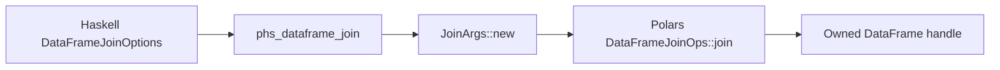

# Polars HS Eager DataFrame Join Design

## Background

Rust Polars 0.53 exposes eager DataFrame joins through
`DataFrameJoinOps::join(other, left_on, right_on, JoinArgs, options)`.
`JoinArgs` carries the join type and optional suffix. The pinned crate also
enables `semi_anti_join` and `cross_join`.

Docs checked:

- https://docs.rs/polars/latest/polars/prelude/trait.DataFrameJoinOps.html
- https://docs.pola.rs/api/rust/dev/polars_ops/frame/join/struct.JoinArgs.html

Local source checked:

- `polars-ops-0.53.0/src/frame/join/mod.rs`
- `polars-ops-0.53.0/src/frame/join/args.rs`

## Problem

`polars-hs` already supports lazy joins, while eager DataFrame users must scan or
convert into lazy execution to combine two in-memory DataFrames. Eager join
coverage closes a major DataFrame operation gap and can reuse the existing join
fixtures.

## Questions and Answers

Q: Should eager joins reuse lazy `JoinOptions`?

A: Use a DataFrame-specific options type. Lazy join keys are `Expr`, eager join
keys are column names, so separate types keep the public surface explicit.

Q: Which join modes belong in this batch?

A: Include the join modes already enabled for lazy joins: inner, left, right,
full, semi, anti, and cross.

Q: Should this batch add null-equality, validation, coalescing, and maintain
order controls?

A: Keep those as a later options expansion. This batch mirrors the existing lazy
join MVP: type, key names, and suffix.

## Design

Public API:

```haskell
data DataFrameJoinType
    = DataFrameJoinInner
    | DataFrameJoinLeft
    | DataFrameJoinRight
    | DataFrameJoinFull
    | DataFrameJoinSemi
    | DataFrameJoinAnti
    | DataFrameJoinCross

data DataFrameJoinOptions = DataFrameJoinOptions
    { dataFrameJoinType :: !DataFrameJoinType
    , dataFrameJoinLeftOn :: ![Text]
    , dataFrameJoinRightOn :: ![Text]
    , dataFrameJoinSuffix :: !(Maybe Text)
    }

defaultDataFrameJoinOptions :: DataFrameJoinOptions
dataFrameJoin :: DataFrameJoinOptions -> DataFrame -> DataFrame -> IO (Either PolarsError DataFrame)
```

C ABI:

```c
int phs_dataframe_join(const phs_dataframe *left,
                       const phs_dataframe *right,
                       const char *const *left_on,
                       uintptr_t left_len,
                       const char *const *right_on,
                       uintptr_t right_len,
                       int join_type,
                       const char *suffix,
                       phs_dataframe **out,
                       phs_error **err);
```

Rust mapping:

```rust
let mut args = JoinArgs::new(join_type);
if let Some(suffix) = suffix {
    args = args.with_suffix(Some(suffix));
}
left.join(right, left_on, right_on, args, None)
```

For cross joins, the ABI validates empty key lists and calls the same `join`
entrypoint with `JoinType::Cross`.



## Implementation Plan

1. Add RED Hspec tests for eager inner, left, cross, suffix, and validation.
2. Add DataFrame-specific join types and Haskell validation.
3. Add Raw.hs import and C header declaration.
4. Add Rust `phs_dataframe_join` using `DataFrameJoinOps::join`.
5. Add Rust FFI tests for success and invalid join type/key counts.
6. Run focused Hspec and Rust tests.
7. Run full Rust, full Stack/Hspec, HLint, and `git diff --check`.
8. Append implementation results.

## Examples

Good:

```haskell
joined <-
    dataFrameJoin
        defaultDataFrameJoinOptions
            { dataFrameJoinType = DataFrameJoinLeft
            , dataFrameJoinLeftOn = ["department"]
            , dataFrameJoinRightOn = ["department"]
            }
        employees
        departments
```

Bad:

```haskell
dataFrameJoin defaultDataFrameJoinOptions employees departments
```

## Trade-offs

Separate eager join options add a small amount of API duplication, but avoid
mixing expression-keyed lazy joins with name-keyed eager joins. Later batches can
extend `DataFrameJoinOptions` with null equality, validation, coalescing, and
maintain-order controls without changing this call shape.

## Implementation Results

Implemented eager DataFrame joins through:

```haskell
dataFrameJoin :: DataFrameJoinOptions -> DataFrame -> DataFrame -> IO (Either PolarsError DataFrame)
```

Delivered `DataFrameJoinType`, `DataFrameJoinOptions`, and
`defaultDataFrameJoinOptions`. Supported join modes are inner, left, right,
full, semi, anti, and cross. Supported options are left key names, right key
names, join type, and duplicate-column suffix.

Rust ABI:

- Added `phs_dataframe_join`.
- Mapped join type codes 0-6 to Rust Polars `JoinType`.
- Used `JoinArgs::new` and `with_suffix`.
- Preserved Rust-owned output handles through `dataframe_into_raw`.

Validation:

- Cross joins require empty key lists.
- Non-cross joins require at least one left key and one right key.
- Left and right key counts must match.
- Rust validates unknown join type codes for ABI drift defense.

Tests added:

- Hspec eager inner join shape/schema/content.
- Hspec eager left, right, and full joins.
- Hspec eager semi, anti, and cross joins.
- Hspec custom suffix behavior.
- Hspec Haskell-side join option validation.
- Rust FFI inner join shape test.
- Rust FFI invalid key count and unknown join type tests.

Verification on 2026-05-17:

- RED Hspec failed on missing `dataFrameJoin`,
  `defaultDataFrameJoinOptions`, and record selectors.
- Focused Hspec: 5/5 examples passing.
- Focused Rust FFI: 2/2 tests passing.
- Full Rust FFI: 100/100 tests passing.
- Full Stack/Hspec: 148/148 examples passing.
- HLint: no hints.
- `git diff --check`: clean.
