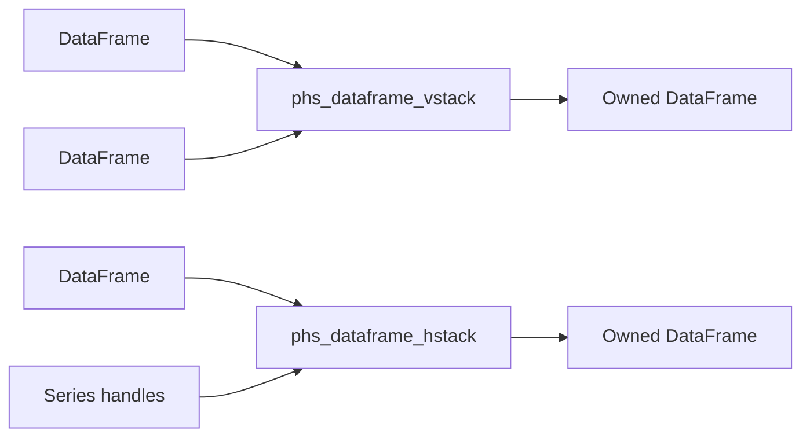

# Polars HS Eager DataFrame Stack Design

## Background

Rust Polars 0.53 exposes eager stacking operations:

```rust
DataFrame::vstack(&self, other: &DataFrame)
DataFrame::hstack(&self, columns: &[Column])
```

Docs checked:

- https://docs.rs/polars/latest/polars/frame/struct.DataFrame.html
- https://docs.rs/polars-core/latest/polars_core/frame/struct.DataFrame.html

Local source checked:

- `polars-core-0.53.0/src/frame/mod.rs`
- `polars-core-0.53.0/src/frame/horizontal.rs`

## Problem

`polars-hs` can construct DataFrames and join/filter/sort them, but it lacks
direct eager row and column stacking. Users need in-memory DataFrame append and
column-add workflows without moving through files or lazy plans.

## Questions and Answers

Q: Should this batch implement list-level concat helpers?

A: Start with binary `vstack` and Series-list `hstack`. List concat and diagonal
concat need separate option design and feature gating.

Q: Should `hstack` accept DataFrames or Series?

A: Accept Series. Rust `DataFrame::hstack` takes columns, and `Series` is the
current public column handle in `polars-hs`.

Q: Should empty hstack inputs be accepted?

A: Validate at the Haskell boundary and require at least one Series. Other
DataFrame transform APIs already reject empty lists where no visible transform
would occur.

## Design

Public API:

```haskell
dataFrameVStack :: DataFrame -> DataFrame -> IO (Either PolarsError DataFrame)
dataFrameHStack :: [Series] -> DataFrame -> IO (Either PolarsError DataFrame)
```

C ABI:

```c
int phs_dataframe_vstack(const phs_dataframe *left,
                         const phs_dataframe *right,
                         phs_dataframe **out,
                         phs_error **err);

int phs_dataframe_hstack(const phs_dataframe *dataframe,
                         const phs_series *const *series,
                         uintptr_t len,
                         phs_dataframe **out,
                         phs_error **err);
```

Rust mapping:

```rust
left.value.vstack(&right.value)?
df.value.hstack(&columns)?
```

Series handles are cloned into Polars `Column` values for `hstack`; the returned
DataFrame owns its output handle.



## Implementation Plan

1. Add RED Hspec tests for `dataFrameVStack`, `dataFrameHStack`, and validation.
2. Add Haskell exports and wrappers.
3. Add Raw.hs imports and C header declarations.
4. Add Rust ABI implementations.
5. Add Rust FFI tests for vstack/hstack success and validation/error paths.
6. Run focused Hspec and Rust tests.
7. Run full Rust, full Stack/Hspec, HLint, and `git diff --check`.
8. Append implementation results.

## Examples

Good:

```haskell
combined <- dataFrameVStack left right
wide <- dataFrameHStack [citySeries] combined
```

Bad:

```haskell
dataFrameHStack [] df
```

## Trade-offs

Binary `vstack` is small and directly mirrors Polars. Series-list `hstack`
matches the current ownership model and avoids adding a second column-handle
type. Multi-DataFrame concat variants can build on these primitives later.

## Implementation Results

Implemented public eager stacking APIs:

```haskell
dataFrameVStack :: DataFrame -> DataFrame -> IO (Either PolarsError DataFrame)
dataFrameHStack :: [Series] -> DataFrame -> IO (Either PolarsError DataFrame)
```

Added C ABI functions:

- `phs_dataframe_vstack`
- `phs_dataframe_hstack`

Rust mapping:

- `phs_dataframe_vstack` calls `DataFrame::vstack`.
- `phs_dataframe_hstack` clones input `Series` handles into Polars columns and
  calls `DataFrame::hstack`.

Validation:

- Haskell rejects empty `dataFrameHStack` inputs with
  `dataFrameHStack requires at least one Series`.
- Rust rejects null series arrays with positive length for direct ABI callers.
- Rust rejects empty hstack arrays for direct ABI callers.
- Polars reports schema mismatch, duplicate column names, and height mismatch.

Tests added:

- Hspec vertical stack shape and value order.
- Hspec horizontal stack shape and extracted new columns.
- Hspec schema mismatch, duplicate-column, length mismatch, and empty-list
  errors.
- Rust FFI stack success shape checks.
- Rust FFI invalid hstack array checks.

Verification on 2026-05-17:

- RED Hspec failed on missing `dataFrameVStack` and `dataFrameHStack`.
- Focused Hspec: 3/3 examples passing.
- Focused Rust stack success test: passing.
- Full Rust FFI: 102/102 tests passing.
- Full Stack/Hspec: 151/151 examples passing.
- HLint: no hints.
- `git diff --check`: clean.
