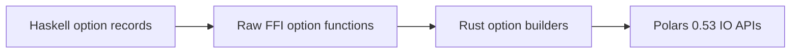

# Design Log: IO Options Phase 1

## Background

`polars-hs` currently exposes eager CSV/Parquet read/write and lazy CSV/Parquet
scan functions with default Polars options. Rust Polars 0.53 exposes typed
option surfaces through `CsvReadOptions`, `CsvParseOptions`, `CsvWriter`,
`ParquetReader`, `ParquetWriter`, and `ScanArgsParquet`.

The user requested continued parity work against the pinned Rust Polars 0.53
dependency. The relevant upstream source shows stable, easy-to-test options for
headers, separators, null values, Parquet compression, row group size, and row
limits.

## Problem

Default-only IO makes common Polars workflows unavailable from Haskell:
headerless CSV, non-comma-separated files, custom CSV null tokens, CSV writer
formatting, limited Parquet reads/scans, and Parquet writer compression/row
group tuning.

## Questions and Answers

### Q1. Should existing functions change behavior?

Answer: Keep the existing behavior. `readCsv`, `writeCsv`, `scanCsv`,
`readParquet`, `writeParquet`, and `scanParquet` should call new `With`
variants with default option records.

### Q2. Which options belong in phase 1?

Answer: Include options with simple scalar ABI and deterministic tests:

1. CSV read/scan: `has_header`, `separator`, all-column single `null_value`.
2. CSV write: `include_header`, `separator`, `null_value`.
3. Parquet read: leading `n_rows` via reader slice.
4. Parquet write: compression and optional row group size.
5. Parquet scan: leading `n_rows`, `use_statistics`, `low_memory`, `rechunk`,
   and `cache`.

### Q3. How should the C ABI be shaped?

Answer: Add explicit option variants while keeping existing C functions:

```c
int phs_read_csv_options(const char *path, bool has_header, uint8_t separator,
                         bool has_null_value, const char *null_value, ...);

int phs_write_csv_options(const char *path, const struct phs_dataframe *df,
                          bool include_header, uint8_t separator,
                          const char *null_value, ...);

int phs_read_parquet_options(const char *path, bool has_n_rows,
                             uint64_t n_rows, ...);

int phs_write_parquet_options(const char *path, const struct phs_dataframe *df,
                              int compression, bool has_row_group_size,
                              uint64_t row_group_size, ...);
```

`scanCsvWith` and `scanParquetWith` receive analogous Rust FFI functions.

## Design



Haskell owns user-facing records and validates signed integer fields before FFI.
Rust owns conversion to Polars option types and validates ABI-only enum codes.

Public Haskell records:

```haskell
data CsvReadOptions = CsvReadOptions
    { csvReadHasHeader :: Bool
    , csvReadSeparator :: Word8
    , csvReadNullValue :: Maybe Text
    }

data CsvWriteOptions = CsvWriteOptions
    { csvWriteIncludeHeader :: Bool
    , csvWriteSeparator :: Word8
    , csvWriteNullValue :: Text
    }

data ParquetReadOptions = ParquetReadOptions
    { parquetReadNRows :: Maybe Int
    }

data ParquetCompression
    = ParquetDefaultCompression
    | ParquetUncompressed
    | ParquetSnappy
    | ParquetZstd

data ParquetWriteOptions = ParquetWriteOptions
    { parquetWriteCompression :: ParquetCompression
    , parquetWriteRowGroupSize :: Maybe Int
    }

data ParquetScanOptions = ParquetScanOptions
    { parquetScanNRows :: Maybe Int
    , parquetScanUseStatistics :: Bool
    , parquetScanLowMemory :: Bool
    , parquetScanRechunk :: Bool
    , parquetScanCache :: Bool
    }
```

## Implementation Plan

1. Add Hspec RED tests for CSV headerless/separator/null read, CSV writer
   options, Parquet write/read options, Parquet scan options, and invalid
   signed option values.
2. Add Rust option helpers and option FFI functions in `dataframe.rs` and
   `lazyframe.rs`.
3. Add declarations to `include/polars_hs.h`.
4. Add safe FFI imports in `src/Polars/Internal/Raw.hs`.
5. Add public option records and `With` functions in `Polars.DataFrame` and
   `Polars.LazyFrame`.
6. Run focused IO tests, then full Cargo/Stack/HLint verification.

## Examples

Good API pattern:

```haskell
Pl.readCsvWith
    Pl.defaultCsvReadOptions
        { Pl.csvReadHasHeader = False
        , Pl.csvReadSeparator = 59
        , Pl.csvReadNullValue = Just "NA"
        }
    path
```

Bad API pattern:

```haskell
Pl.readCsvHeaderlessSemicolonWithNA path
```

The good pattern scales as option coverage grows.

## Trade-offs

This phase avoids schema overrides, projections, row indexes, cloud options, and
Parquet column selection because they need richer cross-module design. The
chosen fields cover common workflows and establish a stable record-based option
pattern for later IO parity batches.

## Implementation Results

Implemented:

1. Added `Polars.IO` with CSV read/write, Parquet read/write, Parquet scan
   option records, defaults, and Parquet compression constructors.
2. Added public `readCsvWith`, `writeCsvWith`, `readParquetWith`,
   `writeParquetWith`, `scanCsvWith`, and `scanParquetWith`.
3. Kept existing IO helpers as default-option wrappers.
4. Added C ABI option variants in `include/polars_hs.h`, Rust FFI builders in
   `dataframe.rs` and `lazyframe.rs`, and safe Haskell imports in
   `Polars.Internal.Raw`.
5. Added Hspec coverage for headerless semicolon CSV with null tokens, CSV
   writer formatting, Parquet compression/row group size, Parquet read `n_rows`,
   Parquet scan `n_rows` and scan toggles, plus negative row validation.

Verification on 2026-05-17:

1. `cargo test --manifest-path rust/polars-hs-ffi/Cargo.toml`: 87/87 passed.
2. `PATH="$HOME/.ghcup/bin:$PATH" stack --system-ghc test --fast`: 103/103
   passed.
3. `PATH="$HOME/.ghcup/bin:$PATH" hlint src app test`: no hints.
4. `git diff --check`: passed.

Deviations from the original design:

1. `ParquetReadOptions` is a `newtype` because it has one field.
2. `CsvWriteOptions.csvWriteNullValue` is plain `Text`, matching Polars' writer
   default of an empty null token.
