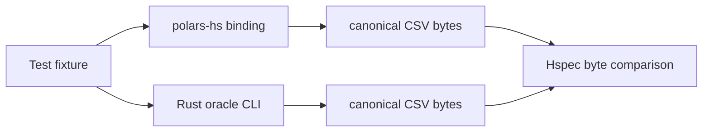

# Design Log: Rust Oracle Parity Harness

## Background

`polars-hs` tests currently verify behavior against expected Haskell-level
results. The roadmap calls for a parity test harness that compares delivered
binding behavior against the pinned Rust Polars dependency, `polars = 0.53.0`.

The Rust crate already builds as part of the Haskell package setup. A small
oracle binary in the same Cargo package can evaluate selected Polars operations
through the upstream Rust API and emit canonical output for Hspec comparisons.

## Problem

Expected-value tests catch regressions in the Haskell surface, but they do not
prove that the binding and upstream Rust Polars agree on option semantics. IO
options are the right first target because they are deterministic and can be
canonicalized as CSV bytes.

## Questions and Answers

### Q1. Should parity tests run as part of the default Hspec suite?

Answer: Yes for a small first batch. Use `cargo run --release` so Stack's custom
setup release build has already compiled most Rust dependencies.

### Q2. What output format should the oracle use?

Answer: Canonical CSV bytes. The oracle writes DataFrames with header enabled,
comma separator, and `NULL` as the null token. Haskell writes the binding result
with the same canonical writer options and compares bytes.

### Q3. Which cases should the first harness cover?

Answer: Cover the newly added IO options:

1. CSV read options: headerless semicolon CSV with `NA` null tokens.
2. Parquet read options: `n_rows = 2` over a file produced by the binding.

## Design



The Hspec helper invokes:

```text
cargo run --quiet --release --manifest-path rust/polars-hs-ffi/Cargo.toml \
  --bin polars_hs_oracle -- <command> <path>
```

The oracle commands initially are:

1. `csv-read-options <path>`
2. `parquet-read-n-rows <path>`

## Implementation Plan

1. Add RED tests under a new `describe "Rust Polars parity harness"` block.
2. Add test dependency `process` for `readProcessWithExitCode`.
3. Add `rust/polars-hs-ffi/src/bin/polars_hs_oracle.rs`.
4. Add Hspec helpers `runRustOracle` and `canonicalDataFrameCsv`.
5. Run focused parity tests, then full Cargo/Stack/HLint verification.

## Examples

Good comparison:

```haskell
oracle <- runRustOracle ["csv-read-options", path]
binding <- canonicalDataFrameCsv df
binding `shouldBe` oracle
```

Good oracle output:

```text
column_1,column_2
Alice,34
Bob,NULL
```

## Trade-offs

Default parity tests now shell out to Cargo. This adds some test time, but keeps
the oracle tied to the pinned Rust crate and avoids introducing a second output
encoding dependency in Haskell. Later parity expansion can cache the oracle path
or split large oracle suites behind an environment variable.

## Implementation Results

Implemented:

1. Added `rust/polars-hs-ffi/src/bin/polars_hs_oracle.rs`.
2. Added Hspec helpers `runRustOracle` and `canonicalDataFrameCsv`.
3. Added parity tests for CSV parser options and Parquet `n_rows`.
4. Added `process` as a test dependency and included the oracle source in
   package extra source files.

Verification on 2026-05-17:

1. Focused RED before oracle implementation: 2/2 parity tests failed because
   Cargo reported no `polars_hs_oracle` bin target.
2. Focused GREEN after oracle implementation: 2/2 parity tests passed.

Deviations from the original design:

1. `runRustOracle` prefers the release binary at
   `rust/polars-hs-ffi/target/release/polars_hs_oracle` and falls back to
   `cargo run --release`.
2. `POLARS_HS_ORACLE` can override the oracle executable path.
3. Hspec reads oracle stdout as bytes so later non-ASCII parity cases can reuse
   the helper.
