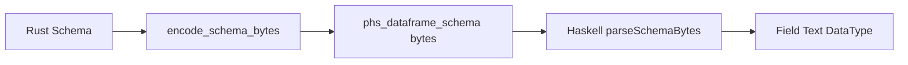

# Design Log: Structured Schema ABI

## Background

`DataFrame.schema` currently crosses the Rust/Haskell boundary as NUL-delimited
UTF-8 chunks: field name, NUL, `format!("{:?}", dtype)`, NUL. Haskell then
parses a small set of debug datatype names with `parseDataType`.

Polars 0.53 `DataType` is an enum with primitive, temporal, nested, decimal,
categorical, object, null, and unknown families. The current Haskell public
`DataType` is a compact subset that intentionally maps richer families to broad
constructors such as `Datetime`, `Duration`, `Categorical`, and `UnknownType`.

## Problem

The current transport is lossy and delimiter-based. Field names containing NUL
bytes split incorrectly, and datatype recognition depends on Rust debug output.
That makes schema transport fragile before broader dtype parity work starts.

## Questions and Answers

### Q1. Should this batch change the public `DataType` shape?

Answer: Keep the public shape stable in this batch. Encode structured dtype tags
and detail bytes at the ABI boundary, then continue mapping to the existing
Haskell constructors. Temporal/nested public representation is a later design
because it affects casts, construction, Arrow, and expression dtype APIs.

### Q2. What format should replace NUL delimiters?

Answer: Use a versioned length-prefixed byte format:

```text
magic "PHS1SCH\0"
u64 field_count
repeat field_count:
  u64 name_len
  name bytes
  u16 dtype_tag
  u64 dtype_detail_len
  dtype_detail bytes
```

`dtype_tag` is the stable ABI discriminator. `dtype_detail` carries a readable
debug/detail string for unknown or parameterized dtypes, without driving known
dtype parsing.

### Q3. How are unknown dtype tags handled?

Answer: Return `UnknownType detail` when the tag is not recognized. Empty detail
falls back to `UnknownType ("dtype tag " <> show tag)`.

## Design



Rust owns the schema walk and writes a deterministic binary record. Haskell
decodes by length, validates enough bytes exist for every segment, decodes field
names and detail as UTF-8, and maps tags to public `DataType`.

Known initial dtype tags:

| Tag | Haskell |
| --- | --- |
| 0 | `Boolean` |
| 1..4 | `Int8`, `Int16`, `Int32`, `Int64` |
| 5..8 | `UInt8`, `UInt16`, `UInt32`, `UInt64` |
| 9..10 | `Float32`, `Float64` |
| 11 | `Utf8` |
| 12 | `Date` |
| 13 | `Datetime` |
| 14 | `Duration` |
| 15 | `Time` |
| 16 | `Binary` |
| 17 | `Null` |
| 18 | `Categorical` |
| 255 | `UnknownType detail` |

## Implementation Plan

1. Add Rust RED test: a DataFrame with a field name containing NUL should encode
   one intact field name through `phs_dataframe_schema`.
2. Add Rust helper functions in `rust/polars-hs-ffi/src/dataframe.rs`:
   `encode_schema_bytes`, `encode_data_type_tag`, and little-endian appenders.
3. Replace `phs_dataframe_schema` debug-string payload with the structured
   encoder.
4. Update `src/Polars/DataFrame.hs` `parseSchemaBytes` to decode the new format.
5. Keep `Polars.Schema.parseDataType` for Series dtype and legacy textual
   parsing.
6. Run focused schema tests, then full Cargo/Stack/HLint verification.

## Examples

Good ABI pattern:

```text
name_len = 3
name = "a\0b"
dtype_tag = 4
detail = "Int64"
```

Bad ABI pattern:

```text
"a\0b\0Int64\0"
```

The bad pattern creates two separate text chunks before dtype decoding.

## Trade-offs

This batch fixes schema transport robustness while preserving public API
compatibility. The detail field carries temporal and nested metadata across the
boundary, but Haskell still maps it into broad constructors. A later dtype design
should add parameterized public constructors and use the same ABI detail bytes
for exact temporal, decimal, list, array, and struct schemas.

## Implementation Results

Implemented:

1. `rust/polars-hs-ffi/src/dataframe.rs` now encodes `phs_dataframe_schema` as
   `PHS1SCH\0` plus length-prefixed field records.
2. `src/Polars/DataFrame.hs` now validates and decodes the structured payload.
3. `src/Polars/Schema.hs` now maps stable schema dtype tags to public
   `DataType` constructors.
4. Rust coverage now includes a DataFrame field name containing an embedded NUL.

Verification on 2026-05-17:

1. `cargo test --manifest-path rust/polars-hs-ffi/Cargo.toml`: 87/87 passed.
2. `PATH="$HOME/.ghcup/bin:$PATH" stack --system-ghc test --fast`: 97/97 passed.
3. `PATH="$HOME/.ghcup/bin:$PATH" hlint src app test`: no hints.
4. `git diff --check`: passed.

Deviations from the original design:

1. The Rust helper is named `schema_dtype_tag`, matching the surrounding helper
   naming style.
2. Empty unknown dtype detail maps to `UnknownType "unknown schema datatype"`;
   the raw numeric tag remains an internal ABI detail.
