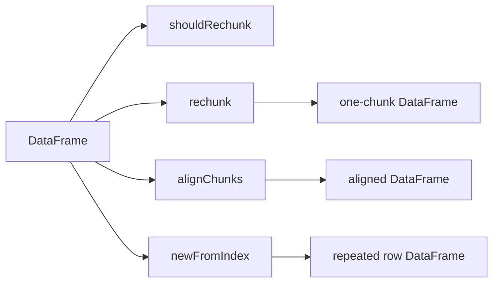

# DataFrame Rechunk And New-From-Index Design

## Background

`polars-hs` now exposes eager DataFrame chunk metadata, clearing, and split views. Rust Polars 0.53 also exposes
low-coupling helpers for chunk materialization and scalar-row expansion:

- `DataFrame::rechunk_mut(&mut self) -> &mut Self`
- `DataFrame::align_chunks(&mut self) -> &mut Self`
- `DataFrame::should_rechunk(&self) -> bool`
- `DataFrame::new_from_index(&self, index: usize, height: usize) -> DataFrame`

The Rust source defines `should_rechunk` as a physical-layout check over chunk counts and chunk lengths. `align_chunks`
calls `rechunk_mut` only when that check returns true. `new_from_index` expands each column from one row; Polars
`Column::new_from_index` returns full-null output when the requested index is outside the column length.

## Problem

Haskell users can inspect DataFrame chunk counts but cannot materialize DataFrame chunks, ask whether alignment is
needed, or expand one row into a repeated DataFrame. These helpers close a small eager DataFrame parity gap and provide
stable building blocks for later concat, Arrow, and writer tests.

## Questions And Answers

### Should `align_chunks` be exposed alongside `rechunk`?

Answer: yes. Rust Polars distinguishes unconditional one-chunk materialization from conditional chunk alignment.
Both methods have small ABI surfaces and useful tests.

### Should out-of-bounds `new_from_index` be rejected?

Answer: no. Polars 0.53 returns full-null columns for out-of-bounds DataFrame column expansion. The Haskell API should
only reject negative Haskell indexes and lengths before unsigned conversion.

### Should `rechunk_mut_par` or `align_chunks_par` be exposed now?

Answer: defer. The first Haskell API should map to deterministic non-parallel Rust methods. Parallel variants can be
added later as explicit execution controls.

### How can tests make `should_rechunk` true?

Answer: build a DataFrame from one appended two-chunk Series and one one-chunk Series with the same length. The chunk
counts differ, so Rust `should_rechunk` returns true. After `dataFrameAlignChunks` or `dataFrameRechunk`, chunk counts
should be one and `should_rechunk` should return false.

## Design

Rust ABI:

```c
int phs_dataframe_new_from_index(const struct phs_dataframe *dataframe,
                                 uint64_t index,
                                 uint64_t len,
                                 struct phs_dataframe **out,
                                 struct phs_error **err);

int phs_dataframe_rechunk(const struct phs_dataframe *dataframe,
                          struct phs_dataframe **out,
                          struct phs_error **err);

int phs_dataframe_align_chunks(const struct phs_dataframe *dataframe,
                               struct phs_dataframe **out,
                               struct phs_error **err);

int phs_dataframe_should_rechunk(const struct phs_dataframe *dataframe,
                                 bool *out,
                                 struct phs_error **err);
```

Public Haskell API:

```haskell
dataFrameNewFromIndex :: Int -> Int -> DataFrame -> IO (Either PolarsError DataFrame)
dataFrameRechunk :: DataFrame -> IO (Either PolarsError DataFrame)
dataFrameAlignChunks :: DataFrame -> IO (Either PolarsError DataFrame)
dataFrameShouldRechunk :: DataFrame -> IO (Either PolarsError Bool)
```



## Implementation Plan

1. Add RED Rust tests for `new_from_index`, `rechunk`, `align_chunks`, and `should_rechunk`.
2. Add RED Hspec tests over committed fixtures and constructed Series with mismatched chunks.
3. Add C header declarations and Raw imports.
4. Add Rust ABI functions in `rust/polars-hs-ffi/src/dataframe.rs`.
5. Add public wrappers and exports in `Polars.DataFrame`.
6. Run focused RED/GREEN checks and full verification.

## Examples

Good:

```haskell
needsAlignment <- dataFrameShouldRechunk df
aligned <- dataFrameAlignChunks df
rowCopy <- dataFrameNewFromIndex 1 4 df
```

This uses Polars physical-layout checks and row-expansion semantics directly.

Bad:

```haskell
aligned <- dataFrameRechunk df
```

This forces one-chunk materialization even when `align_chunks` can preserve an already aligned DataFrame.

## Trade-offs

- `dataFrameNewFromIndex` keeps Polars out-of-bounds full-null behavior, so negative Haskell inputs are the only local
  validation rule.
- `dataFrameRechunk` clones before mutating because Haskell handles are immutable from the public API.
- `dataFrameAlignChunks` may return a clone with unchanged chunks when the input is already aligned.

## Implementation Results

Implemented on 2026-05-18.

Files changed:

- `include/polars_hs.h`: declared DataFrame new-from-index, rechunk, align-chunks, and should-rechunk ABI functions.
- `rust/polars-hs-ffi/src/dataframe.rs`: implemented owned-handle ABI wrappers over Polars 0.53 methods.
- `src/Polars/Internal/Raw.hs`: added raw imports with safe calls for DataFrame-producing work.
- `src/Polars/DataFrame.hs`: exported public wrappers and Haskell negative input validation.
- `test/Spec.hs`: added public API coverage for repeated rows, out-of-bounds full-null expansion, empty expansion,
  negative validation, chunk alignment, rechunking, and value preservation.

Focused verification:

- RED Rust: `cargo test --manifest-path rust/polars-hs-ffi/Cargo.toml dataframe_rechunk_align_and_new_from_index_work`
  failed on missing `phs_dataframe_should_rechunk`, `phs_dataframe_align_chunks`, `phs_dataframe_rechunk`, and
  `phs_dataframe_new_from_index`.
- RED Hspec: `stack test --fast --test-arguments='--match=rechunks'` failed on missing public Haskell exports.
- GREEN Rust: `cargo test --manifest-path rust/polars-hs-ffi/Cargo.toml dataframe_rechunk_align_and_new_from_index_work`
  passed, 1/1.
- GREEN Hspec: `stack test --fast --test-arguments='--match=rechunks'` passed, 2/2.

Deviations:

- Added Rust-only coverage for aligned multi-chunk false and chunk-length-mismatch true `should_rechunk` cases after
  read-only review.

Full verification:

- `jj diff --git --color=never | git apply --cached --check --whitespace=error -`: passed.
- `hlint src test app`: no hints.
- `cargo test --manifest-path rust/polars-hs-ffi/Cargo.toml`: 132/132 passed.
- `stack test --fast`: 179/179 passed.
