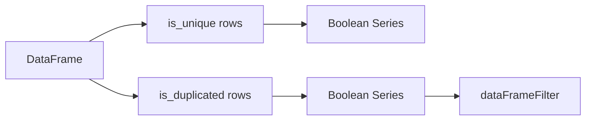

# DataFrame Row Distinct Masks Design

## Background

`polars-hs` exposes eager `dataFrameUnique`, and Series-level distinct predicates already cover duplicated and unique
masks for one Series. Rust Polars 0.53 also exposes row-level DataFrame masks:

- `DataFrame::is_unique(&self) -> PolarsResult<BooleanChunked>`
- `DataFrame::is_duplicated(&self) -> PolarsResult<BooleanChunked>`

The Rust implementation groups by all DataFrame columns and returns a Boolean mask with one output value per input row.
The pinned Rust dependency already enables the Polars `is_unique` feature.

## Problem

Haskell users can ask Polars to keep unique rows, but cannot get a row-level mask for duplicated or unique rows. These
masks are useful for filtering, validation, and parity with DataFrame APIs in Polars.

## Questions And Answers

### Should the API support subsets now?

Answer: no. Rust Polars 0.53 DataFrame methods operate on all columns. Subset variants should be a separate API that
uses expressions or temporary DataFrame selection.

### What should the result type be?

Answer: return `Series`. Existing Haskell DataFrame/Series helpers already expose Boolean masks as owned Series handles,
and callers can pass them into `dataFrameFilter` or extract `Vector (Maybe Bool)`.

### How should the Rust BooleanChunked cross the ABI?

Answer: convert it into `Series` through `into_series()` and return a Rust-owned `phs_series *` handle.

## Design

Rust ABI:

```c
int phs_dataframe_is_unique(const struct phs_dataframe *dataframe,
                            struct phs_series **out,
                            struct phs_error **err);

int phs_dataframe_is_duplicated(const struct phs_dataframe *dataframe,
                                struct phs_series **out,
                                struct phs_error **err);
```

Public Haskell API:

```haskell
dataFrameIsUnique :: DataFrame -> IO (Either PolarsError Series)
dataFrameIsDuplicated :: DataFrame -> IO (Either PolarsError Series)
```



## Implementation Plan

1. Add RED Rust ABI tests for row duplicate and unique masks.
2. Add RED Hspec tests for public Haskell helpers and filtering with the duplicated mask.
3. Add C header declarations and Raw imports.
4. Add Rust ABI functions in `rust/polars-hs-ffi/src/dataframe.rs`.
5. Add public wrappers and exports in `Polars.DataFrame`.
6. Run focused RED/GREEN checks and full verification.

## Examples

Good:

```haskell
mask <- dataFrameIsDuplicated df
dupes <- dataFrameFilter mask df
```

This keeps the mask as a Series handle, matching existing filter APIs.

Bad:

```haskell
uniqueRows <- dataFrameUnique defaultDataFrameUniqueOptions df
```

This returns rows, so it cannot identify which original row positions were duplicates.

## Trade-offs

- Returning `Series` keeps the API simple and avoids adding a dedicated Boolean mask type.
- Row-level grouping cost is owned by Polars; Haskell only manages the returned handle.

## Implementation Results

Implemented on 2026-05-18.

Files changed:

- `include/polars_hs.h`: declared row-level DataFrame distinct mask ABI functions.
- `rust/polars-hs-ffi/src/dataframe.rs`: converted `BooleanChunked` row masks into owned Series handles.
- `src/Polars/Internal/Raw.hs`: added raw imports returning `RawSeries`.
- `src/Polars/DataFrame.hs`: exported public wrappers and local Series-output handling.
- `test/Spec.hs`: added Hspec coverage for duplicate/unique row masks and filtering with the duplicate mask.

Focused verification:

- RED Rust: `cargo test --manifest-path rust/polars-hs-ffi/Cargo.toml dataframe_row_distinct_masks_work`
  failed on missing `phs_dataframe_is_duplicated` and `phs_dataframe_is_unique`.
- RED Hspec: `stack test --fast --test-arguments='--match=distinct masks'` failed on missing public Haskell exports.
- GREEN Rust: `cargo test --manifest-path rust/polars-hs-ffi/Cargo.toml dataframe_row_distinct_masks_work` passed, 1/1.
- GREEN Hspec: `stack test --fast --test-arguments='--match=distinct'` passed, 4/4.

Deviations:

- Added a local `seriesOut` helper in `Polars.DataFrame` because this module now owns one DataFrame-to-Series ABI path.

Full verification:

- `jj diff --git --color=never | git apply --cached --check --whitespace=error -`: passed.
- `hlint src test app`: no hints.
- `cargo test --manifest-path rust/polars-hs-ffi/Cargo.toml`: 133/133 passed.
- `stack test --fast`: 180/180 passed.
