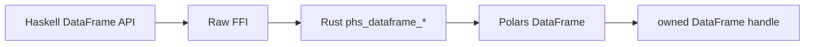

# DataFrame Row Index And Shift Design

## Background

`polars-hs` already exposes eager row slicing, filtering, taking, sampling, view helpers, and row expansion. Rust Polars 0.53 also exposes eager `DataFrame::with_row_index` and `DataFrame::shift`, which are common building blocks for row identity and lag/lead-style eager workflows.

Upstream references:

- `DataFrame::with_row_index(&self, name: PlSmallStr, offset: Option<IdxSize>) -> PolarsResult<Self>`
- `DataFrame::shift(&self, periods: i64) -> Self`
- docs.rs lists `with_row_index` on Polars 0.53 DataFrame: https://docs.rs/polars/latest/polars/frame/struct.DataFrame.html

## Problem

The current Haskell eager DataFrame API has row selection and row expansion, yet it cannot add a Polars row index column or shift all columns together. Users must compose less direct operations and lose Polars-native error semantics for duplicate names and index overflow.

## Questions And Answers

Q: Should row-index offset be optional?

A: Yes. Upstream accepts `Option<IdxSize>`, so the Haskell API uses `Maybe Int`.

Q: Which Haskell column type should tests use for row index?

A: `Word32` in the default non-bigidx build. Rust converts offset to `IdxSize`, and existing typed extraction supports `Word32`.

Q: Should duplicate row-index names fail in Haskell or Rust?

A: Rust should return Polars duplicate-name failure, matching existing eager operations that delegate schema conflicts to Polars.

## Design

Public Haskell API:

```haskell
dataFrameWithRowIndex :: Text -> Maybe Int -> DataFrame -> IO (Either PolarsError DataFrame)
dataFrameShift :: Int -> DataFrame -> IO (Either PolarsError DataFrame)
```

ABI:

```c
int phs_dataframe_with_row_index(const struct phs_dataframe *dataframe,
                                 const char *name,
                                 bool has_offset,
                                 uint64_t offset,
                                 struct phs_dataframe **out,
                                 struct phs_error **err);

int phs_dataframe_shift(const struct phs_dataframe *dataframe,
                        int64_t periods,
                        struct phs_dataframe **out,
                        struct phs_error **err);
```

Validation:

- `dataFrameWithRowIndex` rejects negative offsets at the Haskell boundary.
- Rust rejects offsets that exceed Polars `IdxSize`.
- Rust delegates duplicate column-name errors to Polars.
- `dataFrameShift` accepts positive, zero, and negative periods and delegates null-fill semantics to Polars.



## Implementation Plan

1. Add RED Rust tests for row-index output, duplicate-name failure, shift directions, and null output pointers.
2. Add RED Hspec tests for public API shape, row-index values, offset validation, duplicate-name errors, and shift null-fill behavior.
3. Add C header declarations and raw Haskell imports.
4. Implement Rust wrappers over `with_row_index` and `shift`.
5. Add Haskell wrappers and exports.
6. Run focused RED/GREEN checks and full verification.

## Examples

Good:

```haskell
indexed <- dataFrameWithRowIndex "row_nr" (Just 10) df
shifted <- dataFrameShift 1 df
```

Bad:

```haskell
indexed <- dataFrameWithRowIndex "row_nr" (Just (-1)) df
```

Offsets must be non-negative.

## Trade-offs

- The public offset type remains `Int` for consistency with existing row-count APIs, while Rust keeps the Polars `IdxSize` conversion gate.
- The row-index dtype follows the pinned Rust Polars build. A later bigidx portability pass can expose a dedicated index type.

## Implementation Results

- Added `dataFrameWithRowIndex` and `dataFrameShift` to the public eager DataFrame API.
- Added `phs_dataframe_with_row_index` and `phs_dataframe_shift` to the C header, raw Haskell imports, and Rust FFI.
- Rust row-index wrapper converts the optional offset through `IdxSize` and delegates duplicate-name and offset-plus-height overflow checks to Polars.
- Haskell rejects negative row-index offsets before crossing FFI.
- Rust shift wrapper returns a new owned DataFrame handle from `DataFrame::shift`.

Test coverage:

- Row-index default offset yields `[0,1,2]`; offset 5 yields `[5,6,7]`.
- Row-index column is inserted before existing columns.
- Duplicate row-index names return Polars failure.
- Negative Haskell offsets return `InvalidArgument`.
- Rust FFI rejects `u64::MAX` offset with `InvalidArgument`.
- Rust FFI delegates `IdxSize::MAX + height` overflow to Polars and leaves `out` null.
- Rust FFI rejects null name pointers and null output pointers.
- Shift covers positive, negative, and zero periods over integer and text columns with null-fill semantics.

Verification so far:

- RED Rust: missing `phs_dataframe_with_row_index` and `phs_dataframe_shift`.
- RED Hspec: missing public Haskell exports.
- Focused Rust: `cargo test --manifest-path rust/polars-hs-ffi/Cargo.toml dataframe_row_index_and_shift_work` passed, 1/1.
- Focused Hspec: `stack test --fast --test-arguments='--match=row'` passed, 26/26.
- Full Rust: `cargo test --manifest-path rust/polars-hs-ffi/Cargo.toml` passed, 135/135.
- Full Hspec: `stack test --fast` passed, 182/182.
- HLint: `hlint src test app` returned `No hints`.
- Whitespace: `jj diff --git --color=never | git apply --cached --check --whitespace=error -` returned exit 0.

Deviations:

- None.
