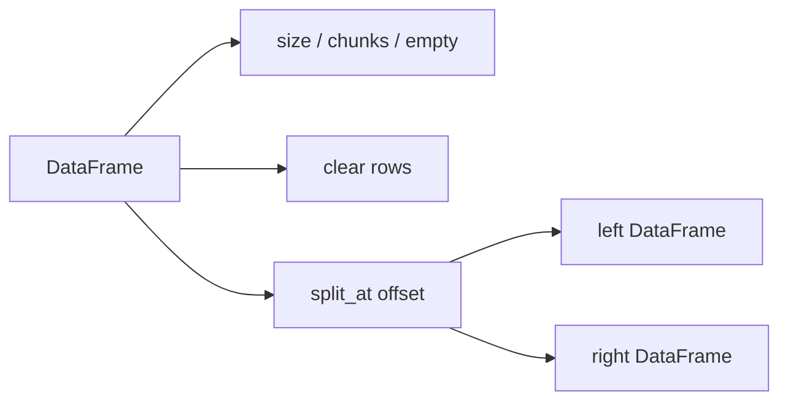

# DataFrame Views And Metadata Design

## Background

`polars-hs` already exposes eager DataFrame shape, schema, head/tail, slice, reverse, null counts, filtering,
sorting, unique, joins, and stacking. Rust Polars 0.53 also has low-coupling DataFrame helpers for memory
estimation, chunk introspection, clearing rows, and splitting views:

- `DataFrame::estimated_size(&self) -> usize`
- `DataFrame::first_col_n_chunks(&self) -> usize`
- `DataFrame::max_n_chunks(&self) -> usize`
- `DataFrame::clear(&self) -> DataFrame`
- `DataFrame::split_at(&self, offset: i64) -> (DataFrame, DataFrame)`

Python Polars also exposes `DataFrame.is_empty`; Rust Polars 0.53 does not have an inherent DataFrame method for
that name, but `height() == 0` is the equivalent check.

## Problem

Haskell users currently need indirect shape checks for emptiness, cannot inspect eager DataFrame memory/chunk
metadata, and cannot split a DataFrame into two views in a single Polars call. Adding these helpers improves
parity while staying inside existing eager DataFrame ownership and view semantics.

## Questions And Answers

### Should `dataFrameIsEmpty` be included?

Answer: yes. It is a common Polars user-facing method. The Rust FFI computes `height() == 0`, which matches the
DataFrame row-count meaning used by Polars.

### Should split offsets be validated?

Answer: no. Rust Polars `split_at` delegates to the same offset logic as Series/chunked arrays: negative offsets
count from the end and out-of-bounds values clamp to the closest valid split.

### Should chunk counts return `Int`?

Answer: yes. Existing `height`, `width`, and Series metadata return checked `Int` values through `Word64`.

### How should two DataFrame outputs cross the ABI?

Answer: mirror the Series pair helper with two owned `struct phs_dataframe **` outputs. Rust sets both output
pointers to null before computing and fills both on success.

## Design

Rust ABI:

```c
int phs_dataframe_estimated_size(const struct phs_dataframe *dataframe,
                                 uint64_t *out,
                                 struct phs_error **err);

int phs_dataframe_first_col_n_chunks(const struct phs_dataframe *dataframe,
                                     uint64_t *out,
                                     struct phs_error **err);

int phs_dataframe_max_n_chunks(const struct phs_dataframe *dataframe,
                               uint64_t *out,
                               struct phs_error **err);

int phs_dataframe_is_empty(const struct phs_dataframe *dataframe,
                           bool *out,
                           struct phs_error **err);

int phs_dataframe_clear(const struct phs_dataframe *dataframe,
                        struct phs_dataframe **out,
                        struct phs_error **err);

int phs_dataframe_split_at(const struct phs_dataframe *dataframe,
                           int64_t offset,
                           struct phs_dataframe **left_out,
                           struct phs_dataframe **right_out,
                           struct phs_error **err);
```

Public Haskell API:

```haskell
dataFrameEstimatedSize :: DataFrame -> IO (Either PolarsError Int)
dataFrameFirstColNChunks :: DataFrame -> IO (Either PolarsError Int)
dataFrameMaxNChunks :: DataFrame -> IO (Either PolarsError Int)
dataFrameIsEmpty :: DataFrame -> IO (Either PolarsError Bool)
dataFrameClear :: DataFrame -> IO (Either PolarsError DataFrame)
dataFrameSplitAt :: Int -> DataFrame -> IO (Either PolarsError (DataFrame, DataFrame))
```



## Implementation Plan

1. Add RED Rust tests for metadata, clear, split-at positive/negative/out-of-bounds offsets.
2. Add RED Hspec tests for public Haskell helpers against committed fixtures.
3. Add local Haskell helpers for DataFrame bool and pair outputs.
4. Implement Rust ABI functions in `rust/polars-hs-ffi/src/dataframe.rs`.
5. Add header declarations and Raw imports.
6. Add public Haskell exports and wrappers in `Polars.DataFrame`.
7. Run focused RED/GREEN checks and full verification.

## Examples

Good:

```haskell
empty <- dataFrameIsEmpty df
(left, right) <- dataFrameSplitAt (-1) df
```

This follows Polars row-view semantics and preserves Rust-owned handles.

Bad:

```haskell
size == height df * width df
```

Estimated size is byte-oriented buffer metadata, not a cell count.

## Trade-offs

- `dataFrameIsEmpty` is computed from `height() == 0` because Rust Polars 0.53 lacks an inherent method with that
  name.
- Chunk metadata exposes physical layout details; tests should use stable construction through `dataFrameVStack`.
- `dataFrameSplitAt` returns a tuple, requiring explicit two-output FFI handling.

## Implementation Results

Implemented on 2026-05-18.

Files changed:

- `include/polars_hs.h`: declared six DataFrame view/metadata ABI functions.
- `rust/polars-hs-ffi/src/dataframe.rs`: implemented ABI mappings to `estimated_size`, `first_col_n_chunks`,
  `max_n_chunks`, `height() == 0`, `clear`, and `split_at`.
- `src/Polars/Internal/Raw.hs`: added raw imports, including `phs_dataframe_free` for defensive pair-output cleanup.
- `src/Polars/DataFrame.hs`: exported public wrappers and local bool/pair output helpers.
- `test/Spec.hs`: added Hspec coverage for metadata, chunk counts after `dataFrameVStack`, `clear`, schema retention,
  null-preserving splits, negative offsets, and clamped offsets.

Focused verification:

- RED Rust: `cargo test --manifest-path rust/polars-hs-ffi/Cargo.toml dataframe_metadata_clear_and_split_at_work`
  failed on missing `phs_dataframe_*` functions.
- RED Hspec: `stack test --fast --test-arguments='--match=inspects clears'` failed on missing public exports.
- GREEN Rust: `cargo test --manifest-path rust/polars-hs-ffi/Cargo.toml dataframe_metadata_clear_and_split_at_work`
  passed, 1/1.
- GREEN Hspec: `stack test --fast --test-arguments='--match=clears'` passed, 2/2.

Deviations:

- Added `phs_dataframe_free` as an internal raw import so `dataframePairOut` can release a partially returned handle
  if an ABI implementation ever violates the two-output success contract.
- Added Rust tests for zero-width DataFrame emptiness and null-output pointer validation after review.

Full verification:

- `jj diff --git --color=never | git apply --cached --check --whitespace=error -`: passed.
- `hlint src test app`: no hints.
- `cargo test --manifest-path rust/polars-hs-ffi/Cargo.toml`: 131/131 passed.
- `stack test --fast`: 178/178 passed.
