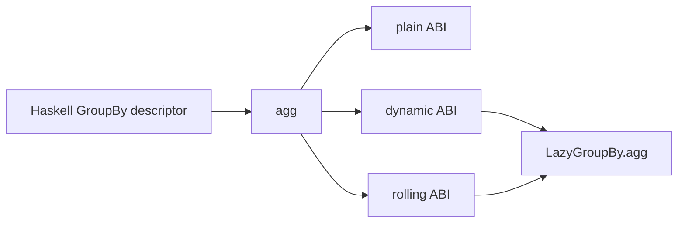

# Lazy Dynamic and Rolling GroupBy Design

## Background

`polars-hs` already exposes lazy grouped aggregation through:

```haskell
groupBy :: [Expr] -> LazyFrame -> GroupBy
groupByStable :: [Expr] -> LazyFrame -> GroupBy
agg :: [Expr] -> GroupBy -> IO (Either PolarsError LazyFrame)
```

Rust Polars 0.53 adds temporal/index windows through
`LazyFrame::group_by_dynamic` and `LazyFrame::rolling`, gated by the
`dynamic_group_by` feature. Both return `LazyGroupBy` and use the existing
aggregation surface.

## Problem

Current grouped aggregation can group by keys only. Polars parity needs windowed
grouping where an Int32/Int64 or temporal index column defines dynamic or
rolling windows, with optional equality grouping keys.

## Questions and Answers

1. Should the first Haskell API accept Polars duration strings or a structured
   duration type?
   Answer: use a `DurationSpec` newtype over `Text` for parity with Polars'
   duration language and future-proof the public type.

2. Should dynamic and rolling grouping reuse `agg`?
   Answer: yes. `GroupBy` remains a pure descriptor, and `agg` dispatches to the
   correct Rust ABI based on the descriptor.

3. Should the first tests use temporal columns?
   Answer: use sorted Int64 indexes first, because current temporal scalar
   construction and extraction remains a separate dtype parity task.

## Design

Public API additions in `src/Polars/GroupBy.hs`:

```haskell
newtype DurationSpec = DurationSpec { durationSpecText :: Text }

data ClosedWindow = ClosedLeft | ClosedRight | ClosedBoth | ClosedNone
data DynamicLabel = LabelLeft | LabelRight | LabelDataPoint
data StartBy
    = StartByWindowBound
    | StartByDataPoint
    | StartByMonday
    | StartByTuesday
    | StartByWednesday
    | StartByThursday
    | StartByFriday
    | StartBySaturday
    | StartBySunday

data DynamicGroupByOptions = DynamicGroupByOptions
    { dynamicEvery :: !DurationSpec
    , dynamicPeriod :: !DurationSpec
    , dynamicOffset :: !DurationSpec
    , dynamicLabel :: !DynamicLabel
    , dynamicIncludeBoundaries :: !Bool
    , dynamicClosedWindow :: !ClosedWindow
    , dynamicStartBy :: !StartBy
    }

data RollingGroupByOptions = RollingGroupByOptions
    { rollingPeriod :: !DurationSpec
    , rollingOffset :: !DurationSpec
    , rollingClosedWindow :: !ClosedWindow
    }

defaultDynamicGroupByOptions :: DurationSpec -> DynamicGroupByOptions
defaultRollingGroupByOptions :: DurationSpec -> RollingGroupByOptions
groupByDynamic :: DynamicGroupByOptions -> Expr -> [Expr] -> LazyFrame -> GroupBy
groupByRolling :: RollingGroupByOptions -> Expr -> [Expr] -> LazyFrame -> GroupBy
```

Internal descriptor:

```haskell
data GroupBy
    = PlainGroupBy !LazyFrame ![Expr] !Bool
    | DynamicGroupBy !LazyFrame !Expr ![Expr] !DynamicGroupByOptions
    | RollingGroupBy !LazyFrame !Expr ![Expr] !RollingGroupByOptions
```

Rust ABI:

```c
int phs_lazyframe_group_by_dynamic_agg(const struct phs_lazyframe *lazyframe,
                                       const struct phs_expr *index_column,
                                       const struct phs_expr *const *keys,
                                       uintptr_t key_len,
                                       const struct phs_expr *const *aggs,
                                       uintptr_t agg_len,
                                       const char *every,
                                       const char *period,
                                       const char *offset,
                                       int label,
                                       bool include_boundaries,
                                       int closed_window,
                                       int start_by,
                                       struct phs_lazyframe **out,
                                       struct phs_error **err);

int phs_lazyframe_group_by_rolling_agg(const struct phs_lazyframe *lazyframe,
                                       const struct phs_expr *index_column,
                                       const struct phs_expr *const *keys,
                                       uintptr_t key_len,
                                       const struct phs_expr *const *aggs,
                                       uintptr_t agg_len,
                                       const char *period,
                                       const char *offset,
                                       int closed_window,
                                       struct phs_lazyframe **out,
                                       struct phs_error **err);
```

Validation:

- Haskell rejects empty aggregation lists through existing `agg`.
- Rust parses all `DurationSpec` text through `Duration::try_parse`.
- Rust rejects unknown enum codes with `InvalidArgument`.
- Polars collect-time errors handle unsorted or incompatible index columns.



## Implementation Plan

1. Add RED Hspec tests for dynamic and rolling grouped aggregation over sorted
   Int64 fixtures.
2. Add RED Rust ABI tests for dynamic/rolling output and invalid enum/duration
   validation.
3. Enable `dynamic_group_by` in Rust Polars features.
4. Add Rust ABI, header declarations, Raw imports, Haskell descriptor types,
   constructors, and `agg` dispatch.
5. Run focused tests and full verification.

## Examples

```haskell
Pl.agg
    [Pl.alias "value_sum" (Pl.sum_ (Pl.col "value"))]
    ( Pl.groupByDynamic
        (Pl.defaultDynamicGroupByOptions (Pl.DurationSpec "2i"))
        (Pl.col "t")
        [Pl.col "category"]
        lf
    )
```

✅ Good pattern:

```haskell
groupByDynamic options (col "t") [col "category"] sortedLazyFrame
```

✅ Rolling pattern:

```haskell
groupByRolling (defaultRollingGroupByOptions (DurationSpec "3i")) (col "t") [] sortedLazyFrame
```

## Trade-offs

- `DurationSpec` is a small typed wrapper; parsing remains Rust-owned and uses
  Polars' duration language directly.
- The first implementation returns `LazyFrame` through `agg`, matching existing
  grouped aggregation behavior.
- Temporal dtype examples follow after the temporal scalar dtype matrix lands.

## Implementation Results

Implemented files:

- `rust/polars-hs-ffi/Cargo.toml` enables `dynamic_group_by`.
- `rust/polars-hs-ffi/Cargo.lock` records the additional transitive
  `chrono-tz` dependency from that feature.
- `rust/polars-hs-ffi/src/lazyframe.rs` adds
  `phs_lazyframe_group_by_dynamic_agg`,
  `phs_lazyframe_group_by_rolling_agg`, duration parsing, enum decoding, and
  Rust ABI tests.
- `include/polars_hs.h` declares the two new ABI functions.
- `src/Polars/Internal/Raw.hs` imports both functions.
- `src/Polars/GroupBy.hs` adds `DurationSpec`, dynamic/rolling option records,
  default option constructors, `groupByDynamic`, `groupByRolling`, and `agg`
  dispatch for the extended descriptors.
- `test/Spec.hs` adds public API tests for dynamic and rolling Int64 windows.

Verification:

- `cargo test --manifest-path rust/polars-hs-ffi/Cargo.toml`
  passed: 167/167 Rust tests.
- `stack test --fast` passed: 213/213 Hspec examples.
- `hlint src test app` passed with no hints.
- `jj diff --git --color=never | git apply --cached --check --whitespace=error -`
  passed.

Deviations:

- The implementation reuses the existing `ClosedInterval` constructors from
  `Polars.Expr` for groupby window closure instead of exporting a second
  `ClosedWindow` type. This keeps `Polars` module exports unambiguous and lets
  callers use the already exported `ClosedLeft`, `ClosedRight`, `ClosedBoth`,
  and `ClosedNone`.
