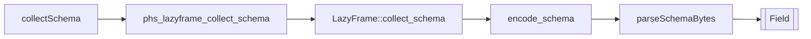

# LazyFrame Collect Schema Design

## Background

Rust Polars 0.53 documents and implements:

```rust
pub fn collect_schema(&mut self) -> PolarsResult<SchemaRef>
```

The method resolves the current lazy logical-plan schema without collecting
the full result data. It returns an error when the logical plan has a schema
problem that would also fail during collection.

`polars-hs` already has a structured schema byte ABI for eager DataFrames:

```text
PHS1SCH\0
field_count:u64
repeat field_count:
  name_len:u64
  name_bytes
  dtype_tag:u16
  detail_len:u64
  detail_bytes
```

## Problem

Lazy users currently need `collect` plus eager `schema` to inspect a lazy plan
schema. That can force file reads and execution work that Polars can avoid.
The Rust schema encoder currently lives inside `dataframe.rs`, so adding the
lazy API should first share that encoder to keep one schema ABI.

## Questions And Answers

Q: What public Haskell name should be used?

A: Use `collectSchema :: LazyFrame -> IO (Either PolarsError [Field])`. This
matches Polars terminology and avoids clashing with eager `schema`.

Q: Should `collectSchema` collect a DataFrame internally?

A: It should call Rust `LazyFrame::collect_schema` and encode the returned
`SchemaRef`. This keeps the API schema-only.

Q: How should invalid lazy plans behave?

A: Return the Polars error from `collect_schema`, preserving the same explicit
`Either PolarsError` style as `collect`, `explain`, and `profile`.

Q: Should the schema parser stay in `Polars.DataFrame`?

A: Move the byte parser into `Polars.Schema` and have eager and lazy callers
reuse it.

## Design

Public Haskell API:

```haskell
collectSchema :: LazyFrame -> IO (Either PolarsError [Field])
```

C ABI:

```c
int phs_lazyframe_collect_schema(const struct phs_lazyframe *lazyframe,
                                 struct phs_bytes **out,
                                 struct phs_error **err);
```

Rust shared encoder:

```rust
pub(crate) fn encode_schema(schema: &Schema) -> Vec<u8>
```

Haskell shared parser:

```haskell
parseSchemaBytes :: ByteString -> Either PolarsError [Field]
```

Flow:



## Implementation Plan

1. Add RED Rust ABI tests for lazy schema success, missing-column plan failure,
   null lazyframe pointer, and null output pointer.
2. Add RED Hspec tests for `collectSchema` over a scan and after lazy select,
   plus missing-column failure.
3. Move Rust schema encoding from `dataframe.rs` into a shared `schema.rs`
   module and update eager DataFrame schema to use it.
4. Move Haskell schema parsing helpers into `Polars.Schema` and update eager
   DataFrame schema to use them.
5. Add header declaration, Raw import, and public LazyFrame wrapper.
6. Run focused GREEN and full verification.

## Examples

```haskell
fields <- collectSchema lf

selectedFields <- collectSchema =<< select [col "name"] lf
```

Good pattern:

```haskell
case collectSchema lf of
    Right fields -> ...
    Left err -> ...
```

Bad pattern:

```haskell
df <- collect lf
schema df
```

## Trade-offs

- The returned `DataType` is still the current `polars-hs` datatype matrix.
  Detailed temporal units, nested inner types, and decimal metadata remain part
  of the broader structured-schema roadmap.
- The Rust ABI returns encoded bytes instead of a new C field array because the
  existing schema byte ABI already preserves embedded NUL column names and has
  test coverage.

## Implementation Results

Implemented on 2026-05-18.

- Added `collectSchema` to `Polars.LazyFrame`.
- Added `phs_lazyframe_collect_schema` to the Rust-owned C ABI and public
  header.
- Added shared Rust schema encoding in `rust/polars-hs-ffi/src/schema.rs`.
- Moved Haskell schema byte decoding into `Polars.Schema` and reused it from
  eager and lazy schema APIs.
- Added Rust ABI coverage for full lazy scan schema, selected lazy schema,
  missing-column schema failure, null lazyframe pointer, and null output
  pointer.
- Added Hspec coverage for scan schema, selected schema, and missing-column
  failure through the public `collectSchema` API.

RED verification:

- `cargo test --manifest-path rust/polars-hs-ffi/Cargo.toml lazy_collect_schema_reports_current_plan_fields`
  failed on missing `phs_lazyframe_collect_schema`.
- `stack test --fast --test-arguments '--match "collects lazy schemas without materializing DataFrames"'`
  failed on missing `Pl.collectSchema`.

GREEN verification:

- Focused Rust: 1/1 passed.
- Focused Hspec: 1/1 passed.
- `cargo test --manifest-path rust/polars-hs-ffi/Cargo.toml`: 152/152 passed.
- `stack test --fast`: 199/199 passed.
- `hlint src test app`: no hints.
- `jj diff --git --color=never | git apply --cached --check --whitespace=error -`: passed.

Deviations:

- `parseSchemaBytes` is now exported from `Polars.Schema` because both eager and
  lazy public modules need the same decoder.
