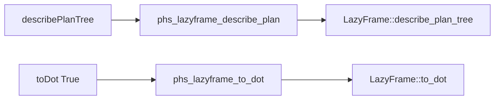

# LazyFrame Plan Introspection Design

## Background

Rust Polars 0.53 exposes logical-plan introspection on `LazyFrame`:

```rust
pub fn describe_plan(&self) -> PolarsResult<String>
pub fn describe_plan_tree(&self) -> PolarsResult<String>
pub fn describe_optimized_plan(&self) -> PolarsResult<String>
pub fn describe_optimized_plan_tree(&self) -> PolarsResult<String>
pub fn to_dot(&self, optimized: bool) -> PolarsResult<String>
```

`to_dot` is available behind the Polars `dot_diagram` feature. Current
`polars-hs` only exposes `explain :: Bool -> LazyFrame -> IO (Either
PolarsError Text)`, which maps to the flat naive or optimized plan text.

## Problem

Users cannot request tree-form plan text or DOT graph text through the Haskell
API. These are useful for parity with Polars plan debugging and for inspecting
optimizer output before materializing data.

## Questions And Answers

Q: Should the Haskell API use separate names or one option record?

A: Use separate names for the four text plan methods, matching upstream method
names and keeping call sites explicit.

Q: Should `toDot` take an `optimized` flag?

A: Yes. Upstream `to_dot` takes `optimized: bool`, and `explain` already uses a
Boolean for optimized versus naive output.

Q: Should the C ABI expose one opcode-style plan function?

A: Use one ABI function for text descriptions with `optimized` and `tree`
booleans, plus one ABI function for DOT output. This keeps the ABI compact while
the public Haskell API remains descriptive.

Q: Which Cargo feature is needed?

A: Add `dot_diagram` to the `polars` dependency feature list so
`LazyFrame::to_dot` is available.

## Design

Public Haskell API:

```haskell
describePlan :: LazyFrame -> IO (Either PolarsError Text)
describePlanTree :: LazyFrame -> IO (Either PolarsError Text)
describeOptimizedPlan :: LazyFrame -> IO (Either PolarsError Text)
describeOptimizedPlanTree :: LazyFrame -> IO (Either PolarsError Text)
toDot :: Bool -> LazyFrame -> IO (Either PolarsError Text)
```

C ABI:

```c
int phs_lazyframe_describe_plan(const struct phs_lazyframe *lazyframe,
                                bool optimized,
                                bool tree,
                                struct phs_bytes **out,
                                struct phs_error **err);

int phs_lazyframe_to_dot(const struct phs_lazyframe *lazyframe,
                         bool optimized,
                         struct phs_bytes **out,
                         struct phs_error **err);
```

Flow:



## Implementation Plan

1. Add RED Rust ABI tests for flat plan text, tree plan text, DOT output, null
   lazyframe pointer, and null output pointer.
2. Add RED Hspec tests for public plan text, optimized tree output, DOT output,
   and missing-column errors.
3. Enable the `dot_diagram` Cargo feature.
4. Add C header declarations, Rust ABI implementations, Raw imports, and
   Haskell wrappers.
5. Run focused GREEN and full verification.

## Examples

```haskell
text <- describePlan lf
tree <- describeOptimizedPlanTree lf
dot <- toDot True lf
```

Good pattern:

```haskell
case describeOptimizedPlanTree lf of
    Right plan -> ...
    Left err -> ...
```

Bad pattern:

```haskell
plan <- explain True lf
```

## Trade-offs

- A single Rust ABI function handles the four description methods because the
  shape is identical and the behavior is covered by tests.
- `toDot` is separate because it requires an additional Cargo feature and
  returns graph-oriented output.

## Implementation Results

Implemented on 2026-05-18.

- Added `describePlan`, `describePlanTree`, `describeOptimizedPlan`,
  `describeOptimizedPlanTree`, and `toDot` to `Polars.LazyFrame`.
- Added `phs_lazyframe_describe_plan` and `phs_lazyframe_to_dot` to the
  Rust-owned C ABI and public header.
- Enabled Polars `dot_diagram` feature for DOT graph output.
- Added Rust ABI coverage for flat plan text, tree plan text, DOT output,
  missing-column optimized-plan failure, null lazyframe pointer, and null output
  pointer.
- Added Hspec coverage for all public wrappers and missing-column failure.

RED verification:

- `cargo test --manifest-path rust/polars-hs-ffi/Cargo.toml lazy_plan_introspection_returns_text_and_dot_outputs`
  failed on missing `phs_lazyframe_describe_plan` and `phs_lazyframe_to_dot`.
- `stack test --fast --test-arguments '--match "describes lazy plans as text trees and dot graphs"'`
  failed on missing `Pl.describePlan`, `Pl.describeOptimizedPlan`,
  `Pl.describePlanTree`, `Pl.describeOptimizedPlanTree`, and `Pl.toDot`.

GREEN verification:

- Focused Rust: 1/1 passed.
- Focused Hspec: 1/1 passed.
- `cargo test --manifest-path rust/polars-hs-ffi/Cargo.toml`: 153/153 passed.
- `stack test --fast`: 200/200 passed.
- `hlint src test app`: no hints.
- `jj diff --git --color=never | git apply --cached --check --whitespace=error -`: passed.

Deviations:

- The Rust test asserts `FILTER` in the unoptimized tree and `SCAN` in the
  optimized tree because Polars pushes the filter down into the scan in the
  optimized plan.
