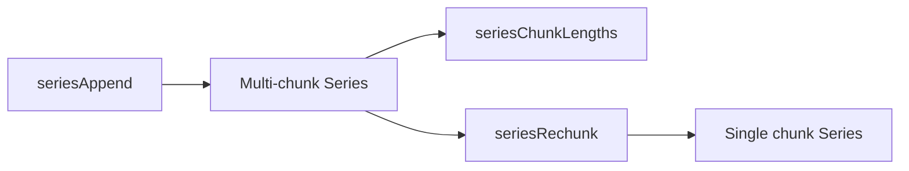

# Design Log: Series Chunk Introspection and Rechunk

## Background

Rust Polars 0.53 stores Series data in Arrow chunks. The `SeriesTrait` API exposes:

```rust
fn chunk_lengths(&self) -> ChunkLenIter<'_>
fn n_chunks(&self) -> usize
fn rechunk(&self) -> Series
```

The Python API documents matching semantics: concatenating two Series without rechunking can produce
chunk lengths such as `[3, 3]`, while rechunking produces `[6]`.

## Problem

`polars-hs` can append Series and perform eager transforms, but users cannot inspect chunking or request a
contiguous rechunked Series. Chunk introspection is useful for validating append/rechunk behavior and for
future Arrow/memory-oriented features.

## Questions and Answers

### Should chunk lengths return a Haskell list or vector?

Answer: return `Vector Int`, matching existing typed extraction APIs and keeping the result compact.

### Should the Rust ABI allocate an array or reuse `phs_bytes`?

Answer: reuse `phs_bytes` with raw little-endian `u64` values. This avoids adding a new owned vector handle
and follows existing byte-return patterns for Series extraction.

### Should `seriesNChunks` return `Int`?

Answer: yes. The Rust value is converted from `usize` to `u64` at the FFI boundary and from `Word64` to
`Int` in Haskell, with overflow checks already used by metadata helpers.

## Design

Rust ABI:

```c
int phs_series_rechunk(const struct phs_series *series,
                       struct phs_series **out,
                       struct phs_error **err);

int phs_series_n_chunks(const struct phs_series *series,
                        uint64_t *out,
                        struct phs_error **err);

int phs_series_chunk_lengths(const struct phs_series *series,
                             struct phs_bytes **out,
                             struct phs_error **err);
```

Public Haskell API:

```haskell
seriesRechunk :: Series -> IO (Either PolarsError Series)
seriesNChunks :: Series -> IO (Either PolarsError Int)
seriesChunkLengths :: Series -> IO (Either PolarsError (Vector Int))
```

`seriesChunkLengths` decodes a `phs_bytes` payload made of 8-byte little-endian unsigned lengths and checks
that each value fits in Haskell `Int`.



## Implementation Plan

1. Add Rust FFI tests proving append creates multiple chunks and rechunk preserves values.
2. Add Hspec tests for numeric and text/null Series.
3. Implement `phs_series_rechunk`, `phs_series_n_chunks`, and `phs_series_chunk_lengths`.
4. Add header declarations, Raw imports, and public Haskell wrappers.
5. Decode chunk-length bytes safely in Haskell.
6. Run focused RED/GREEN checks and full verification.

## Examples

Good:

```haskell
chunks <- seriesChunkLengths appended
rechunked <- seriesRechunk appended
```

This gives users explicit access to Polars chunk metadata while leaving data ownership in Rust.

Bad:

```haskell
values <- seriesInt64 appended
```

Typed extraction verifies values but loses chunk layout information.

## Trade-offs

- Returning chunk lengths as bytes keeps the C ABI simple.
- The API exposes chunk layout as diagnostic metadata; future operations can build on this without changing
  Series ownership rules.
- Tests use `seriesAppend` as the stable local way to create a multi-chunk Series.

## Implementation Results

Implemented public Series chunk helpers:

```haskell
seriesRechunk :: Series -> IO (Either PolarsError Series)
seriesNChunks :: Series -> IO (Either PolarsError Int)
seriesChunkLengths :: Series -> IO (Either PolarsError (Vector Int))
```

Rust ABI added:

```c
int phs_series_rechunk(const struct phs_series *series,
                       struct phs_series **out,
                       struct phs_error **err);

int phs_series_n_chunks(const struct phs_series *series,
                        uint64_t *out,
                        struct phs_error **err);

int phs_series_chunk_lengths(const struct phs_series *series,
                             struct phs_bytes **out,
                             struct phs_error **err);
```

RED checks:

- `cargo test --manifest-path rust/polars-hs-ffi/Cargo.toml series_chunk_introspection_and_rechunk_work` failed while the Rust ABI functions were missing.
- `stack test --fast --ta --match=chunks` failed while the Haskell exports were missing.

GREEN checks:

- `cargo test --manifest-path rust/polars-hs-ffi/Cargo.toml series_chunk_introspection_and_rechunk_work`: 1/1 passed.
- `stack test --fast --ta --match=chunks`: 1/1 passed.

Full verification:

- `cargo test --manifest-path rust/polars-hs-ffi/Cargo.toml`: 128/128 passed.
- `stack test --fast`: 175 examples, 0 failures.
- `hlint src test app`: no hints.
- `git diff --check`: exit 0.

Deviation from design:

- The implementation followed the design. Chunk lengths are encoded as little-endian `u64` values in
  `phs_bytes` and decoded with Haskell-side length and `Int` overflow checks.
