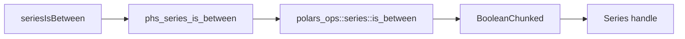

# Series is between design

## Background

Rust Polars 0.53 exposes eager `polars_ops::series::is_between` behind the `is_between` feature. The current binding already enables that feature for expression support and already exposes `ClosedInterval` in `Polars.Expr`.

The upstream Rust function has this shape:

```rust
pub fn is_between(
    s: &Series,
    lower: &Series,
    upper: &Series,
    closed: ClosedInterval,
) -> PolarsResult<BooleanChunked>
```

## Problem

The Haskell Series API has eager scalar predicates such as null, NaN, finite, duplicated, unique, and close-like behavior through expressions, but it lacks an eager Series wrapper for range membership. Users should be able to produce a nullable Boolean Series mask from an input Series and lower/upper bound Series.

## Questions and Answers

1. What is the public API?

   Answer: reuse `ClosedInterval` from `Polars.Expr`.

   ```haskell
   seriesIsBetween :: ClosedInterval -> Series -> Series -> Series -> IO (Either PolarsError Series)
   ```

   Argument order is `(closed input lower upper)` to match `isBetween` expression naming while keeping the interval mode first like other option arguments.

2. How does the ABI encode intervals?

   Answer: use the same opcodes as expression `isBetween`.

   ```text
   0 = ClosedBoth
   1 = ClosedLeft
   2 = ClosedRight
   3 = ClosedNone
   ```

3. Do lower and upper bounds support scalar broadcasting?

   Answer: upstream Polars Series comparisons handle unit-length Series as scalar-style operands. Tests pin this for numeric and text bounds.

4. What happens when lower is greater than upper?

   Answer: upstream performs the two comparisons and Boolean AND. Non-null values become false because no value can satisfy both comparisons.

## Design

The Rust ABI adds:

```c
int phs_series_is_between(const struct phs_series *series,
                          const struct phs_series *lower,
                          const struct phs_series *upper,
                          int closed,
                          struct phs_series **out,
                          struct phs_error **err);
```

Rust maps the interval code to `polars_ops::series::ClosedInterval`, delegates to `polars_ops::series::is_between`, and converts the returned `BooleanChunked` to a Series handle.

Haskell imports the ABI as `safe`, converts `ClosedInterval` through a local opcode helper matching `Polars.Internal.Expr`, and returns the output with `seriesOut`.



## Implementation Plan

1. Add RED Rust FFI test for numeric intervals, all four closed modes, null propagation, text intervals, reversed bounds, dtype mismatch, and invalid closed interval opcode.
2. Add RED Hspec test for the public API over the same user-visible semantics.
3. Implement Rust interval decoder, ABI function, C header declaration, raw Haskell import, and public Haskell wrapper.
4. Run focused tests, then full Rust test suite, full Hspec, HLint, whitespace check, Serena memory, jj describe/bookmark/export/push.

## Examples

Numeric closed-both:

```haskell
seriesIsBetween ClosedBoth values lower upper
-- values: [1, 2, 3, 4, 5, null]
-- lower:  [2]
-- upper:  [4]
-- result: [false, true, true, true, false, null]
```

Text closed-left:

```haskell
seriesIsBetween ClosedLeft textValues lower upper
-- values: ["a", "b", "c", "d"]
-- lower:  ["b"]
-- upper:  ["d"]
-- result: [false, true, true, false]
```

Dtype mismatch:

```haskell
seriesIsBetween ClosedBoth intValues textLower textUpper
-- returns a Polars comparison error
```

## Trade-offs

The API accepts Series bounds instead of separate scalar constructors. This keeps the ABI compact and supports both unit-length bound Series and per-row bounds. Dedicated scalar-bound helpers can be layered later once scalar ABI coverage expands.

## Implementation Results

Implemented files:

- `rust/polars-hs-ffi/src/series.rs`: added `ClosedInterval` opcode decoding, `phs_series_is_between`, and FFI tests.
- `include/polars_hs.h`: added the C ABI declaration.
- `src/Polars/Internal/Raw.hs`: added a safe FFI import.
- `src/Polars/Series.hs`: added `seriesIsBetween` and reused `ClosedInterval`.
- `test/Spec.hs`: added public Hspec coverage.

Focused verification:

- RED Rust: `cargo test --manifest-path rust/polars-hs-ffi/Cargo.toml series_is_between_returns_boolean_masks` failed because `phs_series_is_between` was absent.
- RED Hspec: `stack test --fast --ta --match=is-between` failed because `Polars` did not export `seriesIsBetween`.
- GREEN Rust: focused Rust test passed, 1/1.
- GREEN Hspec: focused Hspec test passed, 1/1.
- Full Rust: `cargo test --manifest-path rust/polars-hs-ffi/Cargo.toml` passed, 125/125.
- Full Haskell: `stack test --fast` passed, 172/172.
- HLint: `hlint src test app` returned `No hints`.
- Whitespace: `git diff --check` returned exit 0.

Deviations:

- None so far.
