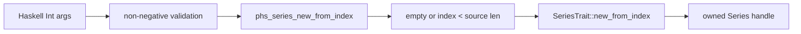

# Series Metadata And Expansion Design

## Background

`polars-hs` already exposes a broad eager Series subset: construction, extraction, filter/take, arithmetic,
comparison, sampling, chunk introspection, and scalar stats. Rust Polars 0.53 also exposes small core Series
helpers that are useful for diagnostics and broadcasting-style workflows:

- `Series::estimated_size(&self) -> usize`
- `Series::clear(&self) -> Series`
- `SeriesTrait::new_from_index(&self, index: usize, length: usize) -> Series`

The upstream Rust docs list `new_from_index` as a required Series trait method and show index `2` expanded to
length `4`. The upstream source documents `estimated_size` as a visible heap-buffer size estimate, including
sliced-array visible size semantics.

## Problem

Haskell users currently cannot inspect Series memory footprint, clear a Series while preserving its dtype/name,
or explicitly expand one Series value into a new owned Series. These operations are low-coupling and fill eager
Series parity gaps without introducing new dtype or IO design work.

The sharp edge is `new_from_index`: upstream takes `usize` values and the low-level chunk expansion treats
`None` as either a null value or a missing index. The public binding should validate user-facing arguments at
the FFI boundary so invalid indexes produce typed errors and real null elements still expand to nulls.

## Questions And Answers

### Should estimated size return `Int`?

Answer: yes. Existing metadata functions (`seriesLength`, `seriesNullCount`, `seriesNChunks`) expose checked
`Word64 -> Int` conversions. The Rust side returns `usize`, the C ABI uses `uint64_t`, and Haskell rejects values
that exceed `maxBound :: Int`.

### Should `seriesClear` preserve name and dtype?

Answer: yes. Rust `Series::clear` calls `Series::new_empty(self.name().clone(), dt)` for ordinary dtypes. Tests
assert name, dtype, zero length, empty extraction, and original handle preservation.

### How should invalid `seriesNewFromIndex` arguments behave?

Answer: negative `index` or `length` are Haskell boundary errors. Rust FFI also checks `index < len` for non-empty
Series before calling Polars. A source null value at a valid index expands to a null Series; an invalid non-empty
index returns `InvalidArgument`.

### Should empty source Series support expansion?

Answer: yes. Rust Polars 0.53 returns an empty clone for ordinary empty Series before reading the index. The binding
preserves this behavior for parity and documents that the requested output length is ignored for ordinary empty
Series.

## Design

Rust ABI:

```c
int phs_series_estimated_size(const struct phs_series *series,
                              uint64_t *out,
                              struct phs_error **err);

int phs_series_clear(const struct phs_series *series,
                     struct phs_series **out,
                     struct phs_error **err);

int phs_series_new_from_index(const struct phs_series *series,
                              uint64_t index,
                              uint64_t len,
                              struct phs_series **out,
                              struct phs_error **err);
```

Public Haskell API:

```haskell
seriesEstimatedSize :: Series -> IO (Either PolarsError Int)
seriesClear :: Series -> IO (Either PolarsError Series)
seriesNewFromIndex :: Int -> Int -> Series -> IO (Either PolarsError Series)
```

Validation rules:

- `seriesEstimatedSize` uses checked `usize -> u64 -> Int` conversion.
- `seriesClear` is a pure owned transform at the Rust boundary.
- `seriesNewFromIndex` rejects negative Haskell arguments before FFI.
- `phs_series_new_from_index` rejects indexes outside a non-empty source Series length.
- Empty source Series delegate to Polars so ordinary dtypes return an empty clone.
- `phs_series_new_from_index` converts output length from `u64` to `usize` with an overflow error.



## Implementation Plan

1. Add RED Rust FFI tests for `estimated_size`, `clear`, valid expansion, null expansion, and invalid indexes.
2. Add RED Hspec tests covering the public Haskell APIs and argument validation.
3. Implement Rust ABI functions in `rust/polars-hs-ffi/src/series.rs`.
4. Add C header declarations in `include/polars_hs.h`.
5. Add Raw imports in `src/Polars/Internal/Raw.hs`.
6. Add public Haskell exports and wrappers in `src/Polars/Series.hs`.
7. Run focused RED/GREEN checks and full verification.

## Examples

Good:

```haskell
expanded <- seriesNewFromIndex 1 3 values
cleared <- seriesClear values
size <- seriesEstimatedSize values
```

This exposes Polars-owned Series operations while keeping argument validation explicit.

Bad:

```haskell
expanded <- seriesNewFromIndex 99 3 values
```

The binding returns `InvalidArgument` for a non-empty source Series; it does not collapse an invalid index into a
null expansion.

## Trade-offs

- `estimated_size` is an estimate, so tests should assert positivity and relative behavior instead of exact byte
  counts.
- `new_from_index` validation is stricter than the low-level chunk helper for invalid indexes on non-empty input,
  while preserving Polars behavior for valid null values and empty input.
- Grouping these three helpers keeps the batch small and all edits inside existing Series/Raw/header/test files.

## Implementation Results

Implemented public Series helpers:

```haskell
seriesEstimatedSize :: Series -> IO (Either PolarsError Int)
seriesClear :: Series -> IO (Either PolarsError Series)
seriesNewFromIndex :: Int -> Int -> Series -> IO (Either PolarsError Series)
```

Rust ABI added:

```c
int phs_series_estimated_size(const struct phs_series *series,
                              uint64_t *out,
                              struct phs_error **err);

int phs_series_clear(const struct phs_series *series,
                     struct phs_series **out,
                     struct phs_error **err);

int phs_series_new_from_index(const struct phs_series *series,
                              uint64_t index,
                              uint64_t len,
                              struct phs_series **out,
                              struct phs_error **err);
```

RED checks:

- `cargo test --manifest-path rust/polars-hs-ffi/Cargo.toml series_estimated_size_clear_and_new_from_index_work`
  failed while the Rust ABI functions were missing.
- `stack test --fast --ta --match='estimates size clears and expands'` failed while public Haskell exports were
  missing. The quoted match text was split by the test runner, so later focused checks use `--match=estimates`.

GREEN checks:

- `cargo test --manifest-path rust/polars-hs-ffi/Cargo.toml series_estimated_size_clear_and_new_from_index_work`:
  1/1 passed.
- `stack test --fast --ta --match=estimates`: 1/1 passed.

Full verification:

- `cargo test --manifest-path rust/polars-hs-ffi/Cargo.toml`: 129/129 passed.
- `stack test --fast`: 176 examples, 0 failures.
- `hlint src test app`: no hints.
- `git diff --check`: exit 0.

Deviation from initial design:

- Empty source Series now follow Rust Polars 0.53 behavior. Ordinary empty Series return an empty clone and ignore
  the requested output length. This preserves upstream parity and avoids inventing a stricter binding-only rule.
