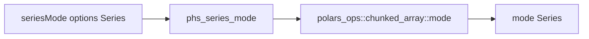

# Polars HS Series Mode Design

## Background

`polars-hs` now exposes eager Series value counts and unique counts. Rust
Polars 0.53 also exposes `mode`, returning the most occurring value or values
from a Series.

## Problem

Callers can compute frequency tables, but selecting the most frequent Series
values still requires extra Haskell-side decoding or DataFrame manipulation.
`seriesMode` fills that gap for common descriptive statistics workflows.

## Questions and Answers

1. Which upstream feature is needed?

   Answer: enable Polars feature `mode`, which maps to `polars-ops/mode`.

2. What should the Haskell options look like?

   Answer: add `SeriesModeOptions` with `seriesModeMaintainOrder :: Bool`.
   Upstream `mode` accepts this flag directly.

3. What should the default be?

   Answer: default `seriesModeMaintainOrder = False`, matching Polars'
   performance-oriented grouping default. Tests that require deterministic tie
   order use `True`.

4. What should the return type be?

   Answer: return `Series`, preserving the original value dtype and nulls.

## Design



Public Haskell API:

```haskell
data SeriesModeOptions = SeriesModeOptions
    { seriesModeMaintainOrder :: !Bool
    }

defaultSeriesModeOptions :: SeriesModeOptions

seriesMode :: SeriesModeOptions -> Series -> IO (Either PolarsError Series)
```

C ABI:

```c
int phs_series_mode(const struct phs_series *series,
                    bool maintain_order,
                    struct phs_series **out,
                    struct phs_error **err);
```

Rust implementation:

```rust
series_transform(series, out, err, |value| {
    Ok(polars_series_mode(value, maintain_order)?)
})
```

## Implementation Plan

1. Add Hspec tests first for tied numeric modes with maintained order, text
   mode, null mode preservation, and empty Series.
2. Add Rust FFI tests for the same behavior.
3. Enable `mode` in `rust/polars-hs-ffi/Cargo.toml`.
4. Export `SeriesModeOptions`, `defaultSeriesModeOptions`, and `seriesMode`
   from `src/Polars/Series.hs`.
5. Add `phs_series_mode` to Raw.hs and the C header.
6. Implement the Rust ABI near other frequency/distinct Series helpers.
7. Run focused tests, full Rust tests, full Hspec, HLint, and diff checks.

## Examples

```haskell
modes <- seriesMode defaultSeriesModeOptions values
```

```haskell
modes <-
    seriesMode defaultSeriesModeOptions { seriesModeMaintainOrder = True }
        values
```

## Trade-offs

- `maintain_order` is exposed immediately because mode ties make ordering
  observable.
- A future grouped aggregation API can reuse the same semantics for mode over
  groups.

## Implementation Results

Files changed:

- `rust/polars-hs-ffi/Cargo.toml`: enables Polars `mode` and
  `polars-ops/mode`.
- `src/Polars/Series.hs`: exports `SeriesModeOptions`,
  `defaultSeriesModeOptions`, and `seriesMode`.
- `src/Polars/Internal/Raw.hs`: imports `phs_series_mode` as a safe FFI call.
- `include/polars_hs.h`: declares the C ABI.
- `rust/polars-hs-ffi/src/series.rs`: implements `phs_series_mode` with
  `polars_ops::chunked_array::mode::mode`.
- `test/Spec.hs`: adds Hspec coverage for tied numeric modes, text mode, null
  mode, and empty Series.

Verified RED:

- Rust focused test failed because `phs_series_mode` was missing.
- Hspec focused test failed because mode options and `seriesMode` were missing
  from the public API.

Verified GREEN:

- Focused Rust FFI: 1/1 passing.
- Focused Hspec: 1/1 passing.
- Full Rust FFI: 120/120 passing.
- Full Stack/Hspec: 167/167 passing.
- HLint: no hints after using `newtype` for `SeriesModeOptions`.
- `git diff --check`: clean.

Deviations:

- `SeriesModeOptions` was implemented as `newtype` rather than `data` because
  it currently has one field and HLint recommends the narrower representation.
