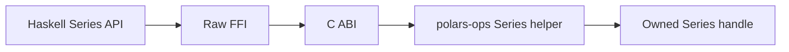

# Polars HS Series Numeric Unary Design

## Background

Rust Polars 0.53 exposes Series-level numeric unary helpers through
`polars-ops`:

```rust
polars_ops::series::abs(&Series)
polars_ops::series::RoundSeries::round(&Series, u32, RoundMode)
polars_ops::series::RoundSeries::floor(&Series)
polars_ops::series::RoundSeries::ceil(&Series)
```

Docs and source checked:

- https://docs.rs/crate/polars-ops/latest/features
- `polars-ops-0.53.0/src/series/ops/abs.rs`
- `polars-ops-0.53.0/src/series/ops/round.rs`
- `polars-ops-0.53.0/src/series/ops/mod.rs`

## Problem

`polars-hs` exposes eager Series arithmetic and scalar statistics, while common
numeric unary transforms still require lazy expressions. Eager Series users need
direct absolute value and rounding helpers that keep nulls, dtype behavior, and
Polars errors intact.

## Questions and Answers

Q: Should rounding mode be encoded as a Haskell enum?

A: Yes. A small enum avoids raw integer opcodes in public code and matches the
two Rust `RoundMode` variants.

Q: Should decimal places use `Int` or `Word32`?

A: Public API uses `Int` for consistency with existing row-count style options.
The Haskell boundary validates non-negative values before converting to C.

Q: Should unsupported dtypes fail through Rust Polars?

A: Yes. Rust Polars already returns typed `InvalidOperation` errors for text and
other incompatible dtypes, so the binding should preserve those errors.

## Design

Public API:

```haskell
data SeriesRoundMode
    = RoundHalfToEven
    | RoundHalfAwayFromZero

seriesAbs :: Series -> IO (Either PolarsError Series)
seriesRound :: Int -> SeriesRoundMode -> Series -> IO (Either PolarsError Series)
seriesFloor :: Series -> IO (Either PolarsError Series)
seriesCeil :: Series -> IO (Either PolarsError Series)
```

C ABI:

```c
int phs_series_abs(const phs_series *series, phs_series **out, phs_error **err);
int phs_series_round(const phs_series *series, uint32_t decimals, int mode, phs_series **out, phs_error **err);
int phs_series_floor(const phs_series *series, phs_series **out, phs_error **err);
int phs_series_ceil(const phs_series *series, phs_series **out, phs_error **err);
```

Rust mapping:

```rust
abs(value)
value.round(decimals, mode)
value.floor()
value.ceil()
```

Flow:



## Implementation Plan

1. Add RED Hspec tests for abs, round, floor, ceil, validation, and dtype errors.
2. Add Haskell exports, `SeriesRoundMode`, and wrappers.
3. Add Raw.hs imports and C header declarations.
4. Add `abs` and `round_series` features to the direct `polars-ops` dependency.
5. Add Rust ABI functions and Rust FFI tests.
6. Run focused Hspec and Rust tests.
7. Run full Rust, full Stack/Hspec, HLint, and `git diff --check`.
8. Append implementation results.

## Examples

Good:

```haskell
rounded <- seriesRound 0 RoundHalfToEven prices
positive <- seriesAbs deltas
```

Bad:

```haskell
rounded <- seriesRound (-1) RoundHalfToEven prices
```

## Trade-offs

This batch keeps rounding options compact. It covers decimal rounding, floor,
ceil, and abs first; significant-figure rounding and floor-divide can use a
later batch with dedicated tests.

## Implementation Results

Implemented:

- `SeriesRoundMode`
- `seriesAbs`
- `seriesRound`
- `seriesFloor`
- `seriesCeil`

Changed files:

- `src/Polars/Series.hs`
- `src/Polars/Internal/Raw.hs`
- `include/polars_hs.h`
- `rust/polars-hs-ffi/Cargo.toml`
- `rust/polars-hs-ffi/src/series.rs`
- `test/Spec.hs`

Semantics verified:

- `seriesAbs` over nullable `Int64` and `Double`.
- `seriesRound 0 RoundHalfToEven` tie behavior for `2.5`, `3.5`, and `-2.5`.
- `seriesRound 0 RoundHalfAwayFromZero` tie behavior for the same values.
- `seriesRound 2 RoundHalfAwayFromZero` over positive, negative, and null
  `Double` values.
- `seriesFloor` and `seriesCeil` over positive, negative, fractional, and null
  `Double` values.
- `seriesRound`, `seriesFloor`, and `seriesCeil` preserve `Int64` values.
- Text dtype returns Polars errors for all four operations.
- Haskell rejects negative decimals and decimals above `Word32`.
- Rust ABI rejects unknown round mode codes with `InvalidArgument`.

Deviation:

- The C ABI uses `uint32_t decimals`, matching Rust `RoundSeries::round`.
  Haskell keeps `Int` at the public boundary and validates before conversion.

Verification:

- RED Hspec failed on missing `seriesAbs`, `seriesRound`,
  `RoundHalfToEven`, `RoundHalfAwayFromZero`, `seriesFloor`, and
  `seriesCeil`.
- Focused Rust FFI:
  `cargo test --manifest-path rust/polars-hs-ffi/Cargo.toml --release series_numeric_unary -- --nocapture`
  passed: 2/2.
- Focused Hspec:
  `PATH="$HOME/.ghcup/bin:$PATH" stack --system-ghc test --fast --test-arguments '--match "applies Series absolute value transforms"'`
  passed: 1/1.
- Focused Hspec:
  `PATH="$HOME/.ghcup/bin:$PATH" stack --system-ghc test --fast --test-arguments '--match "rounds floors and ceils Series values"'`
  passed: 1/1.
- Full Rust FFI:
  `cargo test --manifest-path rust/polars-hs-ffi/Cargo.toml --release`
  passed: 108/108.
- HLint:
  `PATH="$HOME/.ghcup/bin:$PATH" hlint src test`
  returned `No hints`.
- Whitespace:
  `git diff --check`
  returned no output.
- Full Stack/Hspec:
  `PATH="$HOME/.ghcup/bin:$PATH" stack --system-ghc test --fast`
  passed: 158/158.

Review follow-up:

- A read-only research agent confirmed the public Rust imports:
  `polars_ops::series::abs` and `polars_ops::series::{RoundMode, RoundSeries}`.
- The same review recommended `decimals = 2`, integer clone, and `Word32`
  boundary coverage; those cases are included in this implementation.
