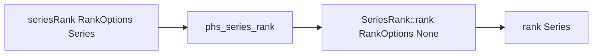

# Polars HS Series Rank Design

## Background

`polars-hs` already exposes expression ranking through `RankOptions` and the
lazy expression DSL. Rust Polars 0.53 also exposes eager Series ranking through
the `polars_ops::series::SeriesRank` trait.

## Problem

Users can rank values in lazy expressions, but eager Series workflows cannot
rank a standalone Series handle. This leaves a gap for interactive workflows
that already extracted or constructed a Series and want rank values without
building a lazy DataFrame query.

## Questions and Answers

1. Which option type should be used?

   Answer: reuse the public `RankOptions` and `RankMethod` from
   `Polars.Expr`. They already mirror Rust Polars deterministic rank methods:
   `Average`, `Min`, `Max`, `Dense`, and `Ordinal`.

2. Should `Random` rank be added?

   Answer: defer random ranking. The current public `RankMethod` omits Random,
   and adding it should include explicit seed semantics across expression and
   eager Series APIs.

3. What should the return type be?

   Answer: return `Series`, matching Rust Polars and the rest of eager Series
   transforms.

4. What dtype should tests expect?

   Answer: `RankAverage` returns `Float64`. `RankMin`, `RankMax`,
   `RankDense`, and `RankOrdinal` return the Polars index dtype. The current
   non-bigidx build uses `UInt32`.

## Design



Public Haskell API:

```haskell
seriesRank :: RankOptions -> Series -> IO (Either PolarsError Series)
```

C ABI:

```c
int phs_series_rank(const struct phs_series *series,
                    int method,
                    bool descending,
                    struct phs_series **out,
                    struct phs_error **err);
```

Rust implementation:

```rust
let method = series_rank_method_from_code(method)?;
Ok(value.rank(RankOptions { method, descending }, None))
```

## Implementation Plan

1. Add Hspec tests first for all deterministic rank methods, null validity,
   descending rank, empty Series, all-null Series, and text ranking.
2. Add Rust FFI tests for deterministic rank outputs and unknown method errors.
3. Export `seriesRank` from `src/Polars/Series.hs`.
4. Add `phs_series_rank` to Raw.hs and the C header.
5. Implement the Rust ABI near other eager Series transforms.
6. Run focused tests, full Rust tests, full Hspec, HLint, and diff checks.

## Examples

```haskell
ranked <- seriesRank defaultRankOptions values
```

```haskell
averageRanked <-
    seriesRank defaultRankOptions { rankMethod = RankAverage } values
```

## Trade-offs

- Reusing `RankOptions` keeps eager and expression ranking aligned.
- A local Haskell opcode mapper duplicates the expression mapper. A generated
  opcode test suite should eventually cover these duplicated ABI families.
- Random ranking is left for a seed-aware API batch so deterministic rank
  methods can ship with tight tests now.

## Implementation Results

Files changed:

- `src/Polars/Series.hs`: exports `seriesRank`, reuses `RankOptions`, and maps
  deterministic `RankMethod` constructors to the C ABI method codes.
- `src/Polars/Internal/Raw.hs`: imports `phs_series_rank` as a safe FFI call.
- `include/polars_hs.h`: declares the C ABI.
- `rust/polars-hs-ffi/src/series.rs`: implements `phs_series_rank` with
  `SeriesRank::rank` and validates unknown method codes.
- `test/Spec.hs`: adds Hspec coverage for all deterministic methods,
  nullable average rank, descending dense rank, text rank, all-null rank, empty
  rank, and method-specific output dtypes.

Verified RED:

- Rust focused test failed because `phs_series_rank` was missing.
- Hspec focused test failed because `Polars` did not export `seriesRank`.

Verified GREEN:

- Focused Rust FFI: 1/1 passing.
- Focused Hspec: 1/1 passing.
- Full Rust FFI: 118/118 passing.
- Full Stack/Hspec: 165/165 passing.
- HLint: no hints.
- `git diff --check`: clean.

Deviations:

- The implementation reused `RankOptions` directly as designed.
- Random rank remains in future seed-aware scope.
