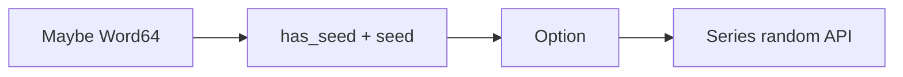

# Design Log: Series Sampling and Shuffle

## Background

Rust Polars 0.53 exposes eager Series sampling through the `random` feature:

```rust
pub fn sample_n(
    &self,
    n: usize,
    with_replacement: bool,
    shuffle: bool,
    seed: Option<u64>,
) -> PolarsResult<Self>

pub fn sample_frac(
    &self,
    frac: f64,
    with_replacement: bool,
    shuffle: bool,
    seed: Option<u64>,
) -> PolarsResult<Self>

pub fn shuffle(&self, seed: Option<u64>) -> Self
```

Local source: `polars-core-0.53.0/src/chunked_array/random.rs`.
The facade crate wires this through the `polars/random` feature to `polars-core/random`.

## Problem

`polars-hs` has eager Series transform coverage for filtering, taking, arithmetic, ranking, `zip_with`,
`search_sorted`, and `is_between`, but it cannot sample or shuffle Series values. Sampling is a common
eager operation and is available in upstream Polars 0.53.

## Questions and Answers

### Should sampling options be positional booleans?

Answer: expose an options record. The two booleans and optional seed are easy to swap accidentally, and
the project already uses option records for sort, mode, and value-count APIs.

### Should Haskell validate sample fractions?

Answer: validate invalid boundary values before FFI. The binding rejects NaN, infinities, negative values,
and `frac > 1.0` when sampling without replacement. Valid fractions still follow Rust Polars 0.53 exactly,
including the current conversion from fraction to sample count.

### Should `shuffle` reuse sample options?

Answer: expose `seriesShuffle :: Maybe Word64 -> Series -> IO (Either PolarsError Series)`.
The upstream method only takes an optional seed, so a dedicated wrapper is clearer.

## Design

Add a public Haskell option record:

```haskell
data SeriesSampleOptions = SeriesSampleOptions
    { seriesSampleWithReplacement :: !Bool
    , seriesSampleShuffle :: !Bool
    , seriesSampleSeed :: !(Maybe Word64)
    }

defaultSeriesSampleOptions :: SeriesSampleOptions
```

Public functions:

```haskell
seriesSampleN :: SeriesSampleOptions -> Int -> Series -> IO (Either PolarsError Series)
seriesSampleFrac :: SeriesSampleOptions -> Double -> Series -> IO (Either PolarsError Series)
seriesShuffle :: Maybe Word64 -> Series -> IO (Either PolarsError Series)
```

Add Rust ABI functions:

```c
int phs_series_sample_n(const struct phs_series *series,
                        uint64_t n,
                        bool with_replacement,
                        bool shuffle,
                        bool has_seed,
                        uint64_t seed,
                        struct phs_series **out,
                        struct phs_error **err);

int phs_series_sample_frac(const struct phs_series *series,
                           double frac,
                           bool with_replacement,
                           bool shuffle,
                           bool has_seed,
                           uint64_t seed,
                           struct phs_series **out,
                           struct phs_error **err);

int phs_series_shuffle(const struct phs_series *series,
                       bool has_seed,
                       uint64_t seed,
                       struct phs_series **out,
                       struct phs_error **err);
```

Seed conversion is shared:



## Implementation Plan

1. Enable `random` on the Rust `polars` dependency.
2. Add Rust FFI tests for `sample_n`, `sample_frac`, `shuffle`, invalid counts, shape mismatch, and seed stability.
3. Add Hspec tests for the public wrappers.
4. Implement Rust ABI functions using `usize_from_u64` for `sample_n`.
5. Add C header declarations, safe Raw imports, and Haskell wrappers.
6. Run focused RED/GREEN checks and full verification.

## Examples

Good:

```haskell
sampled <- seriesSampleN defaultSeriesSampleOptions {seriesSampleSeed = Just 7} 3 values
```

The seed is explicit and the option record keeps replacement and shuffle controls named.

Bad:

```haskell
sampled <- seriesSampleNRaw True False 7 3 values
```

This positional shape hides option meaning and makes accidental swaps likely.

## Trade-offs

- The Haskell wrapper validates negative counts before crossing FFI.
- Rust validates `usize` conversion and upstream Polars validates sampling without replacement from a
  smaller population.
- Valid fraction behavior follows Rust Polars 0.53 exactly, including the current conversion from fraction
  to sample count.

## Implementation Results

Implemented as designed, with the fraction validation described above.

Files changed:

- `rust/polars-hs-ffi/Cargo.toml`
- `rust/polars-hs-ffi/Cargo.lock`
- `rust/polars-hs-ffi/src/series.rs`
- `include/polars_hs.h`
- `src/Polars/Internal/Raw.hs`
- `src/Polars/Series.hs`
- `test/Spec.hs`

Verification:

- RED Rust: `cargo test --manifest-path rust/polars-hs-ffi/Cargo.toml series_sampling_and_shuffle_return_expected_values`
  failed because `phs_series_sample_n`, `phs_series_sample_frac`, and `phs_series_shuffle` were missing.
- RED Hspec: `stack test --fast --ta --match=samples` failed because `defaultSeriesSampleOptions`
  and public sampling wrappers were missing.
- Focused Rust: `cargo test --manifest-path rust/polars-hs-ffi/Cargo.toml series_sampling_and_shuffle_return_expected_values`
  passed, 1/1.
- Focused Hspec: `stack test --fast --ta --match=samples` passed, 1/1.
- Full Rust: `cargo test --manifest-path rust/polars-hs-ffi/Cargo.toml` passed, 127/127.
- Full Haskell: `stack test --fast` passed, 174/174.
- HLint: `hlint src test app` returned `No hints`.
- Whitespace: `git diff --check` returned exit 0.

Deviations:

- The final tests use deterministic seeded golden outputs from the current lockfile:
  `sampleN 2 seed 0 -> [50,20]`, `sampleFrac 0.4 seed 0 -> [50,20]`,
  `shuffle seed 0 -> [40,10,20,50,30]`, and replacement sampling seed 0
  -> `[20,20,20,10,30,10,50]`.
