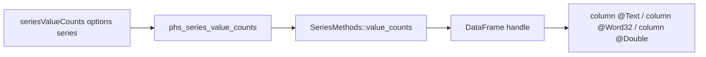

# Polars HS Series Value Counts Design

## Background

`polars-hs` already exposes eager Series distinct helpers:

- `seriesUnique`
- `seriesUniqueStable`
- `seriesArgUnique`
- `seriesNUnique`

Rust Polars 0.53 also exposes `SeriesMethods::value_counts`, which returns a
two-column `DataFrame` containing each unique Series value and its count or
normalized proportion.

## Problem

Haskell users can count the number of distinct values with `seriesNUnique`, but
they cannot get the per-value frequency table from eager Series APIs. This
blocks common profiling and categorical summary workflows without switching to
lazy expressions.

## Questions and Answers

1. Which public Haskell shape should be used?

   Answer: expose an option record plus a default value:

   ```haskell
   data SeriesValueCountsOptions = SeriesValueCountsOptions
       { seriesValueCountsSort :: !Bool
       , seriesValueCountsParallel :: !Bool
       , seriesValueCountsName :: !Text
       , seriesValueCountsNormalize :: !Bool
       }

   defaultSeriesValueCountsOptions :: SeriesValueCountsOptions

   seriesValueCounts :: SeriesValueCountsOptions -> Series -> IO (Either PolarsError DataFrame)
   ```

2. What defaults should the binding choose?

   Answer: match upstream Python user-facing defaults for behavior:
   `sort = False`, `parallel = False`, `name = "count"`, and
   `normalize = False`.

3. How should deterministic tests handle ordering?

   Answer: tests that assert row order set `seriesValueCountsSort = True`.
   Upstream documents the unsorted output order as non-deterministic.

4. How should normalized output be represented?

   Answer: keep upstream behavior. `normalize = True` returns a `Float64`
   count/proportion column.

5. How should duplicate column names be handled?

   Answer: forward the Polars error when the requested count column name equals
   the source Series name.

## Design



Public Haskell API:

```haskell
data SeriesValueCountsOptions = SeriesValueCountsOptions
    { seriesValueCountsSort :: !Bool
    , seriesValueCountsParallel :: !Bool
    , seriesValueCountsName :: !Text
    , seriesValueCountsNormalize :: !Bool
    }
    deriving stock (Eq, Show)

defaultSeriesValueCountsOptions :: SeriesValueCountsOptions

seriesValueCounts :: SeriesValueCountsOptions -> Series -> IO (Either PolarsError DataFrame)
```

C ABI:

```c
int phs_series_value_counts(const struct phs_series *series,
                            bool sort,
                            bool parallel,
                            const char *name,
                            bool normalize,
                            struct phs_dataframe **out,
                            struct phs_error **err);
```

Rust implementation:

```rust
use polars_ops::series::SeriesMethods;

let name = unsafe { c_str_to_str(name, "name") }?;
*out = dataframe_into_raw(handle.value.value_counts(sort, parallel, name.into(), normalize)?);
```

Validation rules:

- Null `series`, `name`, `out`, or `err` pointers use existing FFI boundary
  handling.
- Duplicate output column names are reported by Polars.
- Empty name is forwarded to Polars, matching local string-boundary style.

## Implementation Plan

1. Add Hspec tests first for sorted counts, normalized proportions, duplicate
   output name failure, and empty Series output.
2. Add Rust FFI tests for the same ABI surface.
3. Add `SeriesValueCountsOptions`, defaults, export, and wrapper in
   `src/Polars/Series.hs`.
4. Add `phs_series_value_counts` Raw import in `src/Polars/Internal/Raw.hs`.
5. Add the C declaration in `include/polars_hs.h`.
6. Add the Rust ABI in `rust/polars-hs-ffi/src/series.rs`.
7. Run focused tests, full Rust tests, full Hspec, HLint, and diff checks.

## Examples

Good:

```haskell
counts <- seriesValueCounts
    defaultSeriesValueCountsOptions { seriesValueCountsSort = True }
    colors
```

Good:

```haskell
props <- seriesValueCounts
    defaultSeriesValueCountsOptions
        { seriesValueCountsSort = True
        , seriesValueCountsName = "fraction"
        , seriesValueCountsNormalize = True
        }
    colors
```

Bad:

```haskell
seriesValueCounts defaultSeriesValueCountsOptions colors
```

when asserting output row order in tests, because unsorted output order is
documented as unstable.

## Trade-offs

- Returning a `DataFrame` follows upstream and reuses existing DataFrame column
  extraction.
- The option record gives a stable place for future value-count controls if
  upstream expands the method.
- The count column dtype follows Polars `IdxType`, so current default builds
  decode with `Word32`; a later big-index batch should add a shared index dtype
  abstraction.

## Implementation Results

Implemented:

- `src/Polars/Series.hs`: exported `SeriesValueCountsOptions`,
  `defaultSeriesValueCountsOptions`, and `seriesValueCounts`.
- `src/Polars/Internal/Raw.hs`: added a safe FFI import for
  `phs_series_value_counts`.
- `include/polars_hs.h`: added the C ABI declaration.
- `rust/polars-hs-ffi/src/series.rs`: added `phs_series_value_counts` using
  `SeriesMethods::value_counts`.
- `test/Spec.hs`: added Hspec coverage for sorted counts, normalized
  proportions, duplicate output-name errors, and empty Series output.

Red tests:

- Rust focused test failed on missing `phs_series_value_counts`.
- Hspec focused test failed on missing `defaultSeriesValueCountsOptions`.

Verification:

- `cargo test --manifest-path rust/polars-hs-ffi/Cargo.toml --release series_value_counts_returns_count_and_proportion_frames -- --nocapture`:
  1/1 focused Rust test passed.
- `PATH="$HOME/.ghcup/bin:$PATH" stack --system-ghc test --fast --test-arguments '--match "computes Series value counts as a DataFrame"'`:
  1/1 focused Hspec test passed.
- `cargo test --manifest-path rust/polars-hs-ffi/Cargo.toml --release`:
  116/116 Rust tests passed.
- `PATH="$HOME/.ghcup/bin:$PATH" stack --system-ghc test --fast`:
  163/163 Hspec examples passed.
- `PATH="$HOME/.ghcup/bin:$PATH" hlint src app test`: no hints.
- `git diff --check`: clean.

Review notes:

- Read-only sidecar review confirmed the required Rust import is
  `polars_ops::series::SeriesMethods` and that the current Cargo feature set
  already enables the needed group-by machinery.
- Another sidecar recommended the next low-coupling Series parity batch as
  `seriesArgSort`, followed by `seriesRank`.

Deviation from design:

- None.
