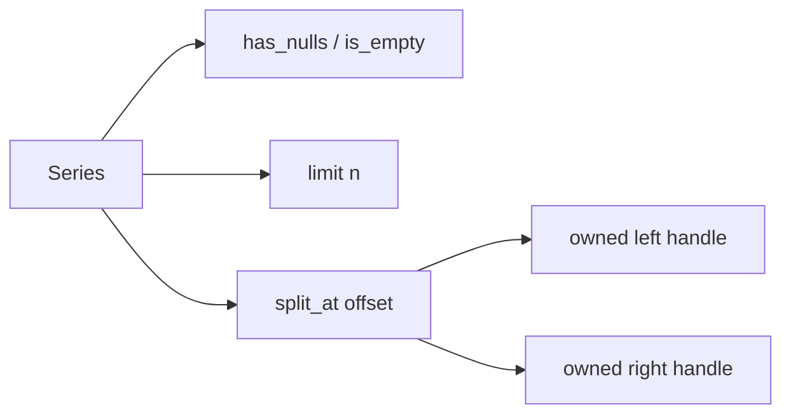

# Series Views And Metadata Design

## Background

Rust Polars 0.53 `SeriesTrait` exposes small core helpers that complement the existing `polars-hs`
Series metadata and slicing APIs:

- `has_nulls(&self) -> bool`
- `is_empty(&self) -> bool`
- `limit(&self, num_elements: usize) -> Series`
- `split_at(&self, offset: i64) -> (Series, Series)`

The upstream docs describe `limit` as taking values from the top as a zero-copy view and `split_at` as a
zero-copy view where negative offsets are counted from the end. The local Polars 0.53 source says chunked
`split_at` never errors and slices the best match when offset is out of bounds.

## Problem

`polars-hs` already exposes `seriesLength`, `seriesNullCount`, `seriesHead`, `seriesTail`, and `seriesSlice`.
Users still lack direct parity names for `has_nulls`, `is_empty`, `limit`, and `split_at`. The first two avoid
manual count checks, `limit` provides the upstream API name, and `split_at` returns both zero-copy views in a
single Rust call.

## Questions And Answers

### Should `seriesLimit` exist when `seriesHead` already exists?

Answer: yes. `seriesLimit` is the Rust Polars API name and keeps parity-facing code readable. It follows the same
non-negative Haskell validation as `seriesHead`.

### Should `seriesSplitAt` validate out-of-bounds offsets?

Answer: no. Rust Polars 0.53 documents best-match slicing for out-of-bounds offsets. The binding passes Haskell
`Int` as `i64` and delegates offset semantics to Polars.

### How should boolean metadata return values cross the ABI?

Answer: use `bool *out` in C and a shared Haskell `seriesBoolOut` helper. This keeps `seriesHasNulls` and
`seriesIsEmpty` consistent and avoids encoding single booleans as bytes.

### How should two Series outputs cross the ABI?

Answer: use two owned `struct phs_series **` output pointers and a shared `seriesPairOut` helper. The Rust ABI
sets both outputs to null before computing and only fills both on success.

## Design

Rust ABI:

```c
int phs_series_has_nulls(const struct phs_series *series,
                         bool *out,
                         struct phs_error **err);

int phs_series_is_empty(const struct phs_series *series,
                        bool *out,
                        struct phs_error **err);

int phs_series_limit(const struct phs_series *series,
                     uint64_t len,
                     struct phs_series **out,
                     struct phs_error **err);

int phs_series_split_at(const struct phs_series *series,
                        int64_t offset,
                        struct phs_series **left_out,
                        struct phs_series **right_out,
                        struct phs_error **err);
```

Public Haskell API:

```haskell
seriesHasNulls :: Series -> IO (Either PolarsError Bool)
seriesIsEmpty :: Series -> IO (Either PolarsError Bool)
seriesLimit :: Int -> Series -> IO (Either PolarsError Series)
seriesSplitAt :: Int -> Series -> IO (Either PolarsError (Series, Series))
```



## Implementation Plan

1. Add RED Rust FFI tests for boolean metadata, limit, split-at positive offset, split-at negative offset, and
   out-of-bounds split-at.
2. Add RED Hspec tests for public APIs, text/null preservation, and negative limit validation.
3. Add `seriesBoolOut` and `seriesPairOut` helpers in `Polars.Internal.Series`.
4. Implement Rust ABI functions in `rust/polars-hs-ffi/src/series.rs`.
5. Add header declarations and Raw imports.
6. Add public Haskell exports and wrappers in `Polars.Series`.
7. Run focused RED/GREEN checks and full verification.

## Examples

Good:

```haskell
hasMissing <- seriesHasNulls values
(left, right) <- seriesSplitAt (-1) values
```

This follows upstream Polars offset behavior and keeps both output views Rust-owned.

Bad:

```haskell
prefix <- seriesLimit (-1) values
```

Negative limits are rejected at the Haskell boundary because the Rust API takes `usize`.

## Trade-offs

- `seriesLimit` overlaps with `seriesHead`, but improves source parity.
- `seriesSplitAt` returns a tuple, so helper code must allocate and validate two output handles.
- Out-of-bounds split behavior is delegated to Polars to preserve parity across dtypes.

## Implementation Results

Implemented public Series helpers:

```haskell
seriesHasNulls :: Series -> IO (Either PolarsError Bool)
seriesIsEmpty :: Series -> IO (Either PolarsError Bool)
seriesLimit :: Int -> Series -> IO (Either PolarsError Series)
seriesSplitAt :: Int -> Series -> IO (Either PolarsError (Series, Series))
```

Rust ABI added:

```c
int phs_series_has_nulls(const struct phs_series *series,
                         bool *out,
                         struct phs_error **err);

int phs_series_is_empty(const struct phs_series *series,
                        bool *out,
                        struct phs_error **err);

int phs_series_limit(const struct phs_series *series,
                     uint64_t len,
                     struct phs_series **out,
                     struct phs_error **err);

int phs_series_split_at(const struct phs_series *series,
                        int64_t offset,
                        struct phs_series **left_out,
                        struct phs_series **right_out,
                        struct phs_error **err);
```

RED checks:

- `cargo test --manifest-path rust/polars-hs-ffi/Cargo.toml series_view_metadata_limit_and_split_at_work`
  failed while the Rust ABI functions were missing.
- `stack test --fast --ta --match=view` failed while public Haskell exports were missing.

GREEN checks:

- `cargo test --manifest-path rust/polars-hs-ffi/Cargo.toml series_view_metadata_limit_and_split_at_work`:
  1/1 passed.
- `stack test --fast --test-arguments='--match=view'`: 1/1 passed.

Full verification:

- `cargo test --manifest-path rust/polars-hs-ffi/Cargo.toml`: 130/130 passed.
- `stack test --fast`: 177 examples, 0 failures.
- `hlint src test app`: no hints.
- `git diff --check`: exit 0.

Implementation notes:

- Added `seriesBoolOut` and `seriesPairOut` to `Polars.Internal.Series`.
- `seriesLimit` rejects negative Haskell counts and uses checked Rust `u64 -> usize` conversion.
- `seriesSplitAt` delegates negative and out-of-bounds offset behavior to Rust Polars 0.53.
