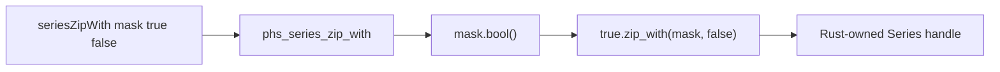

# Series Zip-With Design

## Background

Rust Polars 0.53 exposes `Series::zip_with(&self, &BooleanChunked, &Series) -> PolarsResult<Series>` behind the `zip_with` feature. It selects values from the receiver where the boolean mask is true and from the other Series where the mask is false. Polars also supports unit-length broadcasting for either value side.

## Problem

`polars-hs` has eager `Series` filtering, taking, ranking, modes, and value counts, but it lacks eager conditional selection between two Series. This blocks Series-level APIs that users expect as the eager counterpart to expression conditionals.

## Questions and Answers

1. Should the Haskell argument order follow Rust receiver style?
   Answer: Use `mask, trueValues, falseValues`. This makes the condition visible first and matches common conditional reading.

2. How should null mask values behave?
   Answer: Follow Polars 0.53 `bool_null_to_false`; null mask entries select `falseValues`.

3. Should Haskell validate boolean mask dtype before FFI?
   Answer: Let Rust Polars validate via `Series::bool()`, then surface the Polars error through the existing typed error path.

## Design

Public Haskell API:

```haskell
seriesZipWith :: Series -> Series -> Series -> IO (Either PolarsError Series)
```

Arguments:

```haskell
seriesZipWith mask trueValues falseValues
```

C ABI:

```c
int phs_series_zip_with(const struct phs_series *mask,
                        const struct phs_series *true_values,
                        const struct phs_series *false_values,
                        struct phs_series **out,
                        struct phs_error **err);
```

Rust implementation:

```rust
let mask = mask_handle.value.bool()?;
let selected = true_handle.value.zip_with(mask, &false_handle.value)?;
```

Flow:



Examples:

✅ Good:

```haskell
seriesZipWith mask trueValues falseValues
```

❌ Bad:

```haskell
seriesZipWith trueValues falseValues mask
```

The first form communicates conditional selection at the call site.

## Implementation Plan

1. Add RED Rust FFI tests for value selection, null mask behavior, broadcasting, dtype coercion, text values, mask dtype error, and shape mismatch.
2. Add RED Hspec tests for the same public behavior.
3. Enable the `zip_with` Cargo feature for `polars`.
4. Add `phs_series_zip_with` to Rust, C header, and `Polars.Internal.Raw`.
5. Add `seriesZipWith` to `Polars.Series` exports and implementation.
6. Run focused Rust and Hspec tests, then full `cargo test`, `stack test --fast`, `hlint src app test`, and `git diff --check`.

## Trade-offs

- Letting Rust perform dtype and shape validation keeps Haskell small and aligned with Polars 0.53.
- The API exposes raw `Series` arguments for all three inputs, which preserves flexibility for supported dtype coercions and future dtype expansion.
- Null mask-as-false may surprise users coming from nullable SQL predicates, so tests pin the behavior explicitly.

## Implementation Results

- Added `seriesZipWith :: Series -> Series -> Series -> IO (Either PolarsError Series)` to `Polars.Series`.
- Added `phs_series_zip_with` to the C header, raw Haskell FFI, and Rust adapter.
- Enabled the Rust Polars `zip_with` feature.
- Added Rust FFI tests and Hspec tests for null mask-as-false behavior, unit-length true-side broadcasting, numeric dtype coercion, text selection, shape mismatch, and non-boolean mask errors.
- RED verification:
  - `cargo test --manifest-path rust/polars-hs-ffi/Cargo.toml series_zip_with_selects_with_boolean_mask` failed on missing `phs_series_zip_with`.
  - `stack test --fast --test-arguments '--match "selects eager Series values with a boolean mask"'` failed on missing `Pl.seriesZipWith`.
- GREEN verification:
  - Focused Rust FFI: 1/1 passing.
  - Focused Hspec: 1/1 passing.
  - Full Rust FFI: 121/121 passing.
  - Full Hspec: 168/168 passing.
  - HLint: no hints.
  - `git diff --check`: clean.

No deviations from the design plan.
